# 情报学中的秩变换

> 原文：<https://www.educba.com/rank-transformation-in-informatica/>

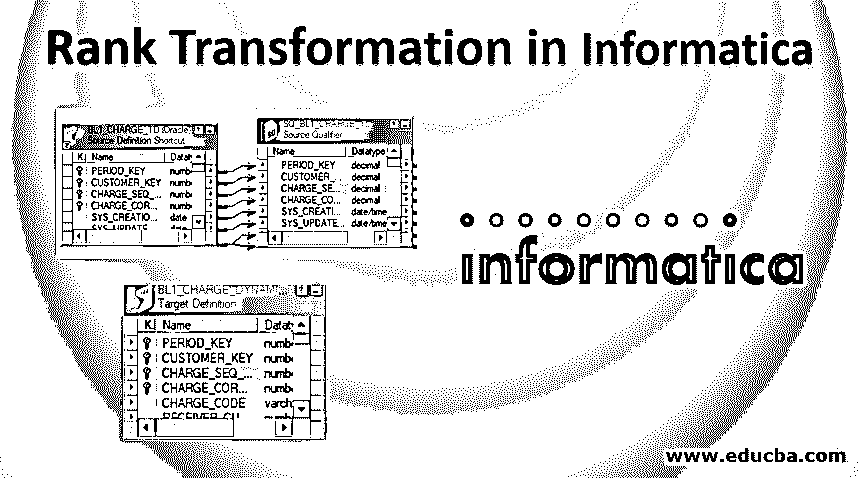

## 情报学中的秩变换综述

Informatica 中的等级转换是一个重要的转换特性，它是基于业务需求对数据进行等级划分的内置功能。它是信息领域中一种活跃的转换类型。它通过范围组织数据，并生成最高或最低排名。这是一种基于等级或组过滤数据的连接转换。Informatica 中的等级转换与一组行相关联，并维护用于存储等级位置值的等级索引。存在与用于计算等级值的等级变换相关联的等级端口和变量端口。等级转换支持多种配置属性，如高速缓存目录、索引大小、顶部/底部跟踪级别、转换输入属性。这种转换有利于根据 Informatica 中的指定列对数据进行分组。

### 如何进行信息学中的秩变换？

等级转换需要一个输出端口，该端口将等级分配给给定的行。让我们一步一步来看看，创建一个等级映射。

<small>Hadoop、数据科学、统计学&其他</small>

**步骤 1:** 创建具有源和目标的映射。

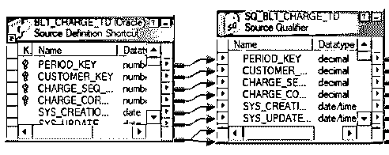

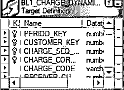

**步骤 2:** 转到转换菜单，然后选择创建选项。

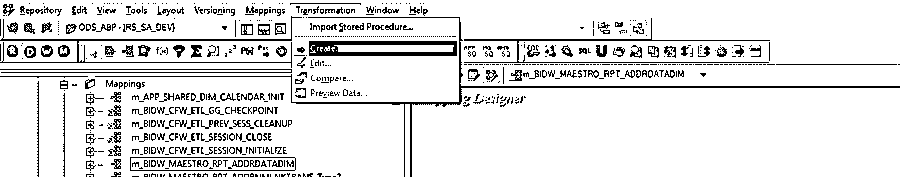

**第 3 步:**点击创建后，进入下拉菜单，在下拉菜单中选择等级。为此等级转换输入一个合适的名称，然后单击 Create。

一旦你点击创建，下面的转换将被创建。

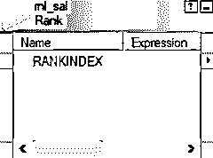

如前所述，在计算等级时，可以进行几种不同的配置。还有一个排名索引，用于存储创建的每个行组的排名位置。有一个用于计算等级的特定等级端口。它还有一个可变端口，可用于临时计算等级。

**第四步:**一旦这样做了。将所有源端口连接到等级转换。在这个等级转换上双击之后，一旦这个窗口打开，你可以看到编辑转换窗口的选项，而不是转到属性标签。

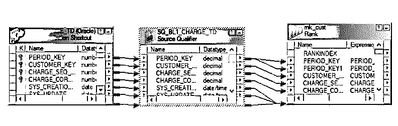

在此选项卡中，您可以通过转到下面的选项卡来定义等级的属性，如下所示。

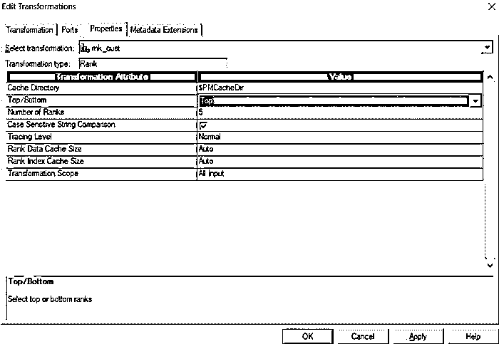

**步骤 5:** 在这里，您可以选择您所选择的属性，无论您想要选择顶部行还是底部行。“等级数”属性的值表示需要多少个等级。这里我们只选择了一个。可以根据需要更改和配置的其他字段如下:

*   **缓存目录:**指定集成服务用于创建索引和缓存所需数据的目录。
*   **顶部或底部:**如前所述，这有助于指定是找到数据的顶部还是底部等级。
*   **级数:**指定需要的级数。可以是前 3 名，也可以是后 2 名等等。
*   **区分大小写字符串比较:**指定是否区分大小写排序。
*   **跟踪级别:**存储会话日志文件跟踪的日志。
*   **等级数据缓存大小:**数据缓存大小可在该字段设置。如果设置为 auto，则集成服务将在运行时决定缓存大小。
*   **等级索引缓存大小:**您可以将索引缓存大小设置为一个数值。默认大小为 1，000，000 字节。

**步骤 6:** 完成后，转到端口选项卡。在这里，您可以选择您想要查找哪个端口的等级。在查找等级时，您还可以为想要分组的字段选择分组依据选项。您必须单击与等级相关联的字段的复选框，以及需要作为分组依据的字段的复选框。以下是对现有端口的描述。

*   **端口名:**表中出现的所有列都在这里用其各自的数据类型来表示。
*   应该检查输出中出现的所有列。
*   **分组依据:**如果选中此项，我们可以理解转换必须根据哪个字段进行分组。

当您转到“Ports”选项卡时，单击带有(R)的复选框，该复选框代表找到 rank 的端口。可以通过选中 GroupBy 选项的勾号来进行分组。

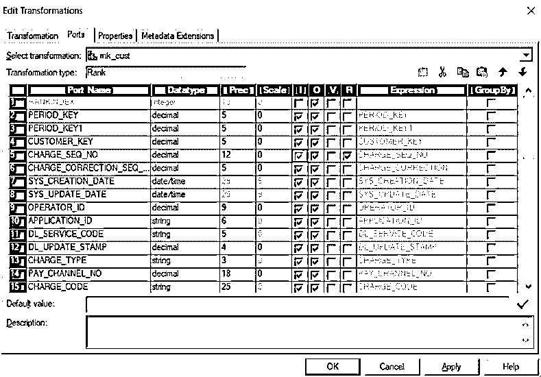

在此，将为 Charge_seq_no .查找等级。分组依据可以按如下方式完成:

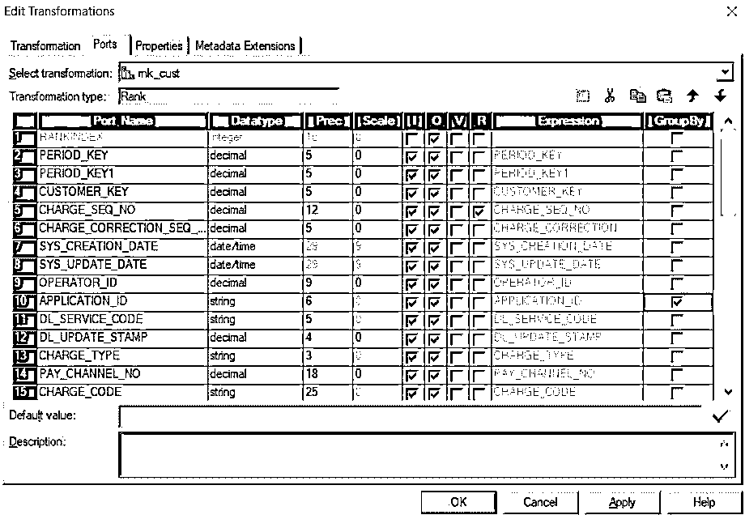

将此转换连接到目标。

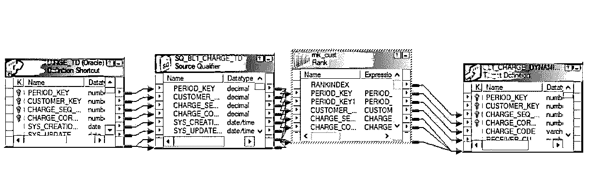

**步骤 7:** 一旦所有这些步骤都完成了，就可以将 rank 转换连接到目标表了。

现在导航到映射菜单，并点击验证选项，如下所示。

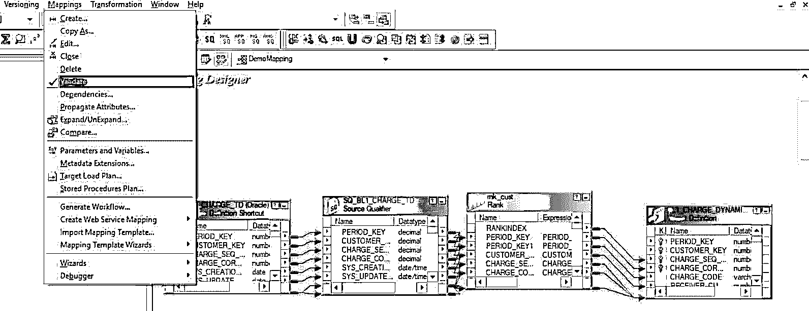

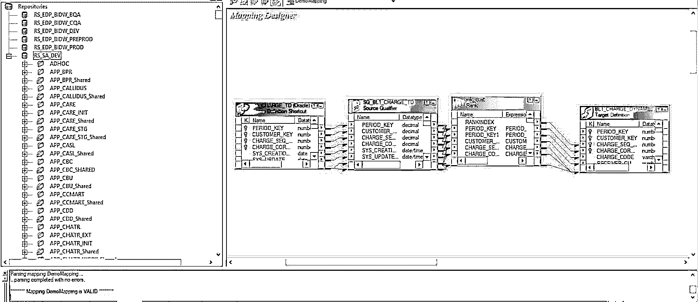

现在可以通过使用工作流管理器轻松运行经验证的映射。可以手动创建工作流，也可以使用工作流管理器向导创建工作流。您可以转到工作流菜单，然后单击创建选项。创建工作流后，您必须通过导航到任务菜单并选择创建任务来创建会话任务。将打开一个新的映射窗口，用户可以在其中将映射与会话相关联。所有的源、目标和公共属性都可以用所需的设置进行配置，这样工作流就可以运行了。转到工作流管理器，然后单击启动工作流选项。一旦工作流开始运行，就可以在监视器上对其进行监视，并且可以在监视器中检查所有会话日志和错误。您也可以查看执行状态。如果工作流失败，您可以单击获取会话日志并检查日志中的错误。

### 结论——信息科学中的等级转换

因此，秩转换有助于获取给定表中的顶部或底部行。在这种转换的帮助下，您可以根据任何特定的列轻松地对结果进行分组。等级转换提供了选择顶部行数或底部行数的工具。一个你可以很容易地指定的行数，这些将被显示。因此，当要过滤一些最高值或最低值时，等级变换是有益的。

### 推荐文章

这是一个信息学中的秩变换指南。这里我们讨论如何使用不同的步骤在 Informatica 中执行等级转换。你也可以看看下面的文章来了解更多-

1.  什么是信息架构？
2.  [使用 Informatica 进行 ETL](https://www.educba.com/informatica-etl-tools/)
3.  [信息学与数据阶段](https://www.educba.com/informatica-vs-datastage/)
4.  [信息职业完整指南](https://www.educba.com/careers-in-informatica/)
5.  [信息查找指南](https://www.educba.com/lookup-in-informatica/)

