# 信息学中的表达变换

> 原文：<https://www.educba.com/expression-transformation-in-informatica/>

## 信息学中的表达式变换导论

Informatica 中的表达式转换是被动转换特性之一，用于通过映射操作行方式的数据。它接受来自输入端口的数据，并通过可变端口和输出端口使用若干操作或函数来处理记录式数据修改。它支持表达式转换中多个输出端口上的多个表达式，这有助于创建计算值或转换值。表达式转换支持数据传播的动态和传递端口。Informatica 中表达式转换的一个用例是使用价目表数据根据税率和常规销售价格计算产品的零售价格。

### 如何在 Informatica 中进行表达式转换？

在这里，我们将看到如何使用 Informatica cloud 在 Informatica 中执行表达式转换，Informatica cloud 是 Informatica 为数据集成提供的最新产品。Informatica Cloud 是软件即服务(Saas)，它提供基于云的平台和功能来开发数据集成解决方案。

<small>Hadoop、数据科学、统计学&其他</small>

下面给出了在 Informatica 中使用表达式转换的步骤。

**第一步:**登录 Informatica 云。

通过 Informatica cloud 开发数据集成的第一步是登录 Informatica 提供的云实例。使用凭证登录到 Informatica 云环境。

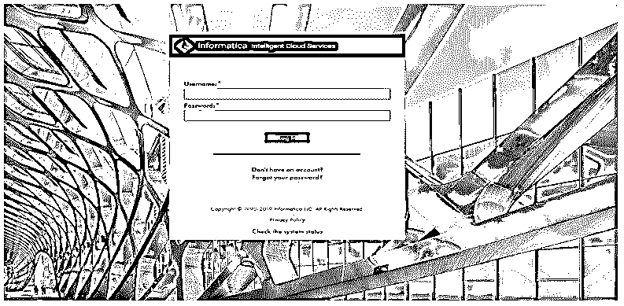

**步骤 2:** 导航到数据集成选项。

登录成功后，将出现“我的服务”控制面板。该部分或仪表板视图基于 Informatica 的许可订阅选项。

在“我的服务”部分选择数据集成，以进入数据集成工具仪表板。仪表板中显示的其他选项卡(如 Administrator、DiscoveryIQ 和 Monitor)用于配置和管理数据集成资源。

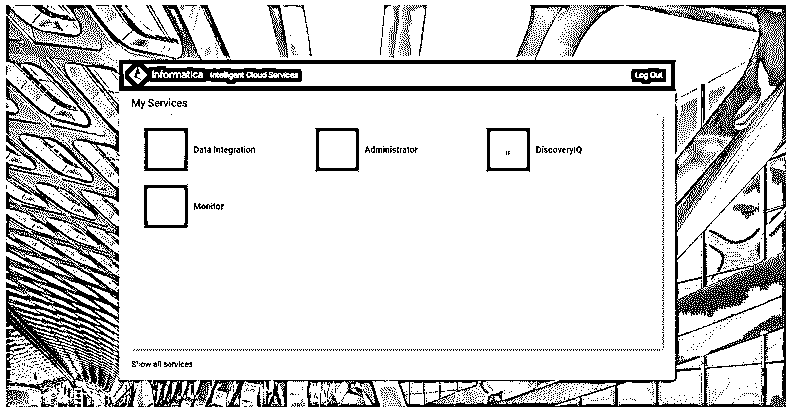

**步骤 3:** 从数据集成仪表板中选择新选项。

数据集成主页显示了资源和工件创建的各个部分以及工件的概要。

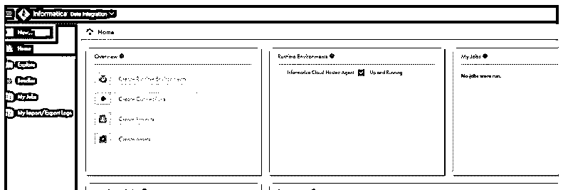

**步骤 4:** 从“新资产”选项创建新的映射。

“新资产”窗口显示多个选项，如创建新任务、映射、模板、任务流和组件。新的映射是使用有助于提取、转换和加载(ETL)过程的内置特性和功能的数据集成流的设计。

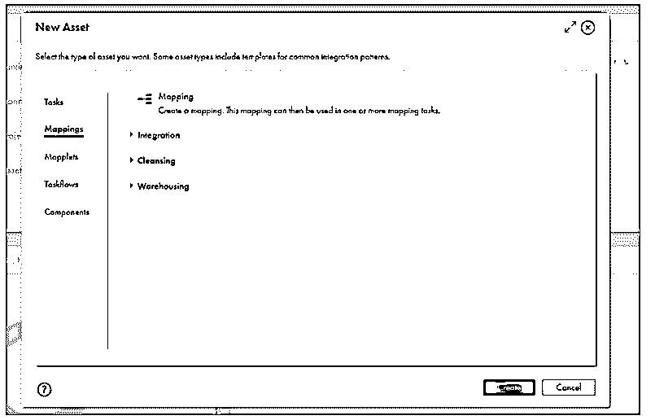

**第五步:**用有意义的词给映射命名。

映射窗口显示默认视图，在设计面板中显示源组件视图和目标组件视图。它显示了允许用户输入名称、选择位置和输入映射描述的属性部分。

我们将在名称文本框中提供映射的名称“DemoMapping ”,然后单击顶部显示的“save”按钮，将名称应用到映射。

默认情况下，它会在映射窗口的顶部显示“无效”标签。这表明源和目的地托盘没有配置正确的连接。一旦应用连接配置，它将显示为“有效”。

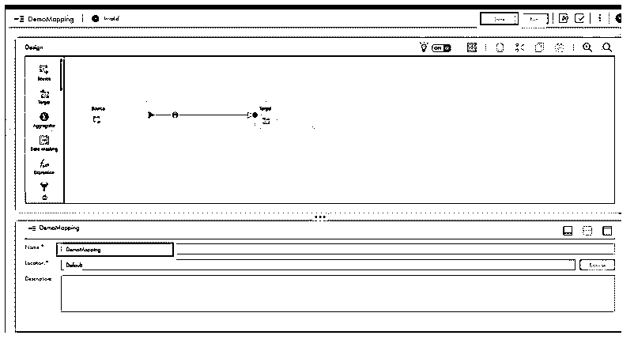

**第六步:**将表达式转换添加到映射中。

由于表达式转换是连接的和被动的转换，它需要添加在源和目标计算机之间的映射里面。“表达式”选项位于“设计”视图的左侧，列为第四个选项，带有函数 f(x)图标。

要将表达式添加到映射中，请选择并将其拖动到源之后的位置，如图所示，然后保存映射。Informatica 会自动将它与源组件和目标组件连接起来。底部显示的表达式属性为常规、传入字段、表达式和高级属性提供了配置选项。

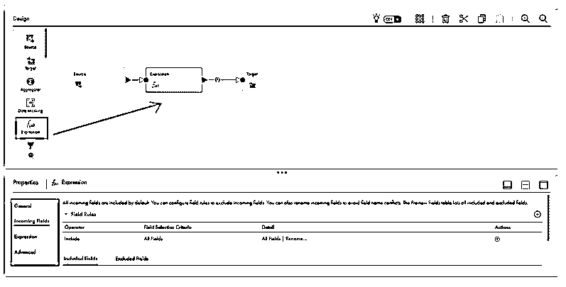

**步骤 7:** 在下一步中，我们将编写表达式转换，将表示名字和姓氏的两个字符串值连接到名为 FullName 的输出字段，以显示表达式的用法。

在属性中选择表达式选项，然后单击+图标创建新的，方法是选择字段类型作为输出字段，输入名称作为全名。选择字符串类型并提供精度 20 来定义输出字段大小。

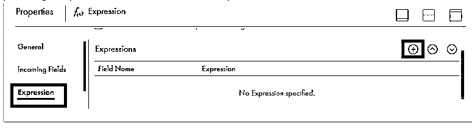

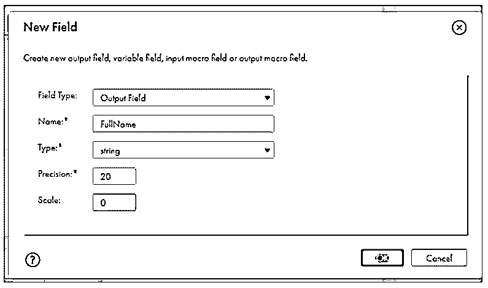

接下来，我们将使用表达式选项中的字符串函数为值分配一个固定的字符串值，以配置输出字段。

选择表达式部分中显示的配置选项。

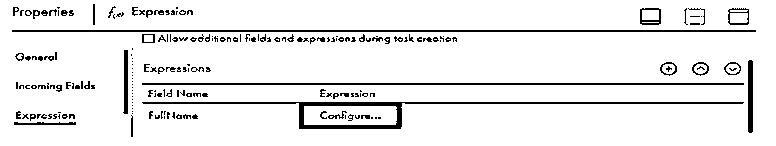

接下来，要在表达式中应用字符串函数，请在字段表达式窗口的第二个下拉列表中选择“内置函数”选项。

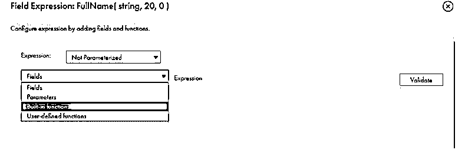

接下来，从列表中选择字符串选项，后跟“fx concat”函数。一旦选择了 concat 函数，它将出现在表达式编辑器窗口中。对于示例表达式，我们在 Concat 函数参数中输入“John”作为字符串 1，输入“Smith”作为字符串 2。

下一步是通过单击 validate 按钮来验证表达式。如果没有语法问题，将出现带有“表达式有效”消息的绿色复选框，如下图所示。如果有任何问题，您可以在表达式编辑器中修复并再次验证它。

一旦该字段的表达式有效。单击确定返回表达式的属性视图。该表达式可与任何输入端口或可用端口字段一起用于数据操作操作。

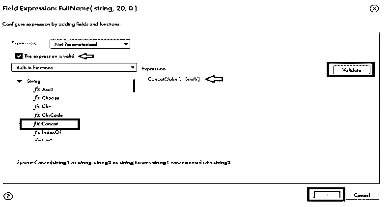

在“表达式属性”窗口中，将显示字段级表达式。保存映射以应用表达式。

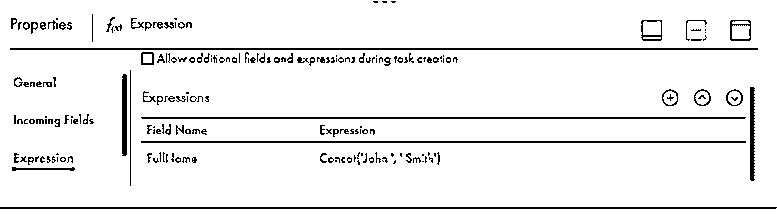

我们已经完成了如何在 Informatica 中执行表达式。

输出或可变端口可用于将转换后的数据传播到后续转换或映射中的目标系统。

类似地，有各种方法来使用基于业务需求和根据目标系统实现的表达式。

### 结论

表达式转换对于开发定制业务逻辑并应用它来转换源数据并将其加载到目标系统上非常有用。因为各种各样的特点。这种转换是信息映射中最常用的转换，用于复杂的数据操作。

### 推荐文章

这是一个信息表达转换的指南。这里我们讨论的是简介以及如何在 informatica？您也可以看看以下文章，了解更多信息–

1.  [信息中的映射](https://www.educba.com/mapping-in-informatica/)
2.  [信息中的路由器改造](https://www.educba.com/router-transformation-in-informatica/)
3.  [信息转换](https://www.educba.com/transformations-in-informatica/)
4.  [信息转换与示例](https://www.educba.com/transformations-in-informatica-with-example/)

