# 信息查找

> 原文：<https://www.educba.com/lookup-in-informatica/>

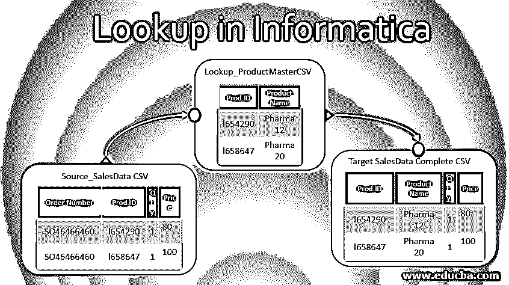

## 信息检索导论

Informatica 中的 Lookup 是一种转换机制，它使用源值来查找参考值，以完成目标负载或业务数据验证的数据集。Informatica power center 是广泛使用的 ETL 工具，具有多种转换功能，Informatica Cloud 是 Informatica 公司提供的最新版本的数据集成产品。

查找是重要的转换之一。属于被动转化范畴。Lookup Transformation 可以处理 Lookup 引用检查，并从平面文件、数据库表、视图和基于 saas 的云应用程序(如 Salesforce)返回数据。

<small>Hadoop、数据科学、统计学&其他</small>

Informatica Integration service 根据源字段值(也称为查找端口)和数据集成管道开发期间配置的查找条件来查询查找源。

流行的 Informatica Power center 有几个版本。随着云技术的出现，Informatica cloud 越来越流行，并成为行业中数据集成的领先工具之一。在本文中，我们将讨论 Informatica Cloud 中的查找转换。

### 查找转换的类型

可以根据源类型、连接类型和缓存类型对查找转换进行分类。

让我们从基于源类型的查找转换开始；主要有 3 种类型。

**来自 Salesforce 的字段查找**

*   Informatica cloud 在与 Salesforce CRM 应用程序集成时具有用于参考字段查找的查找功能，这是 Informatica cloud 的数据同步服务中的现成功能。

**从平面文件中查找**

*   查找源是平面文件，最好是逗号分隔的 CSV 文件。
*   首先，从存储库中选择平面文件的模式或文件定义。
*   或者，在为模式定义创建转换时导入文件。
*   Informatica power center 设计人员使用平面文件向导来处理查找。

**从 RDBMS 中查找，**

*   查找的来源是一个表。
*   Informatica 通过连接器或 ODBC 驱动程序与数据库连接。
*   它连接并获取查找引用表的表模式定义。

现在我们将讨论基于连接类型的查找类型。有两种类型。

**连接查找**

*   连接查找是 Informatica cloud 的 ETL 管道映射的一部分。
*   它接收源值，处理查找转换，并将数据返回到管道流。
*   连接的查找通过查找端口连接。
*   如果没有匹配的场景，则返回默认值。
*   它可以返回多个列作为查找转换。

**未连接查找**

*   未连接的查找转换未连接到直通源或目标。
*   复选框选项可以在查找转换的“常规”选项卡中管理它。
*   Informatica cloud 通过只向调用转换返回一个匹配值来管理查找转换。

此外，查找属性的高级选项卡中提供了查找缓存选项，可对其进行配置以优化流性能。

### 信息云中查找的业务场景

现在，当我们理解了 Informatica 中的查找转换后，让我们详细讨论在使用 Informatica Cloud 开发数据集成管道时，这种转换有哪些有用的业务场景和技术需求。

**1。字段查找**

*   由于 Informatica cloud 高度用于 Salesforce 集成，查找功能用于根据查找条件获取 SalesForce Ids 或相关字段。

**2。从数据库**获取参考值

*   基于源中的值从查找引用中检索值。
*   示例:源具有 CustomerID，从 CustomerAddressLookup 表中检索客户电子邮件。

**3。业务验证**

*   根据查找引用验证数据，以符合业务规则或数据集成管道中的合规性。
*   示例:通过查找基准评级数据来检查产品评级得分。

**4。计算列创建**

*   从查找引用中检索值并在计算中使用它，然后生成计算值。
*   示例:通过折扣百分比数据计算零售企业产品的折扣价。

### 信息云中的查找转换示例

这个例子将展示 Informatica Cloud 或最新的 Informatica 智能云服务中的逐步方法，

我们将讨论一个示例场景，从源 SalesData CSV 文件的本地 CSV 文件中查找产品名称，以生成另一个目标 CSV 文件，该文件将包含带有完整产品名称的订单数据。这将是一种关联查找方法。

在进入 Informatica cloud 控制台之前，让我们使用 ETL 映射规范来理解源数据、查找数据和预期的目标数据，这些数据在下表中有所表示。

| **源文件(平面文件)** |
| 文件名 | 列名 |
| SalesData.csv | 序号 |
|  | CustomerId |
|  | 交易日期 |
|  | 产品 id |
|  | 数量 |
|  | 价格 |

| **目标(平面文件)** |
| 文件名 | ColumnName |
| SalesDataComplete.csv | 序号 |
|  | CustomerId |
|  | 交易日期 |
|  | 产品 id |
|  | 产品名称 |
|  | 数量 |
|  | 价格 |

| **查找源(平面文件)** |
| 文件名 | 列名 |
| ProductLookup.csv | 产品 id |
|  | 产品名称 |
|  | 产品说明 |

现在我们将一步一步地讨论在 Informatica cloud 中使用查找来开发映射的方法。

*   通过您的 Informatica 凭证登录到您的 Informatica 云实例。

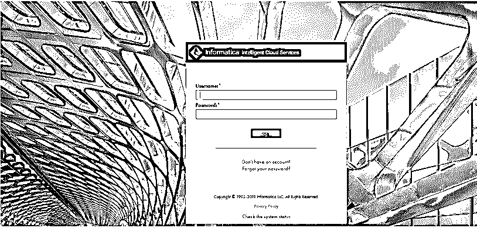

*   成功登录后，它将显示数据集成的登录仪表板。

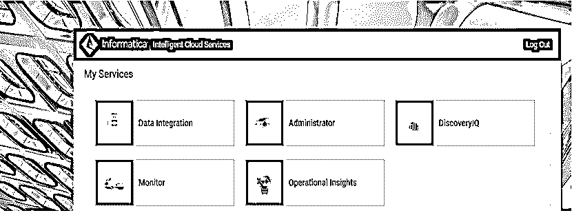

*   选择数据集成选项以查看详细选项。这将提供创建新的映射或项目。

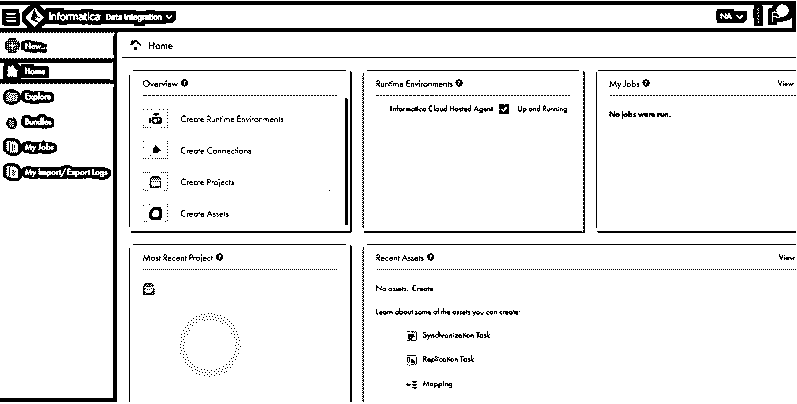

*   接下来点击 New ->Mappings->Create 来创建一个新的映射。

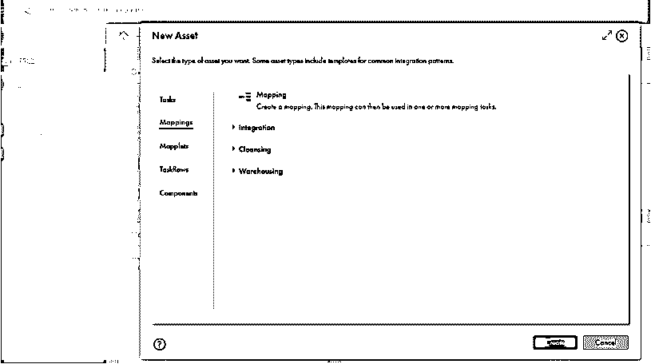

*   它将在下一个屏幕上显示 Informatica designer 视图。

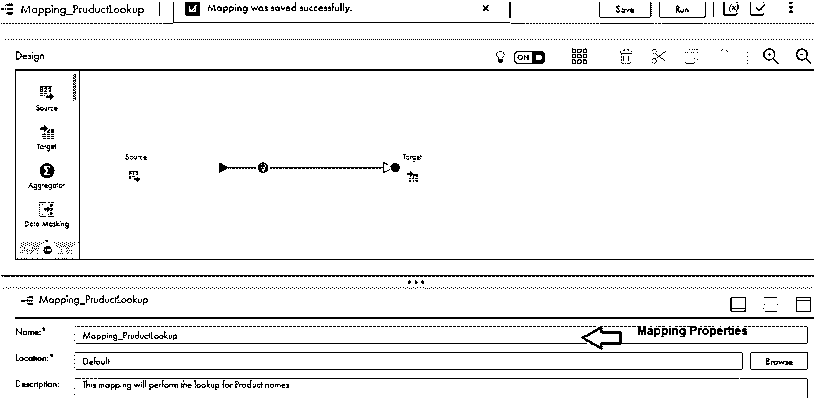

*   在映射属性部分提供一个有意义的名称和正确的描述。
*   接下来，我们将从设计器选项向管道添加查找转换。

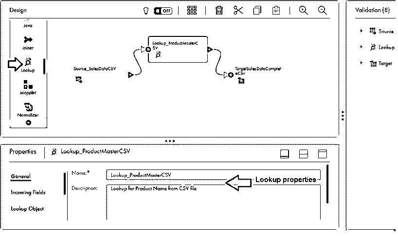

*   接下来，我们将配置源、查找和目标属性来完成映射。
*   源配置，我们将通过 properties 选项卡使用本地 CSV 文件 SalesData.csv。
*   **源数据** : SalesData.csv

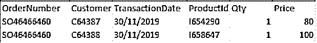

*   为平面文件源创建连接是属性配置的先决任务。
*   可以从数据集成视图的主页部分创建新的连接，并且可以使用 Informatica Administration viewer 现有的连接。
*   平面文件连接的配置依赖于 Informatica 安全代理服务，它是一个可下载的组件。在使用连接之前，需要在 Windows 或 Linux 系统上进行设置。
*   安全代理服务应处于启动和运行状态，以便连接正常工作。
*   查找数据示例:ProductLookup.csv

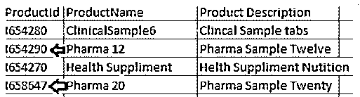

*   查找配置，我们将选择用于查找的源文件、相关字段，并在查找属性选项卡中添加一个条件。
    *   为 ProductLookup CSV 文件配置平面文件连接
    *   使用= operator 选项为 ProductID 提供条件。

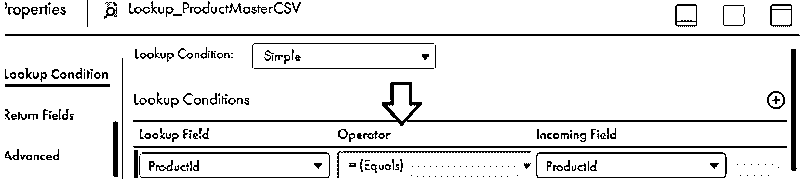

*   目标配置，我们将为 SalesDataComplete.csv 文件配置目标属性。
    *   同样，配置目标连接属性和映射字段。
    *   创建传入字段到目标字段的字段级映射。

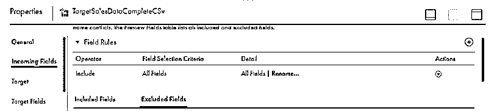

*   一旦映射完成，
    *   保存并运行映射，以在 SalesDataComplete.csv 文件中获得目标结果。
    *   此外，您可以创建一个任务，通过调度程序在 Informatica 中运行映射。

作业成功运行后，目标平面文件将填充相关数据。

*   **目标数据:**销售数据完成. csv

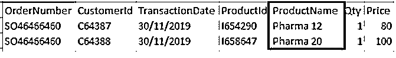

它完成了信息云中查找转换的示例。

### 结论

随着 Informatica 中的查找转换随着新版本的增加而发展，检查官方 Informatica 文档版本或产品文档的更新很重要。

### 推荐文章

这是一个信息查找指南。这里我们讨论查找转换的类型和信息中查找的例子。您也可以参考我们的其他相关文章，了解更多信息——

1.  [信息转换与示例](https://www.educba.com/transformations-in-informatica-with-example/)
2.  [在 MongoDB 中查找](https://www.educba.com/lookup-in-mongodb/)
3.  [信息架构](https://www.educba.com/informatica-architecture/)
4.  [信息领域的职业](https://www.educba.com/careers-in-informatica/)

