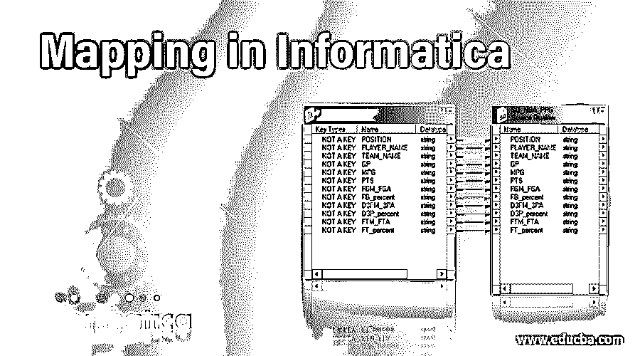

# 信息制图

> 原文：<https://www.educba.com/mapping-in-informatica/>

## 信息学中的映射介绍

Informatica 是一家专注于数据集成产品的软件开发公司。ETL Informatica 应用广泛，也称为 ETL 的 Informatica PowerCenter 工具，具有基于业务需求从异构资源和流程中提取数据的能力。Informatica 中的映射是指通过一组转换从源到目标的结构化数据流。这些转换由定义数据流和将数据加载到目标对象的规则组成。由于映射是 Informatica 的基本元素，因此集成服务运行在映射中配置的会话。

映射包括以下一组对象:

<small>Hadoop、数据科学、统计学&其他</small>

*   **源定义:**定义了源的结构和特征、数据类型、源的类型等。
*   **转换:**定义如何对源进行转换，针对不同的功能使用不同的转换对象
*   **目标定义:**定义转换后的数据要加载到的最终目标。
*   **链接:**它将源、转换和目标连接到集成服务，这有助于在转换上移动数据。

每个映射必须包含从映射组件读取数据的输入和将数据写入映射组件的输出。

### 什么是信息学中的映射？

考虑一个例子:一个名为“B Saideep Reddy”的雇员出现在源系统中，而该雇员在目标系统中的必需姓名是“B Saideep”。因此，要执行这种转换，我们需要映射。作为 Informatica 对象的映射定义了源数据在到达目的地目标对象之前如何被修改或转换。这些操作只能在映射级别完成。映射有助于在列级别为每一行定义转换，在一个映射中，可以处理多个源和目标。

### 映射的组成部分

下面是构成映射的各种组件，

*   映射源
*   映射目标
*   映射参数和变量
*   Mapplets
*   数据对象操作
*   转换
*   片段

它还包括各种转换源、目标、各种转换和用户定义的函数。

**1。数据对象操作**是包含在源或目标上执行运行时操作所需的属性的存储库对象。

**2。转换**在将数据写入目标之前进行修改；为不同的功能执行不同的转换对象。

**3。mapplet**包含一组转换，source 和 targets 是可重用的对象，包含一组可以在多个映射中使用的转换。

**4。段**包含映射、mapplet、规则或虚拟存储过程中的一个或多个对象。

**5。映射源**是从中获取源数据的对象。源可以是数据库文件、XML、平面文件或 COBOL 文件

**6。映射目标:**这是目标数据的目的地，被转换的数据被加载。目标源可以是数据库文件、XML 或平面文件。

源和目标的类型可以不同。

**7。映射参数和变量**帮助创建帮助定义和存储临时值的临时对象。这些是可选的用户定义的数据类型，它们是为映射而创建的，可以根据需要进行引用和更新。

*   像其他编程语言一样，Informatica 以自己的方式定义参数和变量。但是 Informatica 不是基于代码的语言。映射参数和变量特定于映射，不能在另一个映射中引用。
*   一旦赋值，其值在整个映射过程中保持不变的数据类型就是映射参数。
*   映射参数表示一个常量值，该值可以在映射运行时更改。这些参数可用于更改文件目录、连接、任务属性、端口列表和链接以及表达式组件的值。

### 系统参数和用户定义参数的配置

*   系统参数是数据集成服务的内置参数，它定义数据集成服务存储源文件、日志文件、目标文件、缓存文件、临时文件和拒绝文件的目录。管理员在管理工具中定义数据集成服务的默认值。
*   用户定义的参数是在转换、映射、数据对象和工作流中定义的参数。创建用户定义的参数，以便使用不同的连接(如平面文件、临时文件、高速缓存文件、端口、表达式或引用表值)重新运行映射。
*   可以配置参数以在运行时链接端口；可以分配参数以将数据对象更改为读取、写入或查找转换。可以通过为映射分配参数集或参数文件来覆盖参数。包含参数的 XML 文件是一个参数文件。当我们运行映射时，Data Integration Service 使用在插图或文件中定义的值，进而覆盖在转换、映射、mapplet 或工作流中配置的默认参数值。
*   要使用映射参数，必须在每个 mapplet 或映射中声明它。则在运行会话之前，将定义映射参数的值。映射参数可用于增量提取数据。它还可以通过在源限定符转换中应用源过滤器来确定增量提取数据的开始时间戳和结束时间戳。
*   作为常数值的映射参数在整个会话中保持其值。例如，用户希望使用同一个会话单独提取学生记录。用户可以创建代表单个学生的映射参数，而不是为每个学生创建单独的映射。则可以在源过滤器中使用参数来提取或转换特定学生的数据。在运行进程之前，需要输入参数值。

要重复使用相同的映射来提取其他学生的学生记录，用户可以在文件中输入参数的新值，然后运行进程。用户还可以为每个学生创建一个参数文件，并使用 pmcmd 使用不同的参数文件运行会话。使用参数文件，可以减少创建多个映射和会话来提取不同学生记录的开销。

**1。**当用户希望每次运行会话时使用相同的映射参数值时，将使用相同的参数文件来运行每个会话。

**2。**当用户想要改变会话之间的映射参数值时，可以遵循以下步骤。

*   在会话之间更新参数文件。
*   创建不同的参数文件并配置会话
*   从会话属性中删除参数文件。

### 结论

我们可以结束这篇文章了。我们已经看到了如何在 Informatica 中进行映射，映射中需要的组件，映射参数以及如何管理这些参数。

### 推荐文章

这是一个信息制图指南。这里我们讨论 Informatica 中映射的介绍，详细讨论构成映射的各种组件。您也可以浏览我们的其他相关文章，了解更多信息——

1.  [在信息中查找](https://www.educba.com/lookup-in-informatica/)
2.  [信息中的 Joiner 变换](https://www.educba.com/joiner-transformation-in-informatica/)
3.  [计算机化 ETL 工具](https://www.educba.com/informatica-etl-tools/)
4.  [信息中的路由器改造](https://www.educba.com/router-transformation-in-informatica/)

