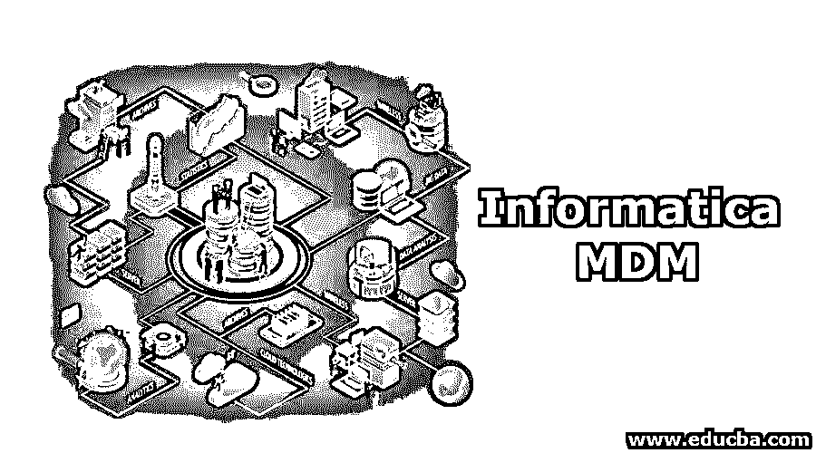
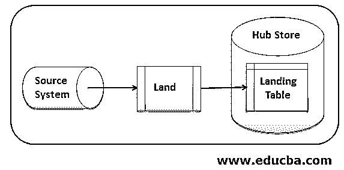
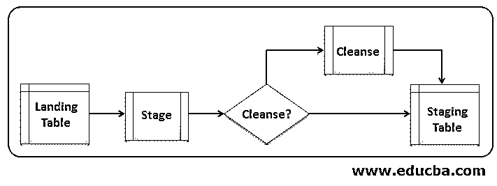
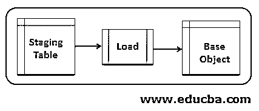
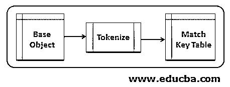
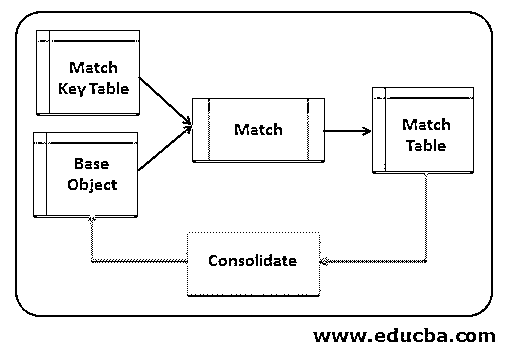
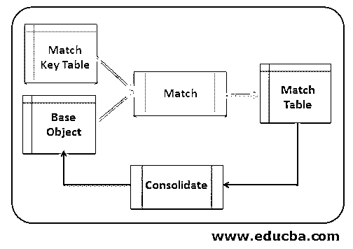
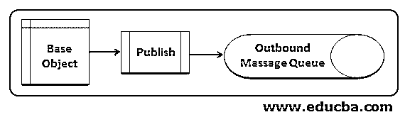
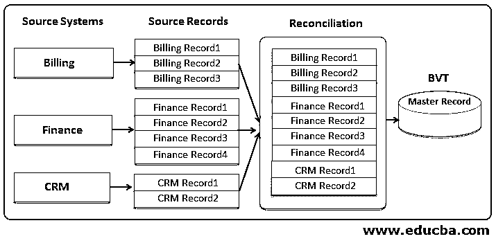

# MDM 计算

> 原文：<https://www.educba.com/informatica-mdm/>

## 信息管理导论

Informatica 主数据管理是 Informatica MDM 的缩写。在数字世界中，每天都会产生大量的数据，处理产生的数据非常重要。就正在生成的数据量而言，2019 年被命名为主数据管理年。人工智能的发展极大地帮助了行业思考他们的数据资源。当市场随着软件和报告过程的频繁变化而波动时，对组织来说变得困难。MDM 提供了更好的方法来帮助这些组织在这个艰难的阶段提高业务质量。

### 信息 MDM 过程

在过去的几年里，Informatica 发布了相当多的热门产品，主数据管理 MDM 就是其中之一。其他比较流行的还有 Power Center，B2B 数据交换，TDM 测试数据管理等。顾名思义，MDM 是识别组织拥有的最重要的信息。

<small>Hadoop、数据科学、统计学&其他</small>

通常，Informatica MDM 的数据可以通过两种方式进行处理。它们是批处理和实时处理。MDM 可以应用批处理和实时处理的组合，这取决于组织的需求。让我们在下图的帮助下了解批量处理的详细步骤:

#### 1.陆地

将文件从外部来源发送到 informatic MDM hub，再发送到商店所需的登录表。因此，基本上要管理的数据是从这里的外部来源收集的。这一阶段被称为着陆，因为数据被收集在 hub store 中的着陆表中。这个过程是由独立的 ETL 工具执行的。

#### 2.阶段

在这里，从着陆的表中读取数据，并执行任何类型的清理适用的或指示的操作。然后将清理后的数据加载到相应的表中，该表称为临时表。如果启用或更改了数据检测功能，则启用数据捕获 CDC，然后仅更改，并捕获新记录，留下未更改的记录。

#### 3.负荷

在此步骤中，临时表的数据被加载到相应的中心存储表中，通常称为基本对象或依赖对象。信任规则用于确定可靠的数据。

#### 4.标记化

匹配密钥为匹配密钥表生成令牌，匹配过程随后将使用该令牌来标识基础对象的匹配候选对象。

#### 5.比赛

在这个阶段，根据匹配的规则匹配记录。使用单独的标志来标识重复的记录。

#### 6.巩固

合并记录是通过合并重复记录的值生成的。该合并记录包含来自源记录或阶段表记录的最可靠的单元格值。

#### 7.出版

将 BVT 发布到其他所需的系统。对于 Informatica MDM 中的批处理，实现是作为存储的数据库来执行的，它可以由 hub 控制台或任何其他自定义编写的脚本来调用。

#### 8.实时处理

**实际上:**时间处理，外部应用程序将通过一个称为服务集成框架 SIF 的接口与 Informatica MDM hub 进行交互。SIF 配备了多个 API，这些 API 将与 MDM hub 进行交互，用于读取、清理、插入、匹配、更新等。每当数据源中的记录有更新时，或者记录已从源系统中删除时，都可以使用实时处理。因此，实时增量 mdm 处理可用于处理中心存储的增量负载。增量加载就是处理一组新添加的数据，或者更新或删除源数据中的数据。

### Informatica MDM 流程的优缺点

下面是 Informatica MDM 过程的一些优点和缺点。

**优点:**

Informatica MDM 流程有许多优势。下面列出了其中的一些:

*   Informatica MDM 确保组织安全无虞。
*   这为关键的信息业务问题提供了解决方案。
*   它提供了各种信息来源和所需的商业理念。
*   这保证了组织的成长和成功。
*   这为重复的、不同的、冲突的数据源提供了数据的单一视图。
*   这提供了其与客户、产品、供应商等关系的 360 度视图。
*   提供全面的 MDM 解决方案，对业务非常灵活。
*   我们可以很容易地安装和操作，也很容易扩展到多个领域。

**缺点:**

*   未设计群集的配置。
*   基于数据的大小和资源的可用性，他们可能对资源非常苛刻。

### Informatica MDM 的主要特征

Informatica MDM 流程有各种关键特性。它们中的一些在本文的解释部分中有所涉及，如负载、平台、阶段、匹配、合并等。在这里，我们将看看其他一些关键功能，如入站和出站数据流。

主 Informatica MDM 入站数据流被恰当地称为协调。这里，信息从一个或多个源系统获得，这些源系统甚至可以是第三方系统。然后，Informatica MDM hub 对数据的多个版本进行协调，事实的最佳版本将作为主文件中的记录到达。主文件中的数据可以来自单个记录，也可以来自不同记录的复合数据。

Informatica MDM hub 的出站流称为分发。一旦建立了主记录，Informatica MDM 将准备把数据分发给其他应用程序或数据库。

#### 信息管理的使用

Informatica MDM 的一些主要用途如下:

*   Informatica MDM 将授权受影响的组织开发他们的所有业务，帮助愿意合并其常规业务关键数据的业务用户，即使是在将数据分布到各个组织之后。
*   Informatica MDM 的应用程序模型方法从用户集成开始，然后转向业务推理，最后转向数据模型。

### 结论

因此，在本文中，我们看到了流行的信息产品之一:informatica MDM。MDM 可以批处理，也可以实时处理，实时处理主要处理增量负载。在本文中，我们已经看到了 Informatica MDM 的主要特性和优势。

### 推荐文章

This is a guide to Informatica MDM. Here we discuss Introduction to Informatica MDM and its top Key Features along with advantages and disadvantages. You can also go through our other suggested articles to learn more –

1.  什么是信息架构？
2.  [ETL 测试工具概述](https://www.educba.com/etl-testing-tool/)
3.  [具有优势的信息 ETL 工具](https://www.educba.com/informatica-etl-tools/)
4.  [Informatica vs . Datastage–主要差异](https://www.educba.com/informatica-vs-datastage/)

