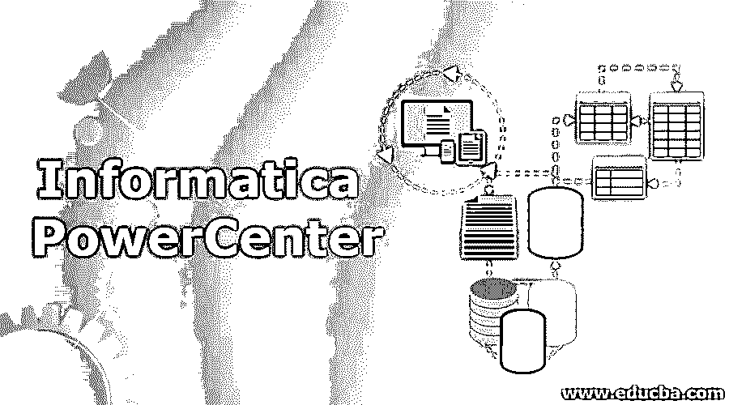

# PowerCenter 计算

> 原文：<https://www.educba.com/informatica-powercenter/>

## 信息动力中心简介

Informatica PowerCenter 被定义为 ETL(提取、转换和加载)工具，广泛用于创建行业中使用的数据仓库。Informatica PowerCenter 有各种组件，用于从数据源提取数据，然后根据业务需求将数据转换成某种形式，然后将数据加载到目标数据仓库。与 Informatica PowerCenter 相关的主要组件是服务器、客户端工具、存储库和存储库服务器。ETL 层由存储库服务器和 PowerCenter 服务器组成，用于 ETL 处理。

### 解释信息动力中心

Informatica PowerCenter 被定义为元数据类型集成平台，有助于加快负责进行数据相关操作并改善其业务运营的数据集成项目的速度。使用该平台，项目完成率呈指数级增长，并有助于减少人工工作量。开发人员广泛使用该产品来执行与数据相关的操作，并立即交付项目。Informatica PowerCenter 平台使用机器学习概念来管理和监控不同位置和域的数据部署。工作流由该工具管理，工作流监视器广泛用于此目的。Informatica PowerCenter 工具从源获取数据，转换数据，然后将数据发送到目标系统进行与数据相关的操作。

<small>Hadoop、数据科学、统计学&其他</small>

Informatica PowerCenter 是用于数据集成、数据仓库、数据分析、应用程序迁移和数据治理的工具。除了所有这些特性之外，该工具还有其他一些重要特性，如下所述:

#### 信息动力中心的主要特征

以下是下面给出的特征:

*   **IT 协作和业务使用:**该工具有利于使用敏捷方法，并被关注准时交付的组织所使用。另一个特征是数据是安全的，并且可以以可信的方式传输，以便组织可以将数据直接用于他们的用途。
*   **易用性、自动化和可重用性:**一旦从源位置获取数据，就会对其进行转换，因此该工具具有一种预先构建的转换技术，无需花费时间即可转换数据并将其发送到目标系统。该工具是无代码的，并且在工具中提供了图形支持，这使得该工具方便易用。
*   **性能和可扩展性:**该工具支持高可用性、分布式处理、网格计算和负载平衡等特性。该工具还能够进行下推优化和动态分区。
*   **支持实时监控:**该工具提供的数据不占用时间，并且实时地为进一步的操作提供数据，并有助于其他数据分析操作。该工具的数据处理可用于以客户为中心的应用。
*   **对云应用的支持:**该工具可以连接到云应用，无缝地执行与数据相关的操作。该工具能够连接到云平台，如亚马逊网络服务和微软 Azure。
*   **通用连接:**数据可以集成到任何来源，并且可以通过该工具轻松访问数据。该工具具有高性能，使用连接器有助于该工具非常容易地连接到任何源。这个特性使得 Informatica PowerCenter 适合于在项目中依赖数据相关操作的组织。
*   **数据验证测试:**数据在该工具中反复测试。自动化流程是一种持续监控数据并检查数据转换操作和开发的工具。该工具还检查工具的生产环境和工作环境。

### 信息动力中心产品

Informatica PowerCenter 提供了许多功能；业务管理员和其他个人团体也使用这些功能。下面讨论了一些产品:

*   **元数据管理器:**该产品用于将所有元数据转换成某种统一类型的集成目录。使用该工具可以进行数据集成。
*   **开发能力:**该产品能够简化管理工作，提高开发速度，可用于学期制。
*   **客户端工具:**开发人员使用客户端工具来管理存储库和报告元数据。客户端工具还用于定义可在运行时属性中使用的映射，并监控用户会话及其执行。
*   **Informatica power center Repository:**该产品用于存储数据和创建的映射，源和目标的详细信息可以存储在该产品中。
*   **服务器:**这是执行所有动作和任务的产品。服务器发布源和目标之间的连接，从源获取数据，应用转换技术，并将数据加载到目标系统中。

### 信息动力中心的优势

在下一节中，Informatica PowerCenter 的一些优势如下:

*   该工具能够以受控方式进行适当的数据集成、数据转换和数据生成，因此使用该工具不会产生任何数据浪费。
*   Informatica PowerCenter 工具并不昂贵，行业可以很容易地使用它来为他们的项目形成数据仓库。
*   与其他类似工具相比，该工具的成功部署率最高。这个工具的成功率接近 100%。
*   该工具的客户是忠诚的，因为该工具提供了出色的客户支持服务，并帮助客户有效地使用该工具。
*   该工具不使用任何第三方调度程序。该工具有自己内置的调度程序。

### 结论

Informatica PowerCenter 是一个用于数据集成操作的强大工具，用于为行业创建数据仓库。该工具无需花费时间进行数据转换操作，并将数据交付给行业，以便可以在项目中创建和使用数据仓库。

### 推荐文章

这是 Informatica PowerCenter 指南。在这里，我们还讨论了简介和 Informatica PowerCenter 产品及其优点和功能。您也可以看看以下文章，了解更多信息–

1.  [演讲 Vs 信息学 PowerCenter](https://www.educba.com/talend-vs-informatica-powercenter/)
2.  [信息学与数据阶段](https://www.educba.com/informatica-vs-datastage/)
3.  [信息转换](https://www.educba.com/transformations-in-informatica/)
4.  [示例信息](https://www.educba.com/transformations-in-informatica-with-example/)

