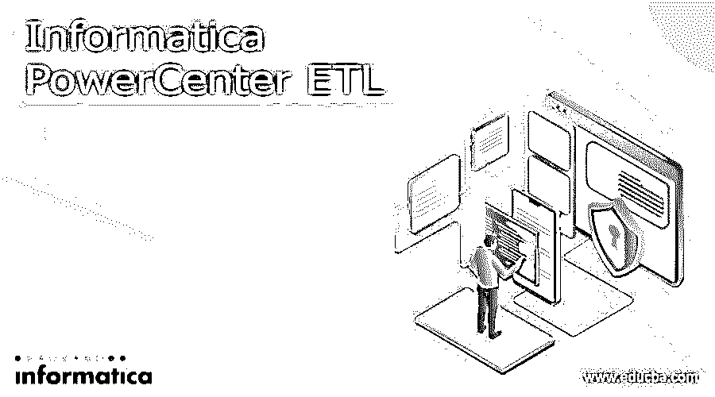

# 计算机 PowerCenter ETL

> 原文：<https://www.educba.com/informatica-powercenter-etl/>

## Informatica PowerCenter ETL 简介

Informatica PowerCenter ETL 是一个软件组织的开发，它有助于数据集成的产品。此外，它还提供主数据管理、数据质量、数据副本、数据虚拟化、ETL、数据屏蔽等产品。Informatica PowerCenter ETL 或数据集成工具是一种广泛使用的工具，一般来说，当用作 Informatica 时，它涉及 Informatica PowerCenter for ETL 的工具。

### 信息的定义

Informatica PowerCenter ETL 广泛用于开发企业数据仓库时使用的转换、提取和 ETL 加载工具。Informatica PowerCenter 中的元素有助于从数据源获取数据，根据业务的先决条件修改数据，并将其存储在指定的数据仓库中。

<small>Hadoop、数据科学、统计学&其他</small>

### 理解信息

它用于数据的集成。它提供了关联和检索来自不同来源和数据处理的数据的能力。例如，您可以关联到 SQL 的服务器数据库和 Oracle 的数据库，以便在第三个系统中混合数据。Informatica PowerCenter 的最新版本是 9.6.0。不同的 PowerCenter 版本如下所述:

*   标准版
*   高级版
*   高级版

### 为什么使用它？

Informatica 的常规应用是:

*   公司使用它来从当前的遗留系统(如大型机)转移到最新的数据库系统。因此，可以将其现有数据转移到系统中。
*   建立数据仓库的公司需要 ETL 工具将数据从生产系统转移到数据仓库。
*   利用 Informatica 可以完成对来自几个不同系统的信息的吸收，如许多数据库和基于文件的系统。
*   它可以用作清理数据的工具。

它的好处不仅仅是提供了广泛的产品版本集合。因此，消费者可以根据需要选择特定的版本。在 Gartner 魔力象限的列表中，Informatica 被一致强调为数据产品领导者集成的产品。

### 信息的实时应用

很长一段时间以来，公司都用 IT 系统主机来支持他们的流程，其中有几个是专门用来划分部门需求的。随着市场形势和公司程序变得越来越复杂，系统不能再在孤岛中运行。组织的成功率在很大程度上取决于它以一种方便的方式进行平衡沟通的能力。准时的组织通过选择 IT 解决方案和业务以及高等级的方法来确保统一、方便的通信，这些方法不断地提供关键的业务过程，以获得关于客户、合作伙伴和产品的某些可靠的、可访问的数据。这使得企业能够实时地对新出现的消费者需求、不断变化的市场环境和不断演变的竞争风险做出积极、稳定和更经济的响应。

信息权力中心有三个重要用途。它们还包括 Informatica PowerCenter 服务器、Informatica PowerCenter 客户端工具和 Informatica Power Center 存储库。它的消费者工具是为了帮助 Informatica 的开发人员处理以下事务而创建的。

*   映射和运行时属性
*   管理存储库
*   监控会话执行
*   报告元数据

### 特征

它的 power center 是一个数据集成企业套件，具有很好的可访问性，是完全可扩展和有效的性能，为组织中概述的每个数据集成提供了基础。Informatica PowerCenter 的特性是为开发人员、专业人员和管理员而创建的。这些产品包括:

*   元数据驱动的架构
*   开发能力
*   元数据管理器
*   一套生产力和可视化工具

### 为什么我们需要 Informatica PowerCenter ETL？

Informatica 会继续查看哪里有可访问的数据系统，在后端，您将需要执行特定的数据操作。它也可以是诸如拾取数据、改变数据等。建立在特定的规则集合上，或者便于将大量数据从一个系统存储到另一个系统。

Informatica 提供了各种各样的功能，比如对数据进行行级操作，集成来自多个结构化、半结构化或非结构化系统的数据，以及数据操作调度。它还包括元数据的特征，因此关于过程和数据的操作的数据也受到保护。

### Informatica PowerCenter ETL 的优势

Informatica 的主要优势如下:

*   有效的 GUI 界面，用于会话监控、作业调度、ETL 设计、调试、管理等。
*   排队消息
*   第三方应用程序数据
*   大型机和基于文件的数据
*   XML 和非结构化数据
*   可访问公司的各种数据源
*   关系数据
*   可以简单地适应和合并供应商提供的数据处理工具。
*   负载稳定和并行处理
*   基于 web 的单一权威点，为应用广泛的企业提供高质量的保护，同时减少管理费用
*   Grid choice 提供了一个经济实惠的解决方案，可以满足具有线性可伸缩性和高可访问性的高需求处理。

### Informatica PowerCenter ETL 的缺点

当你浏览几个网页来查找信息学的缺点时，你可能找不到任何缺点，因为缺点很少。这一部分包含了从未在任何其他文章中出现过的信息。

*   工作流监控程序缺少排序
*   在工作流监控程序中，除了分离出必需或需要的文件夹之外，别无选择
*   在存储库管理器中，不能将对象从一个文件夹移动到另一个文件夹
*   此外，您不能导入 XML 导出文件
*   此外，它包括映射，并且工作流开发也是不可能的

### 这项技术将如何帮助你的职业发展？

这项技术将有助于你的职业发展，你可以预期被选为 Informatica ETL 开发人员的初学者，然后努力工作，晋升为高级或首席开发人员。在接下来的七到十年的经验之后，你可以晋升到信息管理员或架构师的职位。此外，其他 BI 和数据仓库能力也可以为您提供额外的好处，并帮助您成为 BI 或 ETL 架构师或数据架构师。

### 结论

Informatica 可用于每一个广泛使用的平台。它提供基于云的服务，因此一个行业只需很少的结构就可以利用这个工具。Informatica 提供实时大数据版本、企业对企业数据集成(B2B)、数据集成、主数据管理、Web 服务集成以及 Salesforce 和社交媒体的连接器。

### 推荐文章

这是 Informatica Powercenter ETL 指南。在这里，我们讨论了信息的介绍，实时应用，以及优点和缺点。您也可以阅读以下文章，了解更多信息——

1.  [Informatica 开发者工具](https://www.educba.com/informatica-developer-tool/)
2.  [Informatica 云面试问题](https://www.educba.com/informatica-cloud-interview-questions/)
3.  [信息中的表达式转换](https://www.educba.com/expression-transformation-in-informatica/)
4.  [云计算](https://www.educba.com/informatica-cloud/)

