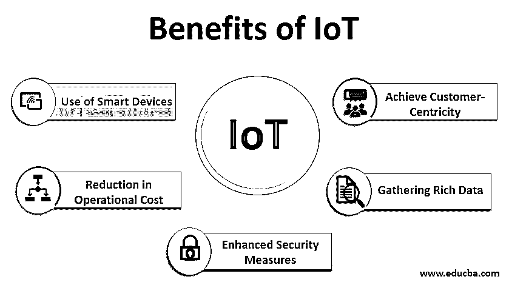

# 物联网的优势

> 原文：<https://www.educba.com/benefits-of-iot/>

## 物联网优势介绍

在研究物联网的好处之前，首先要了解物联网。在当今世界，人们对物联网这一趋势技术议论纷纷。随着世界越来越依赖互联网，互联网帮助人们在全球范围内进行交流。需要一些连接装置来满足这个目的。物联网是负责连接不同设备和收集数据的技术。物联网技术越来越多地被开发用于各种商业目的。几乎每个部门都在其业务中受益于这一趋势技术，并加以利用。

### 物联网的五大优势

在这种情况下，物联网技术在企业未来的业务中发挥着至关重要的作用。这项技术对普通人和专业人士的工作都有重大影响。物联网具有多种优势和好处，可以帮助企业和普通人简化生活。下面重点介绍了一些好处:

<small>Hadoop、数据科学、统计学&其他</small>

#### 1.实现以客户为中心

*   对于任何企业或任何组织，客户满意度是一个非常关键的因素，需要始终关注。通过使用先进的物联网技术，如移动读卡器或智能追踪器，可用于增强客户体验。通过使用移动读卡器，它可以帮助在智能手机上非常顺利地进行所有交易。
*   智能跟踪器有助于监控产品和库存。许多组织正在从物联网中获得帮助，以增强其未来业务并提高客户体验水平。不同的物联网解决方案旨在调试和解决客户的问题，以提高客户满意度。
*   当使用[物联网技术](https://www.educba.com/iot-technology/)时，设备进行交互并改进业务功能。通过使用[物联网设备](https://www.educba.com/iot-devices/)收集客户反馈，有助于改善服务，提高客户满意度。产品缺点很容易凸显，也能解决。通过使用物联网技术，可以收集定性数据并替换定量数据，这将有利于组织。

#### 2.收集丰富的数据

*   对于任何类型的组织，数据都被称为最重要的武器。这些组织在其业务中广泛使用物联网模型和方法来收集大量关于客户和公司产品的数据。
*   通过收集这些信息，组织进行不同的分析并进行深入的了解，以便他们可以提高产品质量，从而扩大业务并获得更多利润。举个例子可以更好理解。假设有一个支持物联网的汽车轮胎，可以用来监控轮胎状况和使用情况。
*   它还可以帮助跟踪轮胎的健康状况，并在轮胎出现任何故障时通知用户。物联网技术为新的业务和收入打开了新的机会之门。物联网驱动的模型有助于增加业务利润，提高投资回报，并从业务中赚取利润。

#### 3.增强的安全措施

*   物联网使访问控制系统能够为组织和普通人提供额外的安全性。在监控中使用物联网技术有助于提高组织的安全标准，也有助于跟踪任何可疑活动。在组织中，跟踪员工的活动是很有用的，可以用来维护他们的日常记录。
*   在互联网的帮助下，可以从任何地方控制它。这样，就可以达到维护组织内安全标准的目的。在企业中使用物联网技术可以提高安全标准，并有助于消除安全隐患。通过使用先进的设备，传感器和可穿戴设备可以用于建筑类型的组织，以便可以针对危险发出警报。
*   通过使用各种先进的物联网解决方案，可以帮助提高安全性，还需要一种可以自行决定的设备。这些设备应该分析数据，然后做出适当的决定。物联网技术可以被视为外部世界与商业组织和普通人之间的屏障。

#### 4.降低运营成本

*   物联网技术的进步可以帮助组织降低运营成本和其他成本，从而获得最大利润。每个组织都试图降低运营成本，但只有最大限度地利用物联网解决方案的企业才能取得成功。需要持续连接到智能设备和组织，以便降低组织的运营成本。
*   例如，在制造业中，使用物联网设备可以帮助跟踪和监控设备，还可以减少设备的停机时间，因为通过使用智能设备，可以轻松预测设备未来的故障转移或错误。通过使用先进的物联网解决方案，还可以降低行业的功耗，从而降低行业的整体成本。

#### 5.智能设备的使用

*   在所有企业中，智能设备的使用增加了微不足道的数量，并且被组织所接受。智能设备应用取得了进步，并应用于交通、酒店、医疗保健和教育等不同领域。
*   所有这些行业都在使用这些设备开展业务，并从中获得最大的优势。智能设备的使用有助于提高生产力水平，这使组织确信他们将从这些设备中获得利润。物联网设备可用于需要管理资源和对不同产品阶段进行实时监控的制造业。
*   物联网设备还用于自动化日常任务。这些设备可以用来发现系统中的技术问题，然后将它们从系统中消除。

### 结论

随着新的物联网设备的开发，它将帮助企业从这些最新的物联网技术中获得更多优势。为了改善组织，需要选择正确的物联网方法并在企业中实施。

### 推荐文章

这是关于物联网优势的指南。在这里，我们讨论物联网的五大优势的基本概述，并详细解释。您也可以浏览我们的其他相关文章，了解更多信息——

1.  [物联网的挑战](https://www.educba.com/challenges-of-iot/)
2.  [物联网应用](https://www.educba.com/applications-of-iot/)
3.  [物联网安全问题](https://www.educba.com/iot-security-issues/)
4.  [物联网项目](https://www.educba.com/iot-projects/)

