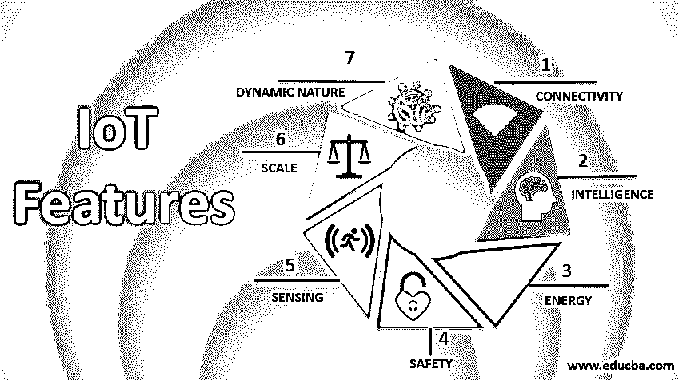

# 物联网功能

> 原文：<https://www.educba.com/iot-features/>

## 物联网功能概述

物联网(IoT)是一种连接智能设备的技术，在各个行业都有越来越多的使用案例。随着各行各业的使用越来越多，定义一个通用的[物联网生态系统](https://www.educba.com/iot-ecosystem/)标准变得十分必要。作为设计标准，任何物联网设备都具有一些常见的功能，如连接、分析、端点管理等。我们来讨论一下物联网设备的高级特征图。

### 物联网的特征

任何物联网设备都具有以下特性:

<small>Hadoop、数据科学、统计学&其他</small>

#### 1.连通性

就物联网而言，人们可以考虑的最重要的特征是连接性。物联网生态系统的相关组件(即传感器、计算引擎、数据中心等)之间没有无缝通信。)不可能执行任何适当的业务用例。[物联网设备](https://www.educba.com/iot-devices/)可以通过无线电波、蓝牙、Wi-Fi、Li-Fi 等连接。我们可以利用互联网连接层的各种协议，以最大限度地提高效率，并建立跨物联网生态系统和行业的通用连接。可能存在物联网生态系统构建在内部或内部网中的特殊情况。

#### 2.感觉

我们人类可以基于我们过去对各种事物或情况的经验，自然地理解和分析我们的环境。在物联网的情况下，为了充分利用它，我们需要读取模拟信号，以某种方式转换它，以便从中获得有意义的见解。我们使用电化学、陀螺仪、压力、光传感器、GPS、电化学、压力、RFID 等。基于特定问题收集数据。例如，对于汽车应用案例，我们使用光检测传感器以及压力、速度和图像传感器。为了让用例成功，我们需要选择合适的传感模式。

#### 3.积极参与

物联网设备将各种产品、跨平台技术和服务连接起来，通过在它们之间建立积极的联系来协同工作。总的来说，我们在区块链使用[云计算](https://www.educba.com/what-is-cloud-computing/)来建立物联网组件之间的积极互动。在行业级的情况下，物联网解决方案原始模拟数据需要根据业务能力进行采集、预处理和重新调整。根据 Google 的说法，只有 50%的结构化数据和 1%的非结构化数据用于制定重要的商业决策。因此，在设计物联网生态系统时，运营商需要考虑未来处理如此大规模数据的需求，以满足不断增长的业务需求。人们可能会将主动参与的需求与规模混淆，实际上，这意味着您的系统应该能够处理跨各种技术、平台、产品和行业的海量数据。

#### 4.规模

物联网设备的设计应该能够根据需求轻松地放大或缩小。总的来说，物联网正被用于从智能家庭自动化到大型工厂和工作站的自动化，因此用例的规模各不相同。运营商应根据其当前和未来的参与规模来设计其物联网基础设施。

#### 5.动态性质

对于任何物联网用例，第一步也是最重要的一步是收集和转换数据，这意味着可以从中做出业务决策。在这整个过程中，物联网的各种[组件需要动态改变状态。例如，温度传感器的输入会根据天气条件、位置等不断变化。物联网设备的设计应该牢记这一点。](https://www.educba.com/components-of-iot/)

#### 6.智力

在当今世界的几乎每一个物联网使用案例中，数据都被用来做出重要的业务洞察和推动重要的业务决策。我们在这些海量数据的基础上开发机器学习/深度学习模型，以获得有价值的见解。模拟信号经过预处理并转换成一种格式，在该格式上训练[机器学习模型](https://www.educba.com/machine-learning-models/)。我们需要记住基于业务需求的适当的数据基础设施。

#### 7.活力

从终端组件到连接和分析层，整个生态系统需要大量能源。在设计物联网生态系统时，我们需要考虑设计方法，以便将能耗降至最低。

#### 8.安全

物联网生态系统的主要特征之一是安全性。在物联网生态系统的整个流程中，敏感信息通过连接组件从端点传递到分析层。在设计物联网系统时，我们需要遵循适当的安全性、安全措施和防火墙，以防止数据被滥用和操纵。损害物联网生态系统的任何组件最终都会导致整个管道的故障。

#### 9.综合

物联网整合了各种跨域模型，丰富用户体验。它还确保了基础设施和运营成本之间的适当平衡。

### 结论

最佳物联网系统的扩展和设计仍然是一个活跃的研究领域，因此在实践中，并非所有的[物联网产品](https://www.educba.com/iot-products/)都具备该标准的所有功能。这主要取决于生态系统需要整合的使用案例和行业。物联网(IoT)是一种连接智能设备的技术，在各个行业都有越来越多的使用案例。随着各行各业的使用越来越多，定义一个物联网生态系统的通用标准变得十分必要。作为设计标准，任何物联网设备都具有一些常见的功能，如连接、分析、端点管理等。我们来讨论一下物联网设备的高级特征图。

### 推荐文章

这是物联网功能指南。在这里，我们讨论物联网生态系统的概述和各种最重要的功能，如传感、连接、端点管理、可扩展性等。您也可以浏览我们推荐的其他文章，了解更多信息——

1.  [物联网项目](https://www.educba.com/iot-projects/)
2.  [Salesforce 物联网云](https://www.educba.com/salesforce-iot-cloud/)
3.  [了解六大物联网云平台](https://www.educba.com/iot-cloud-platforms/)
4.  [物联网连接](https://www.educba.com/iot-connectivity/)

