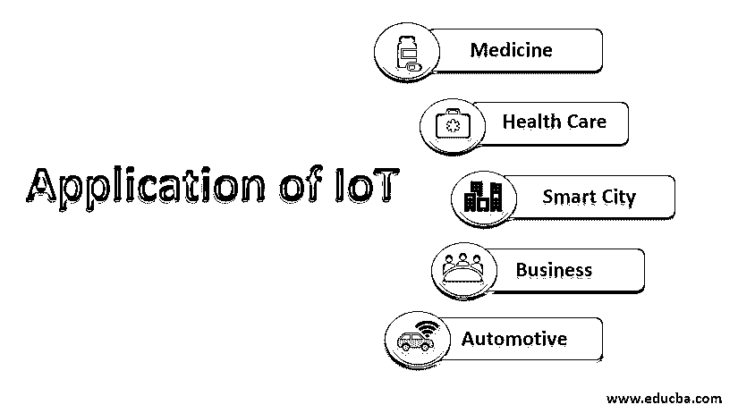

# 物联网的应用

> 原文：<https://www.educba.com/applications-of-iot/>

## 物联网简介

在了解物联网的应用之前，我们先来研究一下物联网。物联网基于“信息和通信技术”，通过嵌入式传感器与电气设备、计算机、物理对象(事物)进行交互。在数据处理能力的帮助下，“物”可以通过连接的设备收集和传输数据。物联网系统可用于支持众多应用，从自动灯等家用电器到人类心跳监测系统等生命维持设备的医疗科学。随着技术的进步，物联网变得高度可用，并用于生成大数据，商业智能工具进一步利用大数据进行决策。

### 物联网的应用

在本节中，我们将介绍物联网的众多主要[应用中的几个。物联网应用已被引入许多领域，如社交媒体、健康、交通、医疗等。物联网解决方案的优势和要求取决于行业需求。本文将讨论几个领域，如医疗保健、商业分析、交通和智能家居/城市。](https://www.educba.com/applications-of-iot/)

<small>Hadoop、数据科学、统计学&其他</small>

#### 1.医药和保健

*   医疗保健一直是物联网应用的主要用户，物联网应用正在帮助用户收集统计数据，并进一步控制和自动化医疗流程。根据最近的一项调查，物联网市场份额已从 2014 年的 2980 亿美元增长到 2017 年的 7000 亿美元。[物联网技术](https://www.educba.com/iot-technology/)正在嵌入医疗保健设备，包括用于监测和改善患者医疗状况的可穿戴和可植入设备。随着物联网在医疗保健领域的发展，投资者和公众将在许多方面受益。
*   维持生命的总体医疗成本将会下降，改善的健康监测系统将每天惠及数百万人。2018 年物联网年会上提出了一种方法，旨在减少儿童肥胖。在人工智能的帮助下制造了一个机器人，并被分配在放置在儿童胸部的传感器的帮助下收集医疗数据。此外，从人群中收集了关于食物饮食、身体活动和其他环境因素的基于问卷的调查，并传输到网络上。这是医疗保健领域先进物联网功能的一个例子。

#### 2.商业分析

嵌入在机器中的物联网设备生成大量数据，这些数据被 BI(商业智能工具)如 Power BI 用来生成有用的见解和预测未来的结果。在业务分析工具的帮助下，物联网生成的数据用于研究客户行为，以提高客户满意率并提供更好的客户体验。在不久的将来，BI 工具将被嵌入可穿戴健康监测系统等设备中，这些设备可以根据当前数据做出即时决策。从用户的行为和日常习惯中记录的数据将为护理人员和医院提前应对任何疾病提供更好的机会。

#### 3.汽车物联网

最近几天，车联网(IoV)发展迅速。许多研究人员和组织正在花费大量的时间和资源来实现车联网的全部潜力。联网汽车的概念离成为现实不远了。物联网将被证明是游戏规则的改变者，并弥合汽车和软件行业之间的现有差距。互联汽车概念背后的主要思想是创建一个运行车辆和交通信号灯等事物的网络，以建立它们之间的通信。在车对车和车对基础设施网络的帮助下，可以开发管理交通的系统，该系统最终将取代传统的交通灯系统。物联网在汽车中的一些应用如下:

*   娱乐系统:一些智能应用程序，如汽车导航系统和语音辅助系统，已经开始进入汽车领域。在物联网的帮助下，这些功能已经嵌入到车辆中。汽车制造商已经与谷歌合作开发他们的应用程序，如谷歌地图、谷歌助手和 Play store 服务。
*   **维护**:在物联网的帮助下，车主将会知道哪些车辆部件需要维修，从而避免任何故障。在嵌入式传感器的帮助下，物联网将能够监控发动机、刹车和电气系统等组件的功能。

#### 4.智能城市和家庭

*   [智慧城市物联网应用](https://www.educba.com/smart-city-application/)旨在提供更好的生活条件。随着技术和人口的增长，物联网将在管理城市和人口方面发挥重要作用。出于可持续和经济高效的原因，节能灯、天气报告系统和路灯等许多服务都将嵌入物联网解决方案。
*   近来，家庭自动化发展迅速。消费者已经获得了各种服务，如家庭闪电控制、语音控制、智能空气质量调节、人工智能体验以及家庭物联网智能锁。
*   人们被智能家居技术吸引的最大原因是安全特性。例如，在简单的物联网设备的帮助下，度假时可以监控房子的灯光；这一功能将使入侵者远离。网络摄像头可以安装在这个应用程序的帮助下，以监测家庭；这里的主要优势是人们可以使用 web 界面或简单的移动应用程序远程控制连接的设备。

### 结论

在本文中，我们看到了物联网在医疗保健行业、汽车行业、智能家居、城市和云中的多种应用。物联网是发展最快的技术之一，在这个时代，我们正在从产品时代转向服务和体验时代，物联网在这场技术革命中发挥着关键作用。你坐无人驾驶汽车回家的日子不会太远，你的家会自动检测你的存在，为你开门，并根据你的心情开始播放音乐。

### 推荐文章

这是物联网应用指南。在这里，我们讨论物联网的不同应用形式的基本概念。您也可以浏览我们的其他相关文章，了解更多信息——

1.  [IOT 简介](https://www.educba.com/introduction-to-iot/)
2.  [物联网软件](https://www.educba.com/iot-software/)
3.  [物联网平台](https://www.educba.com/iot-platform/)
4.  [什么是物联网技术？](https://www.educba.com/what-is-iot-technology/)

