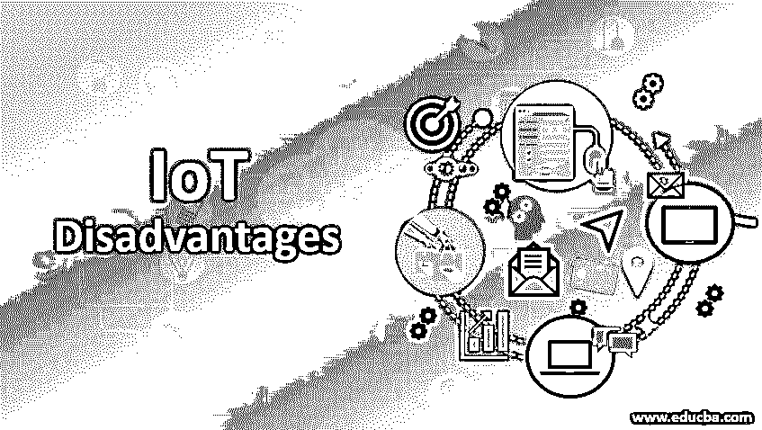
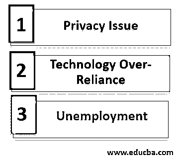

# 物联网劣势

> 原文：<https://www.educba.com/iot-disadvantages/>

## 物联网简介

物联网是一个大型网络，其中任何计算机或几乎任何具有 IP 地址的东西都连接到互联网或相互连接，以自动执行任务或限制人类干预。这些设备可以是移动电话、灯、手表、电视机、工厂机器、汽车等。它可以有一个嵌入软件和电子传感器的计算机芯片。物联网提供了许多优势，侵犯隐私、过度依赖技术和失业是伴随物联网的三个主要问题。让我们看看物联网的缺点。

### 物联网劣势

物联网的缺点如下:

<small>Hadoop、数据科学、统计学&其他</small>

#### 1.隐私问题

*   随着技术和社交媒体的进步，用户的数据总是可以在互联网上获得，并且随着事物与互联网的连接，黑客获得了又一种能够闯入网络并窃取信息的工具。人们可能希望生活中有一些私人空间，所以总是与家人和朋友保持联系并让他们了解我们生活的方方面面并不容易。你的数据很有可能被滥用。
*   网络安全组织已经实施了若干预防措施和协议来防止对个人数据的未授权访问和滥用。但是，技术上总有漏洞可以被黑客利用。例如，一个名为“匿名者”的黑客组织闯入政府数据库并向公众泄露机密信息。
*   政府考虑的最高级别的安全预防措施未能保护数据，安全框架遭到破坏。因此，如果我们所有的信息都存储在互联网上，黑客可以很容易地闯入它，找出所有关于人们的生活。
*   他们获得的信息也可能被公司滥用来剥削用户。这是公司内部一直在发生的越来越多的不幸。例如，谷歌最近被指控为公司利益使用用户提供的私人信息。

#### 2.技术过度依赖

*   今天的这一代人拥有一切唾手可得的东西。无论是来自谷歌的信息还是《权力的游戏》的前一集，人们都可以在旅途中轻松访问数据和媒体。一个简单的加减数学公式是通过我们设备中的一个现成的计算器来完成的。随着物联网的进步，人们越来越依赖技术来完成日常任务，如关灯甚至开车。
*   很少有研究人员声称物联网的进步最终会让人们不愿意工作或使用任何能源。然而，日复一日地依赖技术可能会导致灾难性的后果，因为通过它所放弃的信息来做决定。没有健壮的、无故障的系统。我们看到技术上不断发生的失败，尤其是在互联网上。我们对互联网的信任和关注越多，如果我们失去它，就越有可能出现潜在的负面情况。
*   物联网将最终导致你拥有的所有个人数据都可以在互联网上以及与互联网相连的所有其他设备上获得。用户在家做的任何事情都可以很容易地被跟踪。当一个人起床、睡觉、去办公室、在室内或室外移动时，物联网设备知道所有这些，以及这些设备和服务背后的那些人(组织)。
*   物联网设备自动工作，这意味着它们会一直告诉你，直到你没有起床或准备好完成日常任务。这意味着[物联网设备](https://www.educba.com/iot-devices/)会告诉你去做那件事。设备将决定你的日常生活方式，并通过手机上的定期提醒来控制几乎一切，包括食物和液体的摄入。

#### 3.失业

*   越来越多的设备相互连接，并连接到互联网，这将导致对人力的需求减少，并最终导致失业。物联网和 AI 将推动每一项需要人力的工作实现自动化。像客户支持这样的工作已经自动化，大部分工作由聊天机器人完成。自动化将对中低技能工人产生毁灭性的影响。
*   仓库中作为库存评估员的工作将岌岌可危，因为设备不仅能够相互通信，还能够定期向所有者更新库存信息。今天，我们正看到工作岗位的减少，因为在杂货店收银台甚至自动取款机上自动操作的机器人机器。
*   预计当前和未来的[物联网技术](https://www.educba.com/iot-technology/)将从根本上改变几乎每个行业的业务运营。我们已经可以看到物联网对众多行业的影响，毫无疑问，有非常令人信服的理由相信预测，在不久的将来，越来越多的工作将变得多余。在我们开始恐慌之前，重要的是要认识到，由于技术进步，公司越来越需要拥有全新技能的人来担任角色，这平衡了这一事实。
*   根据牛津大学学者的“就业前景”研究，房地产经纪人、电话推销员、牙科助理和厨师是未来最有可能自动化的前 15 个职位。这仅仅是个开始，随着物联网继续改变人们的日常生活方式，从而改变企业的运营方式。

### 结论

物联网的进步将在许多方面造福人类，但一切都是有代价的。安全、过度依赖技术和工作不安全是物联网的几个主要缺点。随着时间的推移和努力，全球各地的政府都在努力克服这些缺点，并充分利用物联网的潜力。

### 推荐文章

这是一个物联网劣势的指南。在这里，我们分别讨论物联网劣势的三个主要问题，如隐私问题、技术和失业。您也可以浏览我们推荐的文章，了解更多信息——

1.  [物联网架构有哪些阶段？](https://www.educba.com/iot-architecture/)
2.  [物联网框架概述及列表](https://www.educba.com/iot-framework/)
3.  [物联网安全问题介绍](https://www.educba.com/iot-security-issues/)
4.  [物联网的 5 大优势是什么？](https://www.educba.com/benefits-of-iot/)

