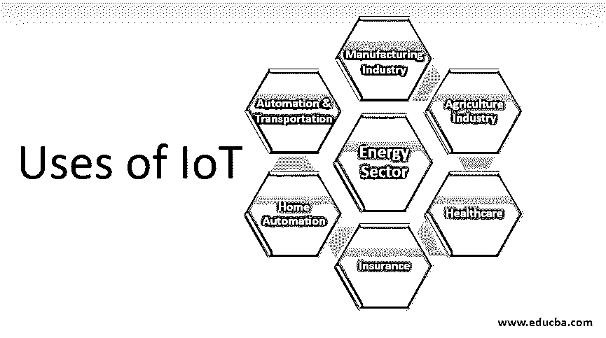
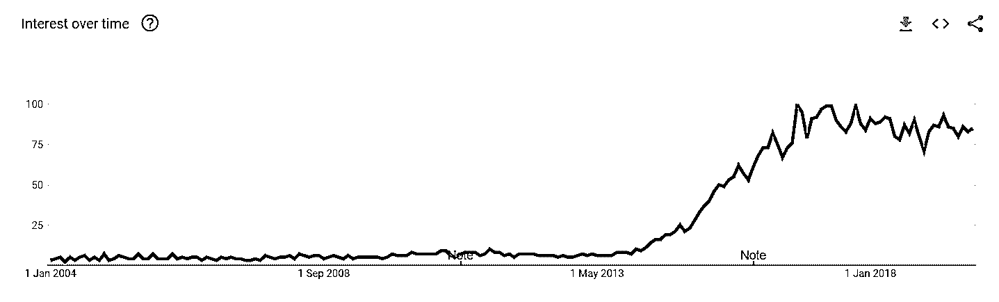

# 物联网的用途

> 原文：<https://www.educba.com/uses-of-iot/>

## 物联网用途介绍

物联网(物联网)的用途是实施[物联网设备](https://www.educba.com/iot-devices/)和技术以促进技术进步的行业。这项技术的用途和新功能不断增加，并且逐年增加。大多数组织都在使用这项技术来帮助人们生活得更轻松。一些行业使用物联网，例如制造业中通过传感器进行资源优化，农业中的实时作物和水资源监控，以及医疗保健行业中的物联网设备。设定安全标准以控制物联网使用的不利影响至关重要。

### 物联网在各行业的应用

物联网将是未来几年最大的 IT 服务类别，这将改变产业格局。让我们来讨论按行业类型分组的各种物联网使用案例。

<small>Hadoop、数据科学、统计学&其他</small>

#### 1.制造业

物联网一直在大规模改变制造业的行业格局。智能传感数据用于防止异常故障、需求分析和资源优化。物联网解决方案可帮助组织进行智能资产管理和性能监控，从而减少资产停机时间并延长硬件寿命。它还使制造商能够缩短上市时间和进行大规模定制。例如，物联网帮助自行车制造商哈雷戴维森将生产一辆完整自行车的时间从几天缩短到几个小时。

#### 2.农业产业

由于工业农业遵循传统的基于经验的操作，严重依赖于人工干预。但随着经济形势的变化和人口的增加，供需缺口巨大。不断变化的环境条件、全球变暖也是挑战的一部分。物联网可能是农业和种植业对抗这一点的最有力武器。物联网使农场管理者能够进行实时企业监控、精准农业、牲畜管理、智能温室管理等。工业级无人机在智能养殖中也有多个用例。一方面，无人机用于监测空气、土壤、水分质量；而另一方面；它们可以帮助身体活动，如自动喷洒肥料，防止农场中的物理爆发等。

#### 3.卫生保健

从工业级物联网中受益最多的一个重要领域是医疗保健。智能设备的普及，可穿戴设备与日俱增。这使得拥有越来越多数据的研究人员能够整合物联网解决方案。来自可穿戴设备的数据被用于预防心脏病发作，持续监控心率、步数、跟踪睡眠、坐姿等。基于物联网的纳米技术解决方案甚至被用于监测体内的癌细胞。物联网和[机器学习](https://www.educba.com/what-is-machine-learning/)正在迅速改变行业。

#### 4.保险

保险作为一个行业，一般遵循结构化数据。但它有可能使用物联网优化资源和理赔流程。最近，保险公司慢慢开始在其行业解决方案中采用物联网。物联网解决方案可用于自动索赔处理，作为保费计算、自动准备金设置、损失评估等的一个因素。

#### 5.家庭自动化

远程控制电子仪器不再是科幻小说，它已经商业化了。物联网在我们的日常生活中用于自动做出决策和优化功耗。Google Home，亚马逊 echo 等。是一些基于物联网的家庭自动化设备的示例，其中大量使用了物联网和机器学习。

#### 6.汽车和运输

在互联网时代，汽车也被认为是可以按需升级的小工具。现代汽车配备了基于物联网的智能传感器，有助于实时汽车跟踪、速度控制、油耗控制、汽车租赁解决方案等。物联网和深度学习有助于开发自动停车系统、半自动驾驶汽车，甚至自动驾驶汽车。

#### 7.能源部门

物联网解决方案通过对功耗、硬件维护、预测动态定价等的宝贵见解，为能源行业带来变革。传统的电力和能源以及相对较新的领域，如太阳能、风能和废物回收，正在从物联网的用例中受益。

### 物联网的行业预测和全球趋势

以下是全球趋势的详细信息:

#### 1.按行业划分的物联网支出报告

市场支出预测是了解物联网工业用例的重要工具。需求图显示了物联网的规模。在这里，我们将重点介绍 IDC(国际数据公司)预测 2019 年的统计数据，这将激励您更多地挖掘您选择的特定业务领域。

#### 2.谷歌物联网趋势

现在我们来看看 2004 年到 2019 年全球谷歌在物联网上的趋势。这将有助于了解基于物联网的用例是如何逐渐增长的。

资料来源:https://trends.google.com/trends/explore?date=all&geo=US&q=IoT

### 结论

在本文中，我们讨论了物联网在当今行业中的各种使用案例，以及物联网的行业预测和全球趋势。虽然这里我们主要讨论了物联网的积极使用案例，但也有一些消极的方面。物联网设备以及[人工智能](https://www.educba.com/what-is-artificial-intelligence/)如果实施不当，可能会妨碍隐私，甚至造成身体伤害。适当规范和基准化的物联网解决方案可以在未来几十年改变社会。

### 推荐文章

这是物联网使用指南。在这里，我们将讨论物联网在各种行业中的用途，以及行业预测和全球趋势。您也可以浏览我们的其他相关文章，了解更多信息——

1.  什么是 IOT？
2.  [物联网的优势](https://www.educba.com/benefits-of-iot/)
3.  [你应该知道的 8 大物联网设备](https://www.educba.com/iot-devices/)
4.  [详细介绍物联网的三大劣势](https://www.educba.com/iot-disadvantages/)

