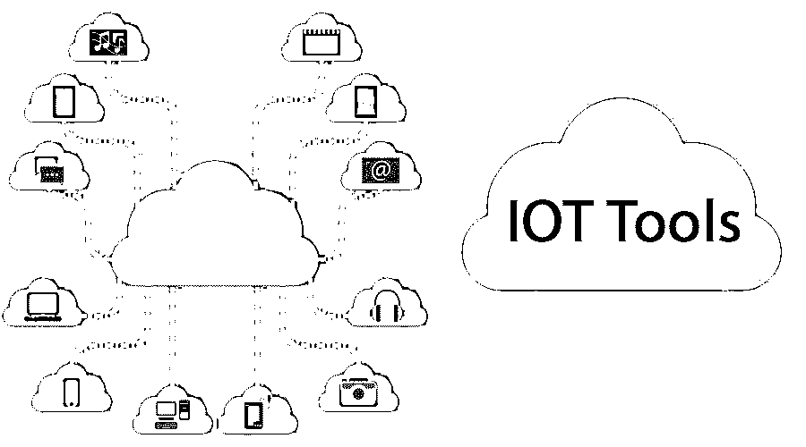
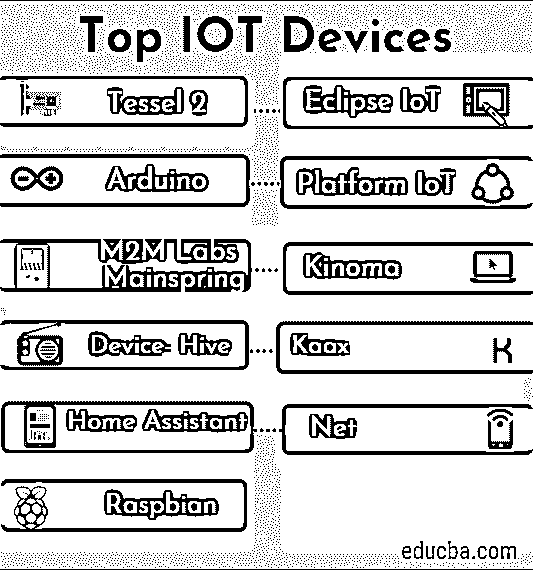

# 物联网工具

> 原文：<https://www.educba.com/iot-tools/>

## 物联网工具简介

物联网工具代表物联网工具。它是设备、车辆、应用嵌入式电子设备的设备、家用电器、建筑物等等的网络或连接。这有助于收集和交换不同种类的数据。它还帮助用户通过网络远程控制设备。

今天，在互联网驱动的世界中，物联网已经席卷了 IT 行业，是最新的流行语。它为从事物联网工作的公司和开发者打开了许多新的视野。由于物联网应用程序的开发，已经开发出许多出色的产品。提供物联网解决方案的公司正在创造[硬件和软件](https://www.educba.com/hardware-vs-software/)设计，以帮助物联网开发者创造新的卓越的物联网设备和应用。

<small>Hadoop、数据科学、统计学&其他</small>

### 顶级物联网设备列表

下面讨论了一些物联网工具和设备:

#### 1.Tessel 2

它用于构建基本的物联网原型和应用程序。它通过其众多的模块和传感器提供帮助。使用 Tessel 2 板，开发人员可以利用以太网连接、Wi-Fi 连接、两个 USB 端口、一个微型 USB 端口、32MB 闪存和 64MB RAM。还可以集成其他模块，如摄像头、加速度计、RFID、GPS 等。

Tessel 2 可以支持节点。它包含两个处理器，其硬件使用 48MHz Atmel SAMD21 和 580。

MHz 联发科 MT7620n 协处理器。一个处理器有助于高速运行固件应用，另一个处理器有助于高效管理电源和实施良好的输入/输出控制。

#### 2.Eclipse 物联网

该工具或仪器允许用户开发、采用和推广开源物联网技术。它最适合构建物联网设备、云平台和网关。Eclipse 支持与物联网相关的各种项目。这些项目包括[物联网协议](https://www.educba.com/iot-protocols/)的开源实现、应用框架和服务，以及使用 Lua 编程语言的工具，Lua 编程语言被宣传为最适合物联网的编程语言。

#### 3.阿尔杜伊诺

Arduino 是一家意大利 IT 公司，生产交互式对象和微控制器板。这是一个开源原型平台，提供物联网硬件和软件。硬件规格可应用于交互式电子设备，软件包括集成开发环境(IDE)。它是所有物联网开发工具中最受欢迎的 ide。这个平台易于使用。

#### 4.平台物联网

它是一个跨平台的物联网 IDE。它带有集成调试器。它最适合移动应用程序开发，开发者可以使用友好的物联网环境进行开发。开发人员可以将 IDE 移植到 Atom editor 上，或者将其作为插件安装。它兼容 400 多种嵌入式主板，拥有 20 多种开发框架和平台。它提供了一个非凡的界面，易于使用。

#### 5.M2M 实验室的主要动力

它是一个[物联网平台](https://www.educba.com/iot-platform/)，是一个开源的应用框架。它用于构建可用于远程监控和车队管理领域的机器对机器应用程序(M2M)。它支持许多功能，如数据的验证和标准化、设备配置、数据检索过程和设备的灵活建模。它基于阿帕奇、卡珊德拉、[、NoSQL 数据库](https://www.educba.com/what-is-nosql-database/)和 Java。

#### 6\. Kinoma

这是一个 Marvell 半导体硬件原型开发平台。它支持三个不同的项目。为了支持这些项目，Kinoma Create 和 Element Board 提供了两种产品。Kinoma Create 是一款硬件套件，用于制作电子和物联网设备的原型。套件包含支持要素，如蓝牙低能耗(BLE)、集成 Wi-Fi、扬声器、麦克风和触摸屏。Element Board 是最小的基于 JavaScript 的物联网产品平台。

#### 7.设备配置单元

它是基于数据艺术的 AllJoyn。这是一个免费的开源 M2M，即机器对机器的通信框架。它于 2012 年推出，被认为是最受欢迎的物联网应用开发平台。它拥有基于云的 API，无论网络配置如何，都可以远程控制。它的库、协议和管理门户也以类似的方式进行控制。它最适合与智能家居技术、安全、自动化和传感器相关的应用。

#### 8.你的斧头

它为跨云连接的物联网设备提供端到端支持。由于其多用途中间件，它允许用户构建连接的应用程序、物联网应用程序和许多智能产品。Kaax 将开源套件描述为“硬件不可知的”,即它可以与任何硬件接口，如传感器、网关和其他设备。它帮助开发人员远程分发固件更新，并实现跨平台的互操作性。

#### 9.家庭助理

它是一个开源工具，主要用于基于 Python 编码系统和家庭自动化的功能。桌面和移动浏览器有助于控制他们的物联网系统。它易于设置，并以其流畅的操作、隐私标准和安全性而闻名。它可以支持运行在 Python 3 上的系统。

#### 10.网

它是面向物联网开发者的集成解决方案。它提供云集成和商业智能等服务，以提供网络技术和硬件。其开发套件以平台即服务(即 PaaS)的形式交付，允许开发人员高效利用其功能进行开发。

#### 11\. Raspbian

这个 IDE 是为 Raspberry Pi 板创建的。它有超过 35000 个软件包，在预编译软件的帮助下，它允许快速安装。它不是由母公司而是由物联网技术爱好者创建的。对于使用 Raspberry Pi，这是最合适的 IDE。

### 结论–物联网工具

在本文中，我们已经看到了一些物联网工具，但还有许多更重要的工具可用。这些工具帮助开发人员探索和创建创新的物联网应用和设备。这些工具可以帮助您追求物联网职业生涯，并为物联网发展协会做出贡献。

### 推荐文章

这是物联网工具的指南。在这里，我们讨论了概念和一些你应该知道的可以帮助开发者的物联网工具。您也可以浏览我们推荐的其他文章，了解更多信息——

1.  [什么是机器学习？](https://www.educba.com/what-is-machine-learning/)
2.  [JavaScript 简介](https://www.educba.com/introduction-to-javascript/)
3.  [什么是 Salesforce 技术](https://www.educba.com/what-is-salesforce-technology/)
4.  [开发安全物联网(IoT)的技巧](https://www.educba.com/iot-applications/)
5.  [物联网服务的各种列表](https://www.educba.com/iot-services/)
6.  [前 5 种互操作性测试](https://www.educba.com/interoperability-testing/)

