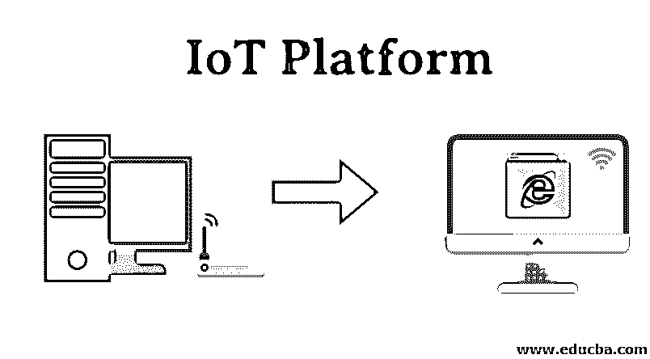
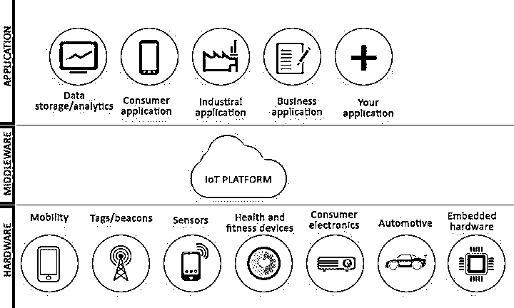

# 物联网平台

> 原文：<https://www.educba.com/iot-platform/>

## 物联网平台简介

物联网是一个多层平台，可对互联网范围内的互联设备进行直接管理、自动化和供应。它是在连接到硬件设备的云、安全和专家系统的帮助下运行的。它是一个现成的平台，供初学者和开发者即时使用，运行速度非常快。它是一种远程设备，允许用户管理硬件和应用程序设备之间的连接。它有很好的业务发展空间，具有独特的功能，如支持云的平台和支持物联网的平台。

### 什么是物联网平台？

物联网平台在智能设备供应商和初创企业中发挥着至关重要的作用，他们可以使用它来安装具有远程控制、实时监控、云服务以及与智能手机和其他设备集成的产品。大规模应用是[智能城市](https://www.educba.com/smart-city-application/)开发和智能能源逆变器。

<small>Hadoop、数据科学、统计学&其他</small>

数字双胞胎提供了一个强大的方法来监测和控制资产。现实世界的系统和设备通过增强的监控特征和增加输入和输出事件的快速响应，由数字双胞胎提供数字表示。数字双胞胎的未来目标是通过提供对即时维护和分析使用的预测分析，建立一个高效的[物联网生态系统](https://www.educba.com/iot-ecosystem/)。

智能事物利用人工智能从储存库中检索更多信息。物联网与人工智能携手面向未来发展。制造单位的自动车辆和机器人提供了最大的产出和更快的交付。

云计算和边缘计算的结合实现了云原生模型的优点，该模型以可扩展的方式在连接的设备之间分离和分布。同时，它节省了他们的时间，执行更快的操作。事实证明，物联网标志着 [DevOps](https://www.educba.com/what-is-devops/) 的成功成长。

### 物联网平台架构

该架构由四层组成:物、连接、核心物联网属性、分析和应用。物联网堆栈的最顶层用于开发互联设备和智能事物。在底层，它具有用于容器管理、平台管理和物联网编排的元素。通信层用于向连接的设备发送消息。核心层用于配置管理、OTA 服务和消息传递。核心物联网层的顶部是分析规则引擎和安全系统，用于检测用户物联网解决方案的异常情况。它很灵活，但运行成本很高。

一些优点是可伸缩、可定制和安全的。先进的物联网平台确保客户需求的弹性可扩展性。它可定制性太强，交付速度快，集成了 API，源代码透明。通常，开发者需要对完整的基础设施进行强有力的控制，因此它提供了对源代码、集成系统、部署系统、连接性和安全机制等的直接访问。它还提供端到端流[加密、](https://www.educba.com/what-is-encryption/)包括静态数据、设备认证、用户 ID 管理和私有[云基础设施](https://www.educba.com/cloud-infrastructure/)。

### 物联网顶级平台

物联网的目的是使用互联网传输协议与另一个物联网设备建立连接以共享信息。

下面列出了市场上可用于构建物联网应用的一些平台:

#### 1.微软 Azure 物联网

它是微软最高端的平台和产品之一，旨在提供可扩展的服务、应用服务、消息传递设施、数据存储服务和高效的数据库。Azure IoT 的目标是通过高效的数据存储提供持久的服务，并帮助公司利用企业每个部门的存储库中的可用数据提供即时准确的解决方案。

#### 2.亚马逊网络服务

它使用户能够在网络空间中托管和管理服务。一些受尊敬的组织使用 AWS 来构建、托管、管理和组织公司的基础设施。在这里，物联网平台为用户提供了许多好处:基于云的数据存储、应用程序传输和存储管理。

#### 3.谷歌云平台

它是一个流行的物联网平台，提供文档辅助数据库、云计算和弹性数据库。它是第三大物联网平台，支持机器智能、谷歌分析等。

#### 4.ThingWorx

它是一个广泛使用的平台，于 2013 年被 PTC 收购。应用程序开发人员使用该平台轻松有效地执行、分析复杂的数据和内容，并提供快速数据管理解决方案。

#### 5.思科物联网云连接

它为服务提供有效的数据和语音连接、可靠的 SIM 卡生命周期、熟练的 IP 会话控制和可定制的计费系统。

#### 6.惠普的通用产品

它为所有与 It 相关的问题提供准确的解决方案。它被有效地用于货币化、有效的数据收集、数据分析以及启动新的移动应用程序的正确平台。

#### 7.SAP 云平台

它有效地适用于以双向方式或直接云服务连接的远距离设备。它是带有组件的设备，用于构建和管理物联网应用。

#### 8.甲骨文物联网

它建立了公司软件和政策之间的联系。这是一个开发新应用程序并将其用于商业目的的灵活环境。

#### 9.博世物联网套件

它由德国开发，代表了其可靠的解决方案和创新的方法。它在开源环境中可用。

#### 10.IBM 沃森物联网

它提供的服务包括远程设备控制和数据传输，没有任何噪音和云存储。它使用物联网平台为[机器学习和人工智能](https://www.educba.com/machine-learning-vs-artificial-intelligence/)提供了多种选择。

### 结论

物联网通过提供实时支持、生产和安全，为运输、农业、卫生、零售、营销、工业等各个领域的许多公司提供了成本优化。对于智能城市开发，它提供智能电网计量和智能辅助部署。

### 推荐文章

这是物联网平台指南。在这里，我们详细讨论了物联网的介绍、架构和一些重要的平台。您也可以看看以下文章，了解更多信息–

1.  [物联网工具](https://www.educba.com/iot-tools/)
2.  [物联网标准](https://www.educba.com/iot-standards/)
3.  [物联网服务](https://www.educba.com/iot-services/)
4.  [物联网框架](https://www.educba.com/iot-framework/)

