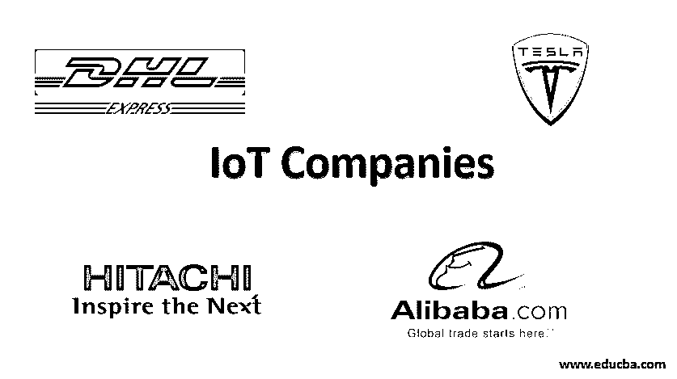

# 物联网公司

> 原文：<https://www.educba.com/iot-companies/>

## 物联网公司简介

物联网(IoT)已经发展成为最重要的业务增长驱动力，并对全球的家庭、组织和环境产生着巨大影响。车联网和智能家居技术已经投入生产，并大获成功。全球许多公司都选择物联网解决方案来提高公司的生产力和效率。事实上，全球许多公司已经选择将物联网解决方案用于其业务。例如，银行部门已经投资了物联网解决方案，在自助服务终端的帮助下为客户提供快速服务。医疗保健行业一直在将物联网解决方案融入可穿戴设备，以积累患者数据。

### 面向公司的物联网技术

在企业使用的各种物联网技术的帮助下，许多公司正在发展其技术范围。这意味着公司能够优化他们的业务，提高利润率。公司有许多方法将物联网纳入商业模式。

<small>Hadoop、数据科学、统计学&其他</small>

让我们来看看公司被物联网解决方案吸引的几个主要原因:

#### 1.数据积累

在集成到设备中的物联网的帮助下，公司能够收集大量关于内部和外部客户的数据。这些数据有助于洞察不同的客户行为，帮助组织提供更好的客户体验。[物联网设备](https://www.educba.com/iot-devices/)使用创新技术来跟踪客户的购买行为，因此公司可以进行促销、交叉销售，从而创造更多收入。

#### 2.效率和管理

物联网设备可以完全控制业务的所有方面。在物联网的帮助下，可以分析和管理业务的多个领域。不盈利的领域可以优化改进。此外，物联网提高了任务的效率，从而减少了花费的时间并提高了生产率。

#### 3.办公设备的跟踪和维护

通过设备中嵌入的物联网，可以监控打印机等多种办公设备。物联网可以检测纸张和墨水何时需要重新填充，并在没有人为干预打印机的情况下订购它们。物联网可以嵌入灯泡中，使它们更加智能，从而取代运动传感器。灯光可以控制和安排何时亮何时灭；可以根据一天中的时间进一步调节和监控亮度。物联网可以在咖啡机中实现，以确保机器一直处于储备状态；这将间接提高员工的生产率。虽然最初实施物联网解决方案可能会很昂贵，但从长远来看，这已被证明是一项投资。

#### 4.智能办公助手

亚马逊的 Alexa for business 等技术可以整合到一个组织中，以实现技术连接。员工无需打字，只需告诉 Alexa 就可以发送电子邮件；在物联网解决方案的帮助下，从安排运输班车到跟踪会议的一切都有可能实现。清洁人员是每个组织都需要的基本服务；物联网嵌入式真空可以帮助节省资金，保持办公室整洁，没有任何问题。借助[物联网技术](https://www.educba.com/iot-technology/)，吸尘器将指示何时需要清空和维修。

### 物联网公司的例子

让我们来看看正在尝试[物联网生态系统](https://www.educba.com/iot-ecosystem/)的公司的实时例子:

#### 1.阿里巴巴

阿里巴巴是当今市场上最大的电子商务公司之一。这家中国公司一直在利用物联网来加速物联网技术在中国的发展。阿里巴巴于 2017 年正式推出 link 物联网平台，连接数十亿台设备。阿里巴巴的云链已经推出了许多基于云的业务。阿里巴巴的云链接已经帮助中国和世界各地的许多企业将物联网纳入他们的生态系统。许多解决方案都提供了多种配置选项。消费者可以轻松配置他们的硬件和软件，而不必担心成本，因为它们的价格非常划算。

#### 2.敦豪速递公司(DalseyˌHillblom and Lynn 是一家国际快递公司)

DHL 是一家总部位于德国的物流公司，自 2017 年以来一直在尝试物联网。在中国公司华为的帮助下，DHL 推出了 handbarrow 物联网应用程序，允许以低得多的价格通过物联网设备传输数据。这项技术的出现是为了管理进出物流业务。随着物流服务中物联网的实施，DHL 成功地实时监控了服务和活动。

#### 3.日立

日立以其智能电视而闻名，并推出了一个名为 Vantara 的新实体，这引发了一个名为 Lumada 的物联网平台的发布，目的是将数据转化为有用的资源。在 Lumada 的帮助下，一个组织可以管理和维护一个组织的物联网生命周期。Lumada video insight 能够收集、存储和分析视频数据。借助 Lumada 工具，组织可以从数据中获得有用的见解和分析，从而最大限度地提高效率和安全性。

#### 4.特斯拉

特斯拉是一家在物联网方面投入巨大的美国汽车公司。该公司的主要动机是使汽车更加可持续和环保。特斯拉出售的每辆汽车都具有自动化功能，可以在公司推出的更新的帮助下，为汽车添加新的和最新的功能；每辆特斯拉汽车都有可能成为无人驾驶汽车。特斯拉已经在路上安装了许多传感器来收集数据，这将有助于他们的汽车了解周围的环境。有了这些功能，汽车不再是固定的商品，而是不断变化和可定制的商品，可以在付费软件更新的帮助下升级。Telsa 汽车制造商已经将互联汽车的想法变成了现实。随着物联网的进步，传统设备将不再是固定的商品，而是能够自我升级，表现智能。

### 结论

在本文中，我们看到了物联网在公司中的多种[应用，并讨论了已经在其生态系统中嵌入物联网解决方案以应对和解决业务需求的各种公司。全球所有大公司都将物联网视为增长和发展的重要因素，并愿意长期试验这项技术。](https://www.educba.com/applications-of-iot/)

### 推荐文章

这是一份物联网公司指南。在这里，我们讨论公司被顶级公司的物联网解决方案吸引的主要原因。您也可以浏览我们的其他相关文章，了解更多信息——

1.  [物联网安全问题](https://www.educba.com/iot-security-issues/)
2.  [物联网平台](https://www.educba.com/iot-platform/)
3.  [物联网模块](https://www.educba.com/iot-module/)
4.  [传感器装置](https://www.educba.com/sensor-device/)

