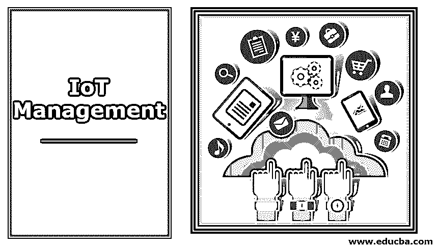
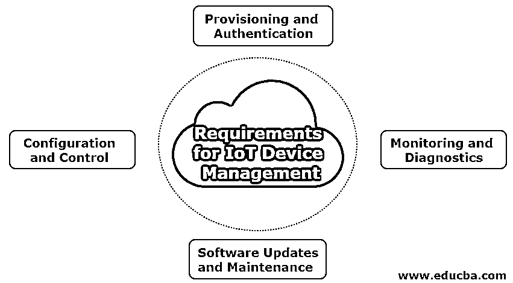

# 物联网管理

> 原文：<https://www.educba.com/iot-management/>

## 物联网管理简介

物联网(IoT)是一个生态系统，其中多个设备借助互联网连接在一起。物联网中的东西可以是 GPS 的追踪器、带传感器的汽车、带温度传感器的设备等。这些东西有 IP 地址，有助于连接设备，以便在没有任何人工干预的情况下自动收集和传输数据。[物联网可以用于很多应用](https://www.educba.com/uses-of-iot/)。其中一些是大数据、人工智能、机器学习、云计算、射频识别(RFID)、预测分析等。现在，让我们看看什么是物联网管理。

### 什么是物联网管理？

物联网设备一旦安装，可能需要软件更新或漏洞修复。有时不得不更换或修理。这可能会导致停机。为了解决我们能做什么？我们可以使用物联网设备管理来有效地管理设备。物联网设备管理是对提供其功能的软件和设备固件进行验证、配置、监控、供应和维护的方法。为了维护[物联网设备](https://www.educba.com/iot-devices/)的安全性、健康性和连接性，有效的设备管理至关重要。通常，物联网应用供应商也会提供解决方案以及广泛的设备管理。

<small>Hadoop、数据科学、统计学&其他</small>

### 物联网设备管理的要求

以下是物联网设备管理所需的四个基本要求。

1.  供应和身份验证
2.  配置和控制
3.  监控和诊断
4.  软件更新和维护

#### 1.供应和身份验证

众所周知，联网设备的数量与日俱增。有时，设备制造商可能无法提供安全设备，因为他们在安全方面没有经验，这可能会引起黑客的恶意攻击。在某些情况下，用户可能不知道他们使用的设备是否安全。研究人员发现，攻击物联网设备很容易，因为进入网络的方式是使用互联网。建议在使用新的物联网设备时，确保只添加可信设备。为了解决这个问题，需要对设备进行供应和认证。

##### 准备金提取

配置是设备注册到系统的过程。它有两部分-

1.  通过注册设备，完成了设备和物联网解决方案之间的初始连接的建立。
2.  根据特定解决方案的要求，对设备进行配置。

只有在完成这些步骤后，我们才能说设备已完全调配。一些提供商完成第一步，但不提供配置。但是，在设备配置中，这两个步骤都是自动进行的，以提供流畅的使用。

##### 证明

身份验证是一个过程，只有具有有效凭据的设备才能注册。它通过验证实际设备与可信软件一起使用并信任用户来帮助信任设备。尽管每个设备的身份验证过程都不相同，但部署的设备将拥有一个证书或密钥来检查其是否可信。安装新设备时，它会通过验证凭据和几个唯一数据(如型号、序列号等)来进行身份验证。

#### 2.配置和控制

每当安装一个新设备时，在开始使用之前都必须进行一些配置。例如，位置跟踪器是安装在卡车上的设备，每分钟都有数据上传到云中。在开始使用该设备之前，必须在该设备中进行一些设置，例如卡车号码、卡车速度、卡车司机姓名等。否则，它可能会造成一些混乱。如果在开始使用之前没有做到这一步，设备就可以说是不完善的。即使在部署之后，控制和配置设备的能力对于确保某些方面(如功能、性能和安全威胁防护)也至关重要。还建议在停用设备之前，将设备重置为出厂配置。

此外，用户需要远程重置设备，以获得良好的状态、错误恢复和新配置的实施。这将有助于在系统中实现控制功能。

#### 3.监控和诊断

有时，可能会出现软件错误或某些其他问题，从而导致设备停机。为了解决这些问题，用户需要首先识别它们。为此，持续监控设备至关重要。具有设备管理功能的软件通过持续记录帮助诊断这些问题。该软件还可以使用某些云托管的分析来提供解决方案。

#### 4.软件更新和维护

安装设备后，需要对其进行更新，以确保设备的正常运行。有时会包含额外的功能。如前所述，设备与日俱增。所以很难手动更新所有的设备。因此，安全更新和维护远程设备软件的能力是良好设备管理的最重要组成部分之一。让我们看看上面提到的卡车例子。如果需要进行更新，也不能在运行轨道上进行。因此，在更新软件之前，请确保卡车处于静止状态。

### 物联网管理的优势

以下是下面列出的优点:

#### 1.了解您的设备

物联网设备管理帮助产品所有者跟踪、管理、监控、追踪、维护和保护连接的设备。由于该平台与 dashboard 相关联，因此远程访问也很容易，并允许设备对其进行管理、退役和配置。

#### 2.运营成本和维护成本更低

在设备管理的帮助下，可以进行预测性维护，作为定期维护和其他几个问题的有效解决方案。因此，消耗的时间会更少，相应地，运营成本也会更低。

#### **3。** IT 与 OT 融合

为了获得成功的业务，信息技术(it)和运营技术(OT)的并行协调是必不可少的。它有助于在不同项目中并行工作的无缝信息流。

### 结论

物联网设备管理是一种在物联网中认证、供应和维护设备的方法。以上章节讨论了物联网设备管理的基本要求和优势。

### 推荐文章

这是物联网管理的指南。在这里，我们讨论了物联网设备管理所需的基本要求及其优势。您也可以浏览我们推荐的其他文章，了解更多信息——

1.  [物联网框架](https://www.educba.com/iot-framework/)
2.  [物联网面试问题](https://www.educba.com/iot-interview-questions/)
3.  [物联网的优势](https://www.educba.com/benefits-of-iot/)
4.  [详细介绍物联网的三大劣势](https://www.educba.com/iot-disadvantages/)

