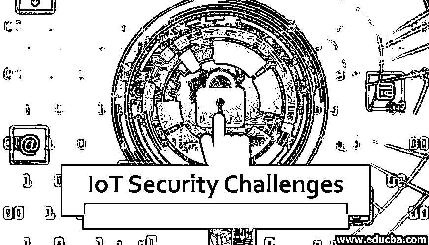
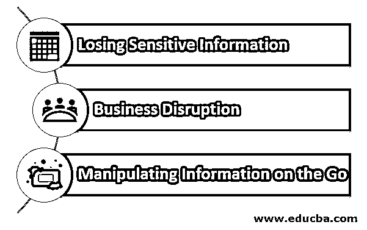

# 物联网安全挑战

> 原文：<https://www.educba.com/iot-security-challenges/>

## 物联网安全挑战简介

随着技术的进步，几乎无限的带宽和廉价的数据速率，物联网用例在各个领域快速增长。据估计，2020 年欧洲的物联网预算将超过 24 万欧元。随着用例的增加，运营商也希望将物联网套装与快速上市能力相结合。这些事情一起留下了主要的安全漏洞。在本文中，我们将介绍物联网用例面临的主要安全挑战。

### 物联网安全挑战的因素

据统计，目前有超过 250 亿台联网设备处于活跃状态，在未来十年内，这一数字可能会突破 1000 亿台。物联网系统的主要安全漏洞是以下变量的因素。

<small>Hadoop、数据科学、统计学&其他</small>

#### 长期使用默认密码或相同密码

许多物联网设备都配置有初始通用密码，该密码对供应商来说是通用的。当这些设备与现有的生态系统挂钩时，用户有时会保持密码不变。或者，如果没有适当的维护策略，用户会设置初始密码并忘记。这些做法使得整个系统[容易受到恶意软件](https://www.educba.com/what-is-malware/)和其他有害软件的攻击。使用默认用户名和密码不仅会危及物联网系统，还会为黑客打开访问整个商业网络的大门。

#### 不当测试和更快上市

物联网组件和制造商总是有兴趣尽快交付他们的产品(准备上市)。传统的商业领袖更感兴趣的是尽快获得可靠的结果证明和可行的见解。为了应付市场需求，在许多情况下，供应商忽略了适当的测试和寻找系统中的安全漏洞。这可能会危及安全需求。这些是保险和 BFS 等处理敏感数据的传统行业仍然远离使用这些系统的主要原因。

#### 面向物联网的遗留系统重用

设置和维护物联网基础设施的初始成本太高。此外，在电信等行业，传统基础设施的成本太高，无法完全替换为新的生态系统。为了保持两者之间的平衡，很多时候运营商会为了更新的目的而重用遗留的基础设施。尽管这些遗留系统服务于这一目的，但它们并不是为应对现代安全威胁而设计的。这可能导致不良从业者获得非法后门进入组织系统。

#### 多设备系统和跨平台架构的使用

行业级物联网系统使用技术堆栈中的各种跨平台技术和工具。这些多供应商系统处理对安全措施的依赖。
例如，在一个用例中，传感器数据用于捕捉模拟信号，这些信号由供应商系统 A 转换为数字信号，这些数据可由供应商系统 B 进行预处理，并可通过手机、台式机、智能可穿戴设备等多个系统访问结果。这些相互依存关系会给整个生态系统带来脆弱性。

### 物联网安全漏洞的影响

物联网生态系统的漏洞可能会给企业带来以下问题:

#### 1.丢失敏感信息

物联网设备被纳入医疗、保险、银行等行业。损害这些系统可能会将客户的医疗信息、银行或财务细节泄露给黑帽黑客。

#### 2.业务中断

由于物联网生态系统中任何一个节点的脆弱性，黑客都有可能获得对整个业务服务器的后门访问。由于网络革命，现在每个行业几乎都是数字化的。部分受损的节点还会导致整个业务流程的中断。

#### 3.随时随地处理信息

正如我们之前所讨论的，敏感的用户信息通过物联网节点和连接的集线器流动。黑客可以随时操纵信息，这可能会产生长期影响。假设在医疗用例中，如果后门访问的应用程序更改了健康信息，则操作也会更改。没有适当的监督，这可能会导致危及生命的挑战。如今，几乎每个物联网用例都集成了机器学习计算引擎。向这些系统输入或操纵错误的数据也会改变可操作的洞察力，最终导致业务损失。

### 物联网系统的推荐安全措施

现在，让我们讨论一些为物联网应用设计安全层的建议:

*   **加密通信:**在物联网生态系统中，使用连接到网关和计算引擎的传感器和其他物联网端点来捕获低层数据。当数据流经这些层时，供应商和中间件服务提供商需要提供[端到端加密](https://www.educba.com/what-is-encryption/)。例如，微软正致力于在他们的物联网平台中部署 BitLocker 加密系统。
*   **最先进的防火墙和恶意软件数据库:**物联网供应商和运营商应在各种节点和计算点部署最先进的防火墙和反恶意软件系统。
*   **定期升级和认证:**通常，物联网设备使用一次性认证连接到网络。建议实施定期身份验证策略，而不是这样。

### 结论

在本文中，我们讨论了物联网用例的各种安全挑战和威胁。我们还经历了各种需要在稳定的生态系统中实施的措施，以最大限度地降低风险。物联网生态系统仍然是一个活跃的研究领域，没有适合所有物联网用例的标准框架。

### 推荐文章

这是关于物联网安全挑战的指南。在这里，我们讨论物联网的因素、影响和推荐的安全措施。您也可以看看以下文章，了解更多信息–

1.  [什么是物联网安全？](https://www.educba.com/iot-security-issues/)
2.  [物联网板卡分类](https://www.educba.com/iot-boards/)
3.  [物联网板卡分类](https://www.educba.com/iot-products/)
4.  [防火墙 vs 防病毒](https://www.educba.com/firewall-vs-antivirus/)

