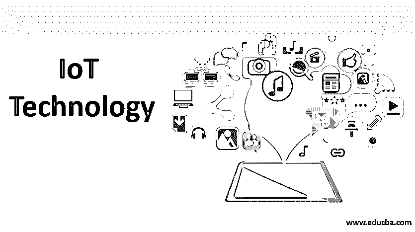

# 物联网技术

> 原文：<https://www.educba.com/iot-technology/>

## 物联网技术简介

物联网技术是一种通过路由器将所有物理组件连接到互联网以共享数据的网络。[互联网应用开发](https://www.educba.com/what-is-internet-application/)日益成为趋势，被各种领域和用途的广泛人群所使用。通常，物联网允许通过不同的算法安装来远程访问现有网络，以减少人力并使事情变得更容易。这是物联网的一个独特功能，称为自动控制任何设备访问系统，无需任何人为干预。在物联网中，这就是[物联网](https://www.educba.com/what-is-iot/)，‘物’是指由硬件组件、软件数据和提供的服务混合而成的袋子。该设备从现有技术的各种设备收集信息，并在连接的设备之间交换数据。

### 为什么会发明物联网技术？

[物联网设备由微型计算机的传感器和处理器组成](https://www.educba.com/iot-devices/)，通过机器学习处理内置传感器收集的数据。通常，物联网组件是作为连接到互联网的微型设置 pc 提供的，但它们最容易出现故障和黑客攻击。机器学习是一个过程，当计算机像人一样通过从环境中捕捉数据来学习，这使它变得更聪明。这些数据使机器能够了解用户的偏好，并相应地进行修改。但这并不意味着智能电视不会告诉你最后一天的交易，而是你的冰箱会向你的智能手机发送通知，告诉你第二天的牛奶和鸡蛋缺货，因为它知道你在杂货店附近

<small>Hadoop、数据科学、统计学&其他</small>

### 物联网技术的范围

物联网技术有几个范围，讨论如下:

*   射频识别系统的频率范围为 120–150 kHz，适用于 10 厘米至 200 米的范围。这些系统部署在库存、道路收费和建筑物入口
*   [NFC 是一种近场通信](https://www.educba.com/full-form-of-nfc/)设备，顾名思义是一种短距离无线连接设备。距离小于 0.2 米，主要用于智能卡、智能钱包和动作标签
*   蓝牙是一种常见的用于共享数据的设备，范围从 1 米到 100 米。它以 2.4GHz 的频率工作。它主要用于钥匙链和健身设备
*   无线保真俗称 WiFi，是一种基于局域网内高速互联网连接工作的电子设备。它的工作频率为 2.4GHz 至 5GHz。它被用于路由器和平板电脑
*   GSM 全球移动通信系统是一个开放的数字移动发明，用于传输数据服务和移动语音。当服务在陆地区域的某些部分不可用时，GSM 漫游服务也被扩展。它工作到 850MHz，数据传输速率为 9.6kbps，部署在智能电表和手机中
*   RIOT OS 是一个基于微内核的物联网操作系统，针对能效、高度模块化和硬件开发进行管理。它支持 IPv4 或 IPv6，可在所有高能效平台上运行，由标准的[编程语言](https://www.educba.com/what-is-a-programming-language/)构建，支持 16 位和 32 位平台。
*   一些基于物联网的云服务是 [ThingWorx，它具有](https://www.educba.com/thingworx/)完整的运行时和应用程序设计，具有智能环境，允许创建基于人与物系统互联的创新解决方案。万物引擎(Everything engine)是一种工业技术，用于大规模服务，并提供数百万种服务来创建活跃的数字身份。Grok an Engine 是一款软件，它以独特的功能打破了物联网的所有挑战，在查找数据方面具有高度的自动化，能够从数据中学习，并根据 Grok 模型的输出采取合适的解决方案。
*   除了这些[软件和硬件](https://www.educba.com/hardware-vs-software/)网络组件，市场上还有许多与物联网连接的设备。它们是 Square Mist 的联网设备，采用无线技术，内存为 16-32kb。无线 SOC 和原型制作板和平台可作为物联网中的硬件设备。

### 优势

下面给出了一些优点:

*   物联网技术让人们的生活更加便捷。在危急情况下，它在很大程度上节省了时间，并使人们以不同的方式思考并采取纠正措施，而不是反复试验。
*   人们可以很容易地实时访问他们指尖上的信息，这是因为网络设备而成为可能，并且一个人可以从地球上的任何地方获得知识并为他的公司工作，这使得他即使不在现场也可以很舒服地进行他们的工作。
*   对于互连设备的网络来说，通信是可实现的，这使得通信设备更加可靠并降低了低效率。过程被分配给机器，以便更好地通信，这使得系统产生更好更快的结果。这种系统的最好例子是在生产单位加工。
*   物联网帮助人们完成日常任务，以节省金钱和时间。在已建立的网络上传输数据分组减少了时间和金钱。数据传输和接收没有任何损失
*   物联网的自动化任务有助于提高服务质量和减少人力。

智慧城市是物联网的另一个主要实现，用于智能监控、水分配、自动运输和环境监控。通过安装交通传感器，解决人们容易受到污染、供应不当和来源短缺以及交通流量不规则的问题，并开发 app 来报告市政系统。市民可以诊断电表中的简单故障，并可以通过电力局应用程序或网站向电力系统报告，他们还可以在传感器系统中轻松找到车辆停车的可用位置，物联网的另一个主要应用是在医疗保健中安装智能医疗系统，以便在早期诊断和治疗疾病。很多[机器学习算法](https://www.educba.com/types-of-machine-learning-algorithms/)用于图像处理和分类，检测胎儿出生前的异常情况。

### 推荐文章

这是一本物联网技术指南。在这里，我们讨论了物联网技术的介绍和几个范围，以及物联网技术的优势。您也可以阅读以下文章，了解更多信息——

1.  [物联网的常见挑战](https://www.educba.com/challenges-of-iot/)
2.  [什么是 Salesforce 物联网云？](https://www.educba.com/salesforce-iot-cloud/)
3.  [物联网安全问题的类型](https://www.educba.com/iot-security-issues/)
4.  [物联网协议的类型](https://www.educba.com/iot-protocols/)
5.  [什么是 IPv6？](https://www.educba.com/what-is-ipv6/)
6.  [什么是路由器？](https://www.educba.com/what-is-router/)
7.  [物联网项目](https://www.educba.com/iot-projects/)
8.  [前 12 种传感器及其应用](https://www.educba.com/what-is-sensors/)
9.  [详细介绍物联网的三大劣势](https://www.educba.com/iot-disadvantages/)
10.  [什么是 IPv4？IPv4 的数据报报头](https://www.educba.com/what-is-ipv4/)
11.  [物联网在交通领域的五大应用](https://www.educba.com/iot-in-transportation/)

