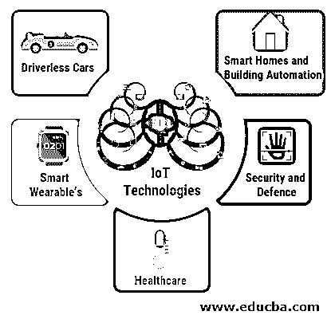

# 物联网技术

> 原文：<https://www.educba.com/iot-technologies/>

## 物联网技术简介

物联网 IoT 是一组嵌入了软件应用程序、智能传感器和其他技术的物理设备，它们通过互联网相互连接，并相互提供实时数据交换和分析。物联网支持的系统由全球超过 70 亿台互联的物联网设备组成。物联网已经成为最重要的技术之一，通过嵌入式设备通过互联网连接汽车、家电、家庭气候控制系统、智能可穿戴设备。它使用大数据分析和机器学习算法来共享、监控和收集数据，并使用基于人工智能的系统在最少的人工交互下提供分析。

### 顶级新物联网技术

以下是一些新的物联网技术:

<small>Hadoop、数据科学、统计学&其他</small>

#### 1.无人驾驶汽车

物联网是自动驾驶汽车的未来。无人驾驶自动驾驶汽车无缝驱动高速公路上的交通。乘客可以输入他们的目的地，软件将与交通网格无缝协调，以非常高的速度将乘客送到目的地。

这些汽车将安装传感器、云架构、陀螺仪、近程传感器和其他技术，这些技术与物联网软件相协调，以获得行人运动、交通状况和道路状况的实时数据，如减速带、信号、停车标志。这些汽车将安装人工智能和机器学习软件，这些软件将即时适应路况(Huh，Cho，& Kim，2017 年 2 月)。

#### 2.智能可穿戴设备

智能可穿戴技术可以集成到物联网生态系统中，为用户提供实时数据。谷歌眼镜项目有可能让用户在旅途中获得信息和娱乐。另一种智能可穿戴设备是 Fit bit，它可以为用户提供活动跟踪、心率监测、多步睡眠以及其他个人指标(Chen et al .，2014)。这些设备使用物联网生态系统连接到基于人工智能的监控系统，通过移动应用程序如 IOS 和基于 Android 的应用程序，为智能手机[提供实时数据分析。](https://www.educba.com/mobile-applications/)

#### 3.医疗保健中的物联网

其中一个主要应用包括不同地理位置的医生对患者的实时监控。Fit bit 等设备通过连接的监测系统实时监测患者健康指标。Kinect HoloLens 辅助康复体验(KHARE)平台允许医疗保健专业人员为不同位置的患者提供个性化治疗建议，它连接到微软 Azure 物联网套件。

由 Viveka 制造的用于疫苗储存的智能冰箱，通过自动化库存管理允许远程监控现场疫苗。这些设备连接到物联网数据分析平台，如 mind sphere(西门子)和 Kaa(KaaIoT Technologies)。通过语音辅助技术和直接连接到植入物的警报系统，物联网医疗保健还可以扩展到老年人和残疾人的护理，以监控突发事件，如癫痫发作。

一些医院已经实施了智能床，可以提供病人占用的实时数据，并向护士提供与病人健康相关的信息。支持物联网的传感器也可用于监控起搏器。支持物联网的平台还使用 IoMT 传感器和 RFID 电子设备，这些电子设备可以制作在电子纺织品上，以无线方式连接到患者监护和诊断系统(贾、冯、范和雷，2012 年 4 月)。

#### 4.智能家居和楼宇自动化

电子传感器、智能家电以及电气和机械系统等物联网技术可用于实现家庭自动化，并将其连接到单一网络中。智能照明等不同系统可以通过用户的手机或家庭气候控制系统进行调节，这些系统可以通过气象数据和用户的要求根据外部气候进行调节。

智能家居还包括家用电器，如智能冰箱、微波炉等。，它可以连接到用户的手机，并提供冰箱内容和微波炉设置的警报。物联网还无缝连接智能电视、音乐和娱乐系统等家庭娱乐系统，并提供单一用户平台，用户可以通过单一平台有效控制所有这些设备(Kelly，Suryadevara 和 Mukhopadhyay，2013 年)。

所有支持物联网的家庭自动化系统都可以连接到一个人工智能平台，该平台可以控制所有这些设备，并提供无缝的用户体验。[基于云计算的系统](https://www.educba.com/what-is-cloud-computing/)可以在虚拟平台中无缝存储用户数据，并通过支持物联网的设备在任何地方使用这些数据。智能能源电网将基于物联网的技术连接起来，以提高家庭能效(王帆、坎 here、尤尔达克、&高拉瓦拉姆，2017 年 3 月)。

#### 5.物联网在安全和国防领域的应用

物联网提供单一用户界面来控制家庭隐私和安全系统。闭路电视摄像头可以通过物联网连接到警察部门，从而有效地监控家庭和建筑物的安全。物联网还为安全机构提供了一个可以在国内和国际上共享的数据库。

物联网提供实时跟踪系统，如束缚带，它提供罪犯的实时数据，如他们的地理位置。军事物联网是用于作战行动和战争的物联网系统(Lee & Lee，2015)。这些系统的应用是无限的，因为机器智能主导了网络战和战斗的潜力。实时数据和协调可以与战场上的士兵进行，他们可以与他们的中央指挥部互动，而不管地理位置如何。

物联网还支持自主无人机和智能作战平台，可用于保护人类免受伤害。战场物联网已经使侦察、无人战争和战场监视技术的使用完全移交给可以远程监控的基于人工智能的系统。海洋的东西是一个 DARPA 启用的计划，旨在收集和分析环境和海洋数据，合同军事和商业远洋船舶。

物联网的军事应用包括环境智能和自主设备，如机器人和无人机，它们可以取代人类的控制。深度强化学习使用物联网系统，其中物联网设备适应[常规机器学习算法](https://www.educba.com/machine-learning-algorithms/)无法使用的环境。网络战和间谍活动也在物联网中得到应用。

### 结论

物联网自诞生以来已经走过了漫长的道路，它将深入到生活的方方面面，从智能家庭自动化和娱乐到个人设备，彻底改变现代战争并改善医疗保健。总体而言，物联网有可能简化人类生活的方方面面，让世界变得更加互联互通。

### 推荐文章

这是物联网技术的指南。在这里，我们将详细讨论物联网新技术的介绍和最新进展。您也可以看看以下文章，了解更多信息–

1.  [物联网通信协议](https://www.educba.com/iot-communication-protocol/)
2.  [物联网设备](https://www.educba.com/iot-devices/)
3.  [物联网劣势](https://www.educba.com/iot-disadvantages/)
4.  [物联网硬件](https://www.educba.com/iot-hardware/)

