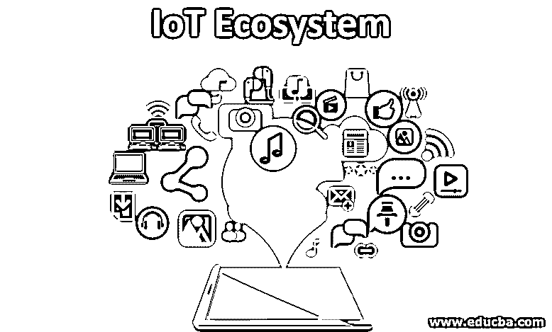
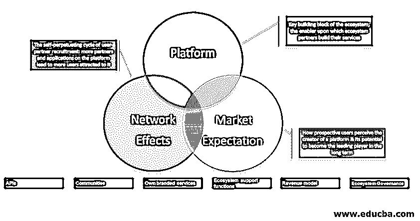

# 物联网生态系统

> 原文：<https://www.educba.com/iot-ecosystem/>

## 物联网生态系统简介

物联网生态系统是从用户层到连接层的各种物联网层的组合。行业级物联网生态系统由各种架构组件组成，如硬件组件、软件和分析组件连接层等。在实践中，定义物联网生态系统的通用架构并不容易，因为它因业务而异。在这里，我们将尝试概括物联网基础设施的组件，生态系统是基于这些组件构建的。

### 物联网生态系统的组成部分

在典型的物联网生态系统中，智能设备、传感器、第三方组件等终端用户组件通过互联网或内部网连接到计算引擎或云实例。让我们看看它的各个模块。

<small>Hadoop、数据科学、统计学&其他</small>

#### 1.传感和嵌入组件

我们整合了温度、陀螺仪、压力、光传感器、GPS、电化学、陀螺仪、RFID 等。基于特定用例获取数据。例如，对于汽车应用案例，我们使用光检测传感器以及压力、速度和图像传感器。选择正确的检测元件是成功用例的关键一步。

#### 2.连接层

物联网环境的一个重要方面是连接性。如果物联网传感器、终端设备和分析或计算组件之间没有无缝连接，我们就无法执行用例。让我们列出连接层的各种模块

*   **协议**:物联网应用可以基于互联网和内部网。对于[互联网应用](https://www.educba.com/what-is-internet-application/)一般遵循基于 TCP/IP 的架构。对于内部网物联网用例，设备通过局域网、射频、Wi-Fi 和 Li-Fi 等连接。

*   **网关**:网关是管理物联网设备和互联网络之间互联网[流量的重要组件。对于任何端到端物联网用例，维护安全性都非常重要。五级网关有助于维护和监控流量。它可以阻止特定的 IP 地址、协议，甚至应用层组件。](https://www.educba.com/iot-devices/)

#### 3.分析层

在几乎每一个物联网用例中，数据都被用来获得重要的业务见解并推动业务决策。我们对这个庞大的数据使用基于预测学习/深度学习的模型来获得洞察力。原始模拟信号经过预处理并转换成一种格式，在这种格式上开发出[机器学习模型](https://www.educba.com/machine-learning-models/)。我们根据使用案例选择大数据基础架构。

#### 4.数据管理层

工业级 IIoT 解决方案需要采集、管理和操作大规模原始和处理数据。一般来说，基于云的架构是用来满足基于业务需求的目的的。能够处理大规模数据(高达每秒 Pb)的超大规模组织通常会建立自己的数据中心来管理这些数据。

#### 5.边缘

Edge IT 是软件和硬件网关的整合架构，用于预处理原始数据。Edge IT 解决方案用于收集来自传感器、RFID、机电组件的原始数据，并在将其发送到云服务器之前进行必要的转换。它们还带有本地存储，在转换之前用作数据管道的缓冲区。

#### 6.终端组件

智能手机、平板电脑、PDA 等智能设备。充当物联网生态系统的终端组件。这些设备通过云应用程序连接到物联网计算引擎，并按需建立远程连接。在某些情况下，计算引擎被集成到第三方 UI 组件、服务中，或者作为父生态系统的一个组件。

我们可以提供物联网生态系统的概要设计，如下所示

### 端到端物联网解决方案提供商

在廉价计算和物联网早期增量的时代，大量技术组织和创业公司正在参与端到端物联网解决方案。

让我们列出一些顶级物联网解决方案提供商及其业务

1.  **ates:**它处理端到端多平台、完全集成的物联网应用和集成。
2.  **占卜:**提供机械诊断物联网解决方案
3.  **Bastille:** 它提供基于物联网的安全和监控生态系统
4.  **FogHorn:** foghorn 提供行业级边缘 IT 解决方案
5.  **Hologram:** 它提供基于云的端到端蜂窝连接和设备管理解决方案

### 结论

在本文中，我们讨论了物联网生态系统的高级架构以及端到端物联网生态系统的全球提供商。在行业格局中，物联网生态系统的定义和标准仍然是一个不断发展的研究领域。根据目标行业、使用案例类型、预算，生态系统会有很大不同。工业物联网解决方案的一个主要方面是期望和参与规模之间的平衡。

### 推荐文章

这是物联网生态系统指南。在这里，我们讨论物联网生态系统的组件，以及各种模块和端到端物联网解决方案提供商。您也可以阅读以下文章，了解更多信息——

1.  [物联网管理](https://www.educba.com/iot-management/)
2.  [物联网的用途](https://www.educba.com/uses-of-iot/)
3.  [物联网应用](https://www.educba.com/applications-of-iot/)
4.  [物联网安全问题](https://www.educba.com/iot-security-issues/)

