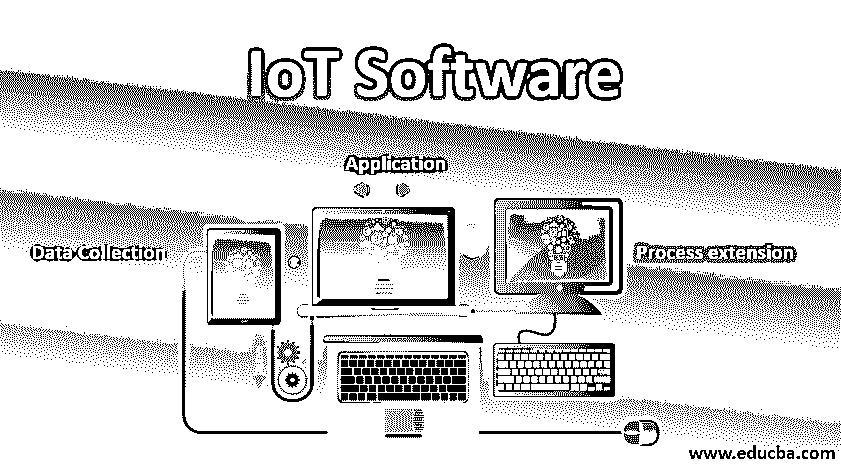
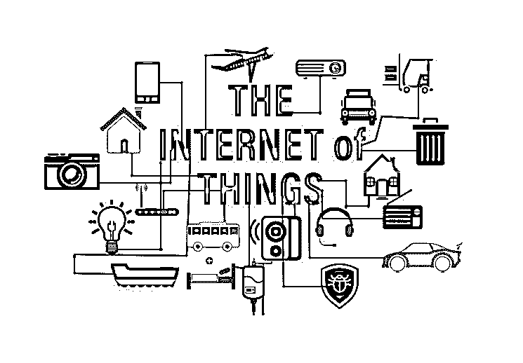
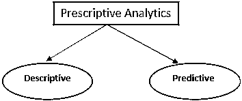

# 物联网软件

> 原文：<https://www.educba.com/iot-software/>

## 物联网软件简介

以下文章提供了物联网软件的概述。IoT 讲的是【互联网+(感知和通信)】。物与物之间通过互联网联系在一起。让我们以 Mi 健身带为例——要使用这种带，用户应该安装 Mi-fit 应用程序来连接手机。Band 计算睡眠总时间、燃烧的卡路里数量、心率监测和睡眠分析。用户可以在手机上看到所有的信息。每一个设备、区域、软件、传感器都是连接在一起的，我们可以通过手机或电脑访问。

### 互联网的影响

*   电子学习——我们可以通过互联网获得任何学科、技术的知识。我们可以从零开始学到专家的水平。
*   业务-全球 70%-90%的业务发生在网上。
*   交流-人类可以通过基于互联网的应用程序与海外的其他人交流。例如——Skype、Webex、WhatsApp 或脸书。
*   娱乐-游戏，视频。
*   医学-飞速发展。例如，医生可以跟踪患者的病史并给予正确的治疗，不同地点的医生可以相互建议应该进行什么治疗来照顾患者。

<small>Hadoop、数据科学、统计学&其他</small>

### 物联网软件

物联网软件通过平台、合作伙伴系统和中间件解决网络和行动领域的问题。

个人和主应用程序负责:

*   数据收集
*   应用
*   过程扩展

#### 1.数据收集

通过物联网连接的设备和技术可以实时监控和测量数据。这些数据可以为节省时间、金钱和能源提供有价值的见解。

*   医疗数据——心跳、血压、血糖水平等。
*   教育数据-出勤率和学习。
*   位置——交通拥堵。
*   农业数据-天气和土壤信息。

**处理物联网数据**

传感器和设备产生了大量的数据；应该在将信息传递给用户之前对其进行处理。我们知道数据不是以一种格式出现的，所以在分析数据之前，我们应该执行一些步骤。

*   将数据转换为统一的格式，确保该格式与您的应用程序兼容。
*   存储并创建新转换数据的备份。
*   过滤重复或不需要的数据以提高准确性。

**物联网数据分析**

物联网设备产生的数据[有各种类型；我们必须应用分析工具来处理这些数据。从大量数据中收集有价值的信息，用于改进应用程序和业务流程。](https://www.educba.com/iot-devices/)

我们可以应用于物联网数据的分析类型:

##### 一.规定性分析

它用于根据给定的情况寻找最佳解决方案。

*   描述性分析将提供对已经发生的事情的洞察。
*   预测分析将预测和预测可能发生的事情，将在选择中确定最佳解决方案。

##### 二。空间分析

它用于从物联网数据中发现隐藏的模式和关系，结合地理空间分析、业务数据和运营数据。工业、旅游和农业公司利用业务应用和 GIS 的地理数据丰富物联网传感器的数据。

##### 三。流式分析

是指从物联网设备采集的实时数据的数据处理。我们可以使用实时数据来分析紧急情况，并提供即时响应。

例如，流量分析和金融交易跟踪。

##### 四。时间序列分析

通过适当的变换观察数据点可能会揭示关于系统趋势和行为的有价值的信息。例如，健康监测和天气监测平台从时间序列分析中获益最多。

物联网数据无处不在；它在我们的家里，在我们的车里，在我们的办公室里。物联网设备会产生大量数据。如果我们收集、处理和分析数据，消费者或组织将获得有价值的洞察力。这将有助于预测未来的决策，并帮助他们成长。

#### 2.物联网软件的应用

IOT 软件的应用如下:

**一、互联家庭**

*   20 世纪 80 年代开始商用，但成本很高。
*   物联网发展最快的领域之一是家庭连接。
*   智能电视等设备
*   通常，它由内部连接的设备网络组成，这些设备通过专有的集线器设备访问互联网。

**二。联网车辆**

*   任何配备无线连接的车辆都可以提供互联网接入。
*   据估计，到 2025 年，道路上近 60%的汽车将联网。
*   启用高级安全功能。
*   提供更简单的车辆软件更新。
*   促进自动驾驶汽车(娱乐、信息、导航功能等设施)。
*   它还可以通过智能手机提供远程解锁/气候控制。

**三世。工业应用**

**a.** 支持从工业工作流程中的无数端点收集数据。

收集的数据可用于:

*   提高运营效率。
*   为决策提供信息。
*   改善客户服务。
*   增加组织内部的协作。
*   提高利润和收入。

**b.** 行业中的物联网可以帮助:

*   开发新服务。
*   提高生产力。

**四。可穿戴设备**

**a.** 一般分为几类。

*   **健身和环境–**腕带、手表和衣服。
*   **健康—**监控医疗指标(心率、血糖)，向患者和医生传达结果。
*   **安全、身份和交易—**银行卡、NFC 设备、安全徽章(为进入建筑物和资源提供身份验证)。

**b.** 一定要小巧节能。

#### 3.过程扩展

应用程序扩展了现有系统和软件的范围。它提供了最有效的系统。它集成了用于特定目的的预定义设备，例如允许某些移动设备访问。它提供了改进的生产力和数据收集。

### 结论–物联网软件

人类应该关心物联网，因为我们都需要简化和安全的生活。从物联网中获得这一价值有助于拥有一个平台来创建和管理应用程序、运行分析、存储和保护您的数据。

### 推荐文章

这是物联网软件指南。在这里，我们讨论物联网的影响和不同类型的物联网软件及其类型。您也可以阅读以下文章，了解更多信息——

1.  [物联网框架](https://www.educba.com/iot-framework/)
2.  [物联网标准](https://www.educba.com/iot-standards/)
3.  [物联网协议](https://www.educba.com/iot-protocols/)
4.  [物联网服务](https://www.educba.com/iot-services/)

