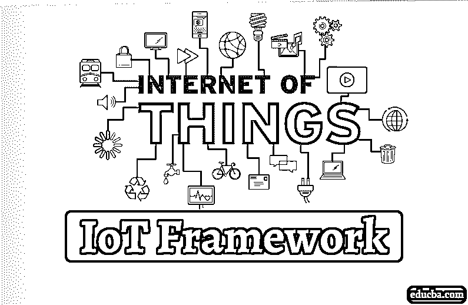

# 物联网框架

> 原文：<https://www.educba.com/iot-framework/>

## 物联网框架概述

物联网(Internet of Things)是一种连接到互联网的设备网络，用于传输和感知数据，无需太多人工干预，用于此的框架称为物联网框架，该框架包括云支持所需的所有功能和满足物联网技术所需的其他需求，常用的常见物联网框架有 KAA 物联网、思科物联网云连接、ZETTA 物联网、SAP 物联网、IBM Watson、惠普企业等

### 什么是物联网框架？

物联网是一个大型[物联网生态系统](https://www.educba.com/iot-ecosystem/)的关键部分，它促进并链接方案中的所有元素。 [It](https://www.educba.com/iot-management/) 允许设备管理，处理[软件和硬件](https://www.educba.com/hardware-vs-software/)上的通信协议，收集/分析信息，改善信息流和智能应用程序功能。

<small>Hadoop、数据科学、统计学&其他</small>

### 物联网框架列表

现在我们将逐一讨论物联网框架

#### 1.KAA 物联网

Kaa IoT 是最有效和最丰富的开源物联网云平台之一，任何人都可以在其中自由实施他们的智能产品概念。在这个平台上，您可以管理 N 个相互连接的设备，实现跨设备的互操作性。您可以通过提供和配置远程设备来实时监控您的机器。Kaa 支持互联设备、物联网云、信息和可视化系统以及物联网生态系统的其他元素之间的信息交换

#### 2.思科物联网云连接

思科物联网云连接为企业提供强大、自动化和高度安全的连接。物联网数据管理由 Cisco Kinetic 物联网平台完成，以提取、移动和计算数据。由于思科以其安全服务而闻名，它通过安全的[物联网架构](https://www.educba.com/iot-architecture/)保护物联网部署免受威胁。

#### 3.泽塔 IoT

Zetta 只不过是一个基于 REST、NodeJS 和 Siren 超媒体(API-strip flow-based reactive programming 哲学)开发的面向服务器的平台。在被抽象为 REST APIs 之后，它们与云服务相连接。这些互联网服务包括用于可视化机器分析和支持的工具，例如 Splunk。它通过与 Heroku 等系统连接到 Arduino 和 Linux hackers 等端点，构建了一个 gero 分布式网络。

#### 4.Salesforce 物联网

Salesforce 是雷霆的力量。Thunder 允许公司释放早期未发现的想法，并允许任何人从任何设备采取主动的个性化活动，以使他们的客户比以往任何时候都更接近。Salesforce 在全球拥有超过 150，000 个客户。Salesforce 在全球 CRM 市场中占有 19.7%的市场份额。SAP (12。%1)、微软(6.2%)、甲骨文(9.1%)都远远落后于紧随其后的竞争对手。许多企业现在在 Salesforce 平台上开发他们的应用程序或迁移到 Salesforce。这增加了 Salesforce 对开发人员和[管理员的需求。](https://www.educba.com/careers-in-salesforce/)

#### 5.你猜 IoT

DeviceHive 是另一个丰富的物联网开源平台，在 Apache 2.0 许可下分发，可以免费使用和更改。它为 [Docker 和 Kubernetes](https://www.educba.com/kubernetes-vs-docker/) 提供了部署选项，可以通过公共云和个人云下载和使用。除了设备信息之外，您还可以运行批量分析和机器学习。DeviceHive 支持几个库，包括 Android 和 iOS。

#### 6.Oracle 物联网

当我们比较顶级物联网平台时，我们当然包括 Oracle，一家以提供顶级数据库管理和商业软件解决方案而闻名的全球软件公司。Oracle 以其灵活的环境为公司提供了创建公司应用程序的绝佳机会。Oracle 支持处理并构建具有非常广泛数据的大规模物联网网络。使用先进的安全系统来保护物联网系统免受外部威胁是另一个值得一提的问题。由于这些系统通常具有不同的设备，其中一些设备没有安全工具，因此实施集中的安全措施是不够合理的。

#### 7\. SAP IoT

SAP 物联网云平台拥有构建和处理物联网应用所需的一切。SAP 平台为远程管理和监控物联网系统的所有连接设备提供了便利的环境。在 SAP 平台中，我们可以直接或通过云服务连接远程设备。显然，SAP 可以利用物联网信息创建[机器学习和人工智能](https://www.educba.com/machine-learning-vs-artificial-intelligence/)应用，同时保持最近的技术趋势。

#### 8.微软 Azure 物联网

没有微软 Azure 解决方案，有 [AWS 和谷歌云平台](https://www.educba.com/google-cloud-vs-aws/)的云服务巨头，我们物联网平台的对比就不完整。Microsoft Azure 物联网套件提供预配置的解决方案，以及个性化和开发新解决方案以满足项目要求的能力。通过 Microsoft Azure 物联网套件，可以实现最强大的安全机制、卓越的可扩展性以及与您当前或未来系统的简单集成。

#### 9.谷歌云平台–物联网框架

事情可以由谷歌来做。谷歌云是当今最好的物联网系统之一，其端到端平台。谷歌脱颖而出，因为它可以使用云物联网核心处理大量信息。由于谷歌的云数据工作室和大查询，你可以获得高级分析。在谷歌云平台的[帮助下，你可以加速你的业务，也可以加速你的设备。](https://www.educba.com/what-is-google-cloud-platform/)

#### 10.IBM Watson–物联网框架

我们不能指望蓝色巨人错过在物联网领域有所作为的机会。IBM Watson 在物联网平台中非常受开发者欢迎。Bluemix 混合云支持的 Watson 物联网平台允许开发人员轻松使用物联网应用。IBM Watson 管理安全通信和数据存储。实时数据交换也是由 IBM Watson 完成的。

#### 11.惠普企业–物联网框架

Hewlett Packard Enterprise 的通用业务平台通过为客户的大多数问题提供解决方案，为客户提供了可扩展性。该平台提供基于云的协助或本地支持。在智慧城市和汽车行业，HPE 通用物联网平台得到了恰当的应用。HPE 已经实现了几项业务的数据货币化。惠普企业收集和分析信息以发展公司。在惠普企业 M2M 公司中，设备管理采用单点、单一卖方方式。

#### 12.Bsquare 的 DataV–物联网框架

下一个云平台是 Bsquare 的 DataV。该公司正在与公司中最好的公司合作，包括谷歌、亚马逊网络服务和微软。Bsquare 非常重视它的服务，并引入了 DataV 应用程序，这是一个用于管理服务的混合框架。它提供各种服务，预测和分析你所有的生态系统问题。它改善了条件维护。

#### 13.西门子 mind sphere–物联网框架

西门子的 Mindsphere 提供了一个经济高效的平台即服务，是应用程序开发的理想选择。经济高效的平台允许您将所有设备连接到云解决方案。根据 DIn ISO / IEC 27001 标准，西门子声称每一个存储的信息都是严格保密的。您可以从业务中选择开放接口和本地连接。允许您管理机器信息，以便打开新的机会。

#### 14.Ayla 网络–物联网框架

Ayla networks 开发了他们的平台作为企业解决方案。敏捷 Ayla 网络的建立是为了支持客户顺利建立服务，而不仅仅是开发产品。除了 Ayla 敏捷平台，AMAP 是 Ayla 的一个敏捷移动应用平台，通过应用开发开发和指导消费者。

#### 15.MBED 物联网设备平台

开源服务在 Apache 2.0 Arm MBED 计算机平台上可用。它涉及云服务、开发人员工具和操作系统，促进了商业产品的创建和运营。该服务旨在简化用户的流程。MBED OS 旨在作为开源平台连接您的所有设备。该平台提供来自 60 多个合作伙伴的服务，并免费访问由 200，000 名设计师组成的社区。您可以灵活地访问 MBED 俱乐部服务

#### 16.亚马逊网络服务(AWS)物联网框架

[亚马逊网络服务](https://www.educba.com/aws-services/) (AWS)是亚马逊提供的物联网平台。这个物联网平台通过 AWS 控制台提供云计算、数据库和安全服务。还有许多其他服务，如区域、可用性区域和虚拟私有云(VPC)。它有助于缓解应用程序的持久性、分布性和可用性的提高。它为 AWS 与英特尔、德州仪器、博通和高通等硬件制造商合作的设备提供识别设备的注册表、安全设备网关和兼容软件开发套件。

#### 17.mocana–物联网框架

名单上最后一个是 Mocana 公司的安全平台。该平台旨在为工业物联网设备和云提供安全性。该公司目前为 100 多家公司提供服务。

#### 18.RTI 物联网

RTI 是历史最悠久、最具开拓性的物联网平台提供商之一，也是最具影响力的物联网产业公司。Connext DDS 专为智能计算机及其相应的信息物理系统而打造。与主要为 IT 系统设计的消息中间件不同，Connext DDS 不需要响应代理、目录服务、服务器以及管理。

### 结论

物联网是大型物联网生态系统的关键部分。物联网促进并链接方案中的所有元素。我们已经看到了不同的物联网平台，这有助于您根据自己的需求选择给定的物联网平台。对你绝对有帮助。

### 推荐文章

这是物联网框架指南。在这里，我们讨论了有帮助的不同物联网框架的基本概述和列表。您也可以浏览我们推荐的其他文章，了解更多信息——

1.  [什么是 JSP？](https://www.educba.com/what-is-jsp/)
2.  [物联网的优势](https://www.educba.com/benefits-of-iot/)
3.  [前 5 种互操作性测试](https://www.educba.com/interoperability-testing/)
4.  [Azure IoT Edge | Azure IoT Edge 综合指南](https://www.educba.com/azure-iot-edge/)

