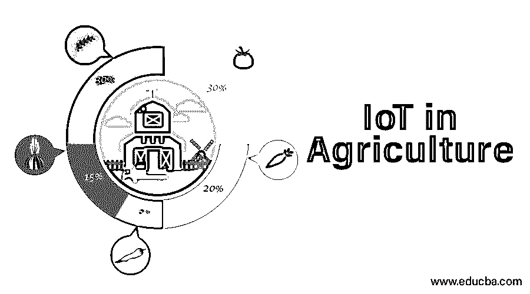
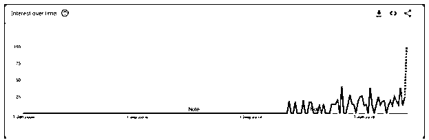
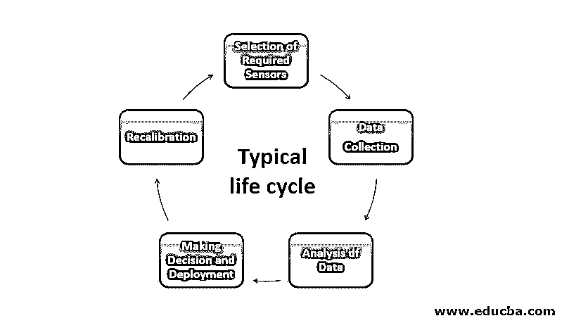

# 农业中的物联网

> 原文：<https://www.educba.com/iot-in-agriculture/>

## 农业物联网简介

在互联网和互联设备时代，物联网(IoT)是行业的下一件大事。另一方面，预计到未来 30 年，世界人口将超过 60 亿，为这些人口生产食物所需的增量为 70%。整合基于物联网的智能农业系统对于应对这一需求至关重要。让我们看看农业行业面临的挑战，以及物联网是如何解决这些问题的。

### 现代农业面临的挑战以及物联网是如何解决的？

农业和种植业面临的主要挑战可以简单分为以下几类。

<small>Hadoop、数据科学、统计学&其他</small>

*   全球变暖和环境变化。
*   劳动力缺乏，人力供需缺口巨大。
*   缺乏适当的监控，需要大量人工干预。
*   分析大规模非结构化数据的挑战。

### 智能耕作和农业中的物联网应用

互联网连接和廉价计算的便利性使得将物联网解决方案融入农业成为可能。

以下是物联网在农业行业的一些重要使用案例。

#### 1.实时作物监控

智能传感器、运动检测器、智能运动感应摄像机和光检测器使农民能够获得农场的实时数据，以监控产品质量和优化资源管理。

#### 2.农业中的物联网分析

来自智能传感器的数据可用于预测分析和自动化决策。它通过智能的自动化决策来帮助农民，而不是传统的基于规则的系统或手动程序。预测分析和机器学习可以帮助农民应对洪水、干旱等极端天气条件。物联网分析的主要优势是将土壤质量、温度、湿度作为一个参数。

#### 3.牲畜管理

由于工农业非常依赖体力劳动者。鉴于全球经济形势的变化，供需缺口日益加大。牲畜就是这样一个需要定期监测的领域。基于物联网的智能跟踪可以帮助农民将股票信息直接发送到他们的智能设备上。它使有牲畜管理的农民能够更早地发现烟道爆发，并将受感染的品种与未受感染的品种分开。

#### 4.基于无人机的用例

工业级无人机在智能农业中也有多个用例。一方面，无人机用于监测空气、土壤、水分质量；另一方面；它们可以帮助身体活动，如自动喷洒肥料，防止农场中的物理爆发等。显然，在农场中使用无人机存在一些挑战，但成功的部署和使用案例可以帮助显著减少农业中的人工劳动力。

#### 5.智能温室解决方案

温室通常用于维持植物所需的空气，这一过程需要持续的监控和人工干预。工业物联网解决方案可以实现这一过程的自动化。智能传感器收集的数据可以被自动分析，基于深度学习的系统可以被部署来做出决策，并自动创造某种氛围。借助这些智能传感器，可以通过短信或基于 Wi-Fi 的系统监控气候变量和用水量。

#### 6.智能废物管理

农业和其他工业的主要区别之一是工业废物的价值。农业产生的生物废物可以重新用于制造肥料；物联网解决方案可以帮助以智能的方式远程管理流程。智能传感器可用于测量废物中有毒化学物质的存在，并管理适当的农业生命周期。

### 物联网在农业领域应用的全球趋势

### 基于物联网分析的农业用例的典型生命周期

基于物联网的典型用例的生命周期，如果我们分解一个物联网分析的示例用例，它包括以下阶段:

**1。传感器的选择:**传感器的选择因用例而异；例如，牲畜管理所需的传感器与智能温室用例所需的传感器非常不同。

**2。数据收集:**从部署的传感器收集数据，并将其转换成所需的格式。

**3。做出决策和部署:**从传感器收集的数据可用于获得洞察力和做出自动化的业务决策。通过适当的数据科学后，生命周期模型根据需要部署到云或本地服务器。

**4。模型的重新校准:**根据业务 KPI 和与结果的偏差，监控和重新校准从先前流程获得的结果。

### 结论

在本文中，我们讨论了农业部门面临的各种问题，以及工业物联网如何帮助缓解这些问题。具有机器学习和计算机视觉的物联网可以改变智能农业的产业格局。我们还讨论了典型物联网用例的各个阶段，以及农业领域物联网的全球趋势。尽管事实上与其他行业相比，物联网用例的可扩展性仍然非常有限，但整合这些用例对于全球食品管理来说正变得至关重要。

### 推荐文章

这是农业物联网指南。在这里，我们将讨论一个简要概述、现代农业面临的挑战、物联网应用的全球趋势以及基于物联网分析的典型生命周期。您也可以浏览我们推荐的其他文章，了解更多信息——

1.  [物联网简介](https://www.educba.com/introduction-to-iot/)
2.  [物联网软件](https://www.educba.com/iot-software/)
3.  [物联网平台](https://www.educba.com/iot-platform/)
4.  [物联网项目](https://www.educba.com/iot-projects/)

