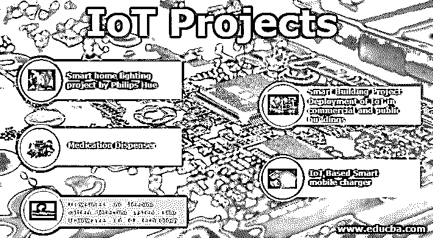

# 物联网项目

> 原文：<https://www.educba.com/iot-projects/>

## 物联网项目介绍

在欧洲研究项目报告中，物联网被称为互联网未来的重要组成部分，因为物联网充当了互联网和事物之间的桥梁，从而建立了它们之间的联系。物联网项目已在不同领域实施，例如，交通、教育、智能家居等。然而，单个物联网架构可能无法适应多个项目，因此需要标准的[物联网架构](https://www.educba.com/iot-architecture/)来提高融合度和接受度。最近，美国、英国和中国的政府都在考虑并资助物联网原型。在本文中，我们将了解各国政府为实施基于物联网技术的项目[而开展的不同广受好评的项目和步骤。](https://www.educba.com/what-is-iot-technology/)

### IOT 项目

包括欧盟、中国和美国在内的许多国家都在开展各种物联网项目，以进一步发展本国经济。欧洲成立了 ERC，这是一个发展物联网的组织，目前正在资助 50 多个项目。联合国网络与信息技术部为物联网技术的研究提供了基础，该研究完全由美国国家科学基金会管理。大多数项目旨在改善公众的生活和健康状况。

<small>Hadoop、数据科学、统计学&其他</small>

现在，让我们看看世界各地的政府和公共部门开展的一些物联网大项目。

### 物联网增强的人类体验

当今社会正朝着科技时代前进，人们在日常生活中会遇到许多电子设备，如手机、平板电脑、智能手表和各种其他形式的电子产品，也称为物联网。到这个十年结束时，预计将有超过 400 亿台设备部署在我们的周围。这些设备生成的数据将定期上传到互联网，可进一步用于自动化和决策目的。全球多家公司都在考虑使用物联网来增强客户满意度和员工福利方面的体验；健康、福利、健身、运输、物流、环境和制造等领域的精细服务是物联网可以提升人类体验的几个领域。

#### 1.卫生服务

现在，患者在手腕上佩戴嵌入式数字传感器，这样医生就可以监控他们的健康状况，并远程监控患者的状况。嵌入腕带的传感器有助于收集心率和液体摄入量等数据。内科医生和医生可以使用各种工具来改善患者的生活质量。

#### 2.公共安全

公共安全工作者和灾害管理小组现在可以相互联系，并在危难情况下发送信号。在操作过程中，工人的安全可以在实时输入、压力和心率检测器的帮助下得到监控，从而在搜索和救援操作过程中建立更好的团队协调。

### 私营部门项目

以下是下文提到的私营部门项目清单:

#### 1.飞利浦 Hue 智能家居照明项目

*   飞利浦 Hue 是现代家庭的一项革命性技术，让您可以远程控制家中安装的灯光。人们可以计划灯在一段时间内的开关。灯还嵌入了传感器，以检测人类的存在，并相应地打开和关闭。
*   这项技术可以更进一步，通过根据正在观看的电影类型自动调节亮度来增强电影体验。例如，如果你在看恐怖电影，房间的亮度会降低，给用户更好的体验。

#### 2.药物分配器

飞利浦的这款配药器是为那些无法掌握每日服药情况的老年患者设计的。该设备有助于跟踪他们的药物，并在预装杯中分配所需剂量。该装置进一步通知用户何时需要补充或维修。

#### 3.利用脑电波和物联网技术的睡意和睡眠模式检测系统

*   一个新的系统将能够检测脑波频率，并在检测到用户困倦时发出警报。根据一项研究，成年人的大脑由数十亿相互连接的神经元组成。这些处于完全清醒状态的神经元产生电荷，这有助于在我们的头皮周围产生小范围的电荷。
*   这种电荷可以在传感器 T1 的帮助下被检测到。如果用户在驾驶汽车时处于昏昏欲睡的状态，则系统可以检测到不活动，并在用户的移动设备上发出警报来唤醒用户。
*   辛苦一天后，人们容易睡着。由于工作压力很大，即使在工作时间之外，一个人也可能不得不付出额外的努力。在当今世界，当大脑感到昏昏欲睡时，很难集中注意力。物联网有着广泛的应用。
*   物联网包括广泛的系统、传感器和网络产品、计算能力的进步、电子小型化和网络互联，以提供许多以前没有的应用。每个人的睡眠模式是不同的，所以所有的用户数据都存储在云中。
*   基于年龄组，可以分析该数据，并且可以生成睡眠模式图。而用户的睡眠信息也可以用来评估用户是否为自己的健康状况留下健康的生活。
*   可以创建一个跟踪用户睡眠模式的 Android 应用程序。客户端必须设置一个计时器，设备将在该时间范围内完成工作。睡眠模式信息将被存储并用于将来参考。
*   提出了一种基于 EEG 的睡意检测模块，用于在忙碌一天后仍有未完成的工作要做并且需要保持清醒来完成这些工作的人。所以，累了一天之后，很难坚持下去完成工作。借助脑电波，这个装置可以感知个人的精神状态。
*   在移动应用上，用户设置一个定时器，模块处于开启状态，直到定时器开启。该程序还将保存用户的睡眠模式，这些信息将存储在云中。该应用程序将跟踪模式，并根据需要提出建议。

#### 4.智能建筑项目:物联网在商业和公共建筑中的部署

*   该项目基于与建筑共存的物联网，为商业建筑构建一个经济高效的能源管理系统。建筑物中的自动化能源管理利用了占用识别和预测，因为占用与能源的使用直接相关。
*   因此，有可能仅使用普通可用且低成本的传感器来检测住宅建筑中的占用情况，使得有可能在建筑的能量管理系统中集成占用检测以及随后的占用预测服务。此外，该系统足以区分居住者的活动并远程控制诸如摄像机之类的设备。
*   通过改进对房屋能耗的估计，占用预测可以帮助改进建筑物的自动化能源管理系统。此外，如果占用预测被实现为独立的微服务，则占用数据也可以被其他应用使用，例如建筑自动化。因此，我们正在努力用更多的传感器来扩展我们的方法，以便更可靠地检测和预测人口。
*   物联网在使我们的建筑和城市智能化方面发挥着关键作用。智能建筑旨在保护居住者免受盗窃、袭击、火灾和自然灾害。这可以通过评估建筑物及其周围环境来实现，然后部署所需的措施，例如检测未知的存在，即检测不属于社区的人以及入侵者。
*   安全措施分为三个步骤:安全操作、建筑系统和对策。
*   今天的建筑是结构和技术的复杂结合。随着时间的推移，建筑内的每一个元素都得到了改进和发展，使建筑居住者能够通过按下按钮来控制供暖、通风、空调、照明、娱乐和安全系统，甚至可以配置他们的环境，以自动适应他们的生活方式和活动。为了运行，智能建筑管理系统使用嵌入式传感器设备。
*   传感器提供关于建筑物中当前居住者的信息，包括照明、加热、通风、电气和其他机械系统。单个光传感器可以用来检测人们通过门口或阻塞点。虽然肯定比智能门或运动探测器更具成本效益，但这些方法都不能用于实时监控房间占用情况。
*   第一种方法是让我们在门框的顶部放置一个传感器，这样当门打开时会挡住传感器。第二种方法是将传感器放置在腰部高度，指向窗外。

#### 5.基于物联网的智能移动充电器

*   在 2018 年年度物联网大会期间，有人提出了一个可以简化移动设备和笔记本电脑充电过程的计划。该系统将仅能够在电子设备被连接时打开和关闭，并且在必要时被充电，并且可以被进一步增强以控制其他设备。可以对系统进行进一步的改进，以提高硬件的性能。
*   能够跟踪和管理功耗的机器将大大有助于减少能源浪费。该系统将只能在设备连接时打开和关闭，并在需要时充电，并且可以进一步改进以监控其他设备。有几个模块可以在与充电电路结合时将适配器转换为基于物联网的设备，如 ESP8266、Particle Photon 和其他基于 Arduino 的 Wi-Fi 模块。
*   该项目旨在引入一种智能充电系统，使用充电设备通过云自动监控其行为。在物联网中，系统可以设计为降低功耗和人力。
*   正在使用的系统是 ESP8266，webserver 是物联网网络，设备可以与平台分离。该系统旨在与基于物联网的网络服务器进行通信，并向网络服务器转发命令。该设备有助于监控其他设备，并自动向手机发送通知。
*   设计了一个系统来帮助控制充电器的电源，并监控设备消耗的电量。使用这个程序，可以帮助防止手机和笔记本电脑等设备被禁用或过载。三个基本组件，即物联网设备、[物联网平台、](https://www.educba.com/iot-platform/)和客户端设备，将用于设计该系统。
*   物联网在几乎每个领域都有巨大的潜力来开发新的智能应用。使用延长物联网设备电池寿命并降低其功耗的技术，可以提高基于能源的物联网设备的效率。这台机器可以用来管理手机，笔记本电脑和其他电子设备的充电。

### 结论

在这个新的数字环境中，物联网扮演着越来越重要的角色，为我们提供了让我们的世界比以往任何时候都更加智能和互联的方法。尽管如此，为了让公司充分利用物联网，仍有一些重大挑战需要解决。作为智能革命的关键组成部分，物联网大有可为。这提供了更高的效率和新的服务，通过允许从周围容易地收集数据来改善市民的生活。为了实现这个梦想，需要足够的应用程序模型和编程抽象来克服物理世界的复杂性，并帮助开发人员更快、更有效地构建应用程序。

### 推荐文章

这是物联网项目指南。在这里，我们讨论政府和公共部门物联网项目的各种列表。您也可以看看以下文章，了解更多信息–

1.  [物联网框架](https://www.educba.com/iot-framework/)
2.  [农业中的物联网](https://www.educba.com/iot-in-agriculture/)
3.  [物联网协议](https://www.educba.com/iot-protocols/)
4.  [物联网公司](https://www.educba.com/iot-companies/)

