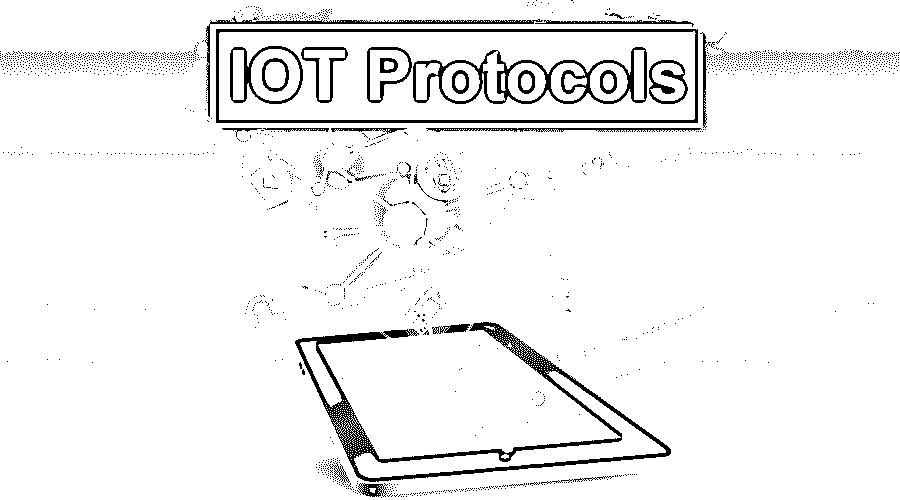
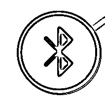
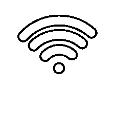
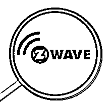
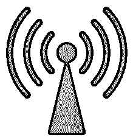
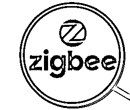

# 物联网协议

> 原文：<https://www.educba.com/iot-protocols/>

## 物联网协议简介

IoT 代表物联网。我们非常擅长许多通信技术，如 WIFI、蓝牙、3G/2G/4 G，现在市场上 5 G 即将到来，但市场上有几个新鲜的波联网选择。[物联网系统](https://www.educba.com/iot-framework/)只有在两台设备通过通信网络安全连接的情况下，才能在线运行和传输数据。是什么使这种联系成为可能？[物联网标准](https://www.educba.com/iot-standards/)和协议由一种看不见的语言组成，它允许物理对象在它们之间“说话”。用于电脑、智能手机或平板电脑的通用协议可能不符合 IOT 解决方案的具体条件。

### 物联网网络的类型

网络的划分取决于它们提供的范围。

<small>Hadoop、数据科学、统计学&其他</small>

物联网网络如下所示:

*   毫微；纤（10 的负九次方）
*   [NFC](https://www.educba.com/full-form-of-nfc/)
*   平底锅
*   局域网
*   男人
*   广域网

#### 1.纳米网络

纳米网络是纳米设备之间的纳米级通信网络。为了使用纳米机器的各种功能，完整的纳米网络中的一系列纳米器件必须由适当的体系结构来管理和控制。纳米网络可以收集医疗保健领域的重要患者信息，并将其提供给计算机系统，使健康监测更加准确和高效。除了肿瘤检测过程，卫生系统中的纳米物联网将通过精确和本地化的药物治疗为患者的治疗提供诊断和支持。

#### 2.国家足球联盟

NFC 代表近场通信。这种短距离无线连接(ECMA-340，ISO / IEC 18092)允许设备在互联或放置在几厘米范围内时进行通信。该标准由飞利浦和索尼共同设计，提供了一种创建用于信息交换的对等(P2P)网络的方式。

当 P2P 网络建立后，其他无线技术如蓝牙或 WiFi 可以用于扩展通信或传输更大的信息。现在，大多数 Android 智能手机都可以使用相同的技术，这意味着你可以使用 Google Pay、TecTile 等服务将钱包数字化。

#### 3.平底锅

个人区域网络(PAN)是单个人范围内的 IT 设备的互连，一般在 10 米以内。举一个用户携带笔记本电脑、私人数字助理(PDA)和移动打印机旅行的例子，移动打印机可以通过无线技术将它们连接起来，而无需插入任何东西。这种类型的专用区域网络通常也可以在没有电缆的情况下与互联网或其他网络互连。

#### 4.局域网

LAN 是指局域网。这用于小型区域网络。计算机和其他移动设备通过局域网连接共享资源，如打印机或网络存储。Wi-Fi 和以太网是实现局域网连接的两种主要方式。以太网是一种允许机器交互的规范。无线电波用于电脑、打印机、手机等的无线连接。用户可以与其他人一起访问存储在局域网服务器上的文件；网络管理员拥有读写权限。

#### 5.男人

MAN 代表城域网。这是一个[计算机网络](https://www.educba.com/introduction-to-computer-network/)，帮助用户连接某个地理区域的计算机资源。它覆盖的区域比广域网(WAN)小，但比局域网(LAN)大。它还可以用来定义在有几个局域网的大都市区域中它们之间点对点的互连。

#### 6.广域网

WAN 代表广域网。广域网也称为数据网络。基本上，这个网络也用来连接城市，国家，州。虚拟专用网(VPN)允许 WAN 站点进行连接。有线和无线技术可以包括 WAN 连接。企业广域网帮助用户共享对中央应用程序、服务和其他资源的访问。

### 物联网协议

下面提到了一些最重要的物联网协议:

#### 1.蓝牙

蓝牙是最常用的短距离无线技术之一。您可以快速获得蓝牙应用程序，这些应用程序为您配对智能设备提供了便携技术。是的，我们可以说蓝牙并不是为了传输巨量的数据而设计的，但是少量的数据却可以轻松完美的传输。这就是为什么蓝牙在互联网上引领了这一代的协议。蓝牙有一个新版本，它是蓝牙核心，2.4 GHz，50 到 150m 的范围，1 Mbps 的速度。

#### 2\. Wi-Fi

Wi-Fi 是无线保真的缩写。无线互联网是领先的现代技术发展之一。它可以被锁定、固定或打开，也可以在短距离或长距离内自由移动。无需柔性电缆，WiFi 就能连接手机，并由此接入互联网。对于这些设备来说，wi-fi 是访问互联网的无线连接。Wi-Fi 利用无线电波以特定频率发送数据，而不是使用有线链路，通常是 2.4GHz 或 5GHz，尽管更多的是在其他利基设置中使用。标准的 Wi-Fi 网络在户外最远可达 100 米。

#### 3.z 波

Z-Wave 是一种无线协议，主要用于智能家庭网络，与智能设备链接和交换控制和信息。Z-Wave 协议为家庭自动化提供了低成本的无线连接，是 WiFi 的低功耗替代方案，也是蓝牙的长期替代方案，通过网状网络和消息确认实现双向通信。Z-Wave 协议在美国以低频 908.42 工作，在欧洲以 868.42 MHz 工作。Z-Wave 提供 9.6 kbps、40 kbps 或 100 kbps 吞吐速率的小数据包传输速率。

#### 4.西福克斯

SigFox 开发了一个全球网络来监听数十亿台机器的数据传输。Sigfox 能够从全球各地的物联网设备收集非常微小的信号——使用最小的能量水平，以实现自然能量采集系统的效率。

这个 SigFox 基于三个支柱:

*   低能耗
*   成本低
*   互补技术

Sigfox 通过一个标准 API 包提供了从传感器和设备收集信息的标准方法。Sigfox 兼容蓝牙、GPS 2G/3G/4G、Wifi。

#### 5.线

这个词来自线程；我们也可以说是一个轻量级的过程。其概念是将进程分成不同的线程，实现并行。例如，几个选项卡可以是浏览器中的不同线程。MS Word 使用许多线程，比如一个用于文本格式，一个用于输入处理，等等。几个线程之间的通信更简单，因为线程共享一个公共空间。在该方法中，我们必须遵循某些特殊的通信技术来进行两个进程的通信。

#### 6.细胞的

这些物联网应用可以使用 GSM/3G/4 G 等蜂窝通信功能。蜂窝是物联网通信的协议之一，可以发送或传输大量信息。对于一些应用，蜂窝电话不仅成本高，而且耗电也高。蜂窝电话的频率为 900/ 1900，最大频率为 21000 MHZ，GSM 的最大范围为 35 公里，HSPA 的最大范围为 200 公里。

#### 7.6LoWPAN

6LoWPAN 是一种基于 IP 的通信协议。6LoWPAN 代表低功率无线个人区域网上的 IPv6。IPv6(互联网协议版本 6)是一种 128 位互联网协议，旨在克服 32 位 IPv4 在寻址方面的局限性。因为它，许多设备可以互相连接。6LoWPAN 系统用于各种目的，包括传感器的无线网络。这种无线传感器网络形式通过低功耗 WLAN 网络以数据包的形式传输数据，并使用 IPv6 作为 [IPv6](https://www.educba.com/what-is-ipv6/) 名称的基础。随着全球迁移到 IPv6 分组信息，这种 6LoWPAN 方案为低功率无线传感器网络和其他低功率无线网络类型提供了许多好处。IPv6(互联网协议版本 6)是一种 128 位互联网协议，旨在克服 32 位 IPv4 在寻址方面的局限性。因为它，许多设备可以互相连接。

#### 8.射频识别（Radio Frequency Identification）

RFID 代表射频识别。无线电波用于读取和记录存储在物品标签上的数据。标签上的 RFID 组件有两部分:存储和处理数据的微芯片和传输信号的天线。通常有两种类型的 RFID，第一种是无源的，第二种是电池供电的。无源 RFID 标签用于通过无线电波功率将存储的数据转发给询问器。一个电池供电的 RFID 标签使用一个微型电池内置在数据继电器中。标签包括特定物品的序列号。

#### 9.Zigbee

Zigbee 是一种短程无线通信协议。它基于 IEEE 802.15.4 协议。它主要用于家庭自动化和工业。它是低功耗应用的首选。低功耗、高可扩展性、安全性和耐用性是 Zigbee 的主要特点。Zigbee 的范围是 10 米，但这个范围可以扩展到 100 米。Zigbee 的最大数据速率为 250 kbps。

### 结论

在本文中，我们已经了解了不同类型的物联网网络，以及通信中使用的协议。

### 推荐文章

这是物联网协议类型的指南。这里我们讨论了物联网协议的基本概念和各种类型的协议。您也可以浏览我们推荐的其他文章，了解更多信息——

1.  [路由协议](https://www.educba.com/routing-protocol/)
2.  [物联网服务列表](https://www.educba.com/iot-services/)
3.  [物联网的优势](https://www.educba.com/benefits-of-iot/)
4.  [Wi-Fi vs 以太网](https://www.educba.com/wifi-vs-ethernet/)

