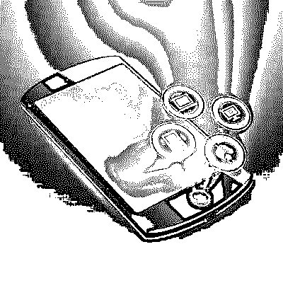

# 物联网应用

> 原文：<https://www.educba.com/iot-applications/>

## 什么是物联网

由于互联网的使用越来越多，技术进步和连接成本低，物联网(IoT)正在快速发展。物联网是一种环境，在这种环境中，物体、动物和人被赋予唯一的身份，数据在网络上传输，无需人机交互的帮助。它有助于通过开关将任何设备连接到互联网。物联网物联网教程是连接到互联网的日常物品的集合。

物联网以更安全的方式实现数据交换。现在，企业创建自己的物联网应用程序并充分利用它变得更加容易。有许多现成的物联网平台可以帮助您更轻松地开发应用程序。物联网 IoT 教程一天比一天大。

<small>Hadoop、数据科学、统计学&其他</small>

### 它是如何工作的？

物联网(IoT)需要一个巨大的数据库，使用很少的技术对物体进行编目和跟踪。使用这些无线识别系统和可追溯性，对象可以向其他对象或节点传递信息。

### 物联网技术

下面列出了使用的主要技术

*   射频识别（Radio Frequency Identification）
*   无线局域网（wireless fidelity 的缩写）
*   条形码 e 二维码
*   ZigBee
*   传感器和智能手机

### 物联网的应用领域

未来 15 年，物联网将对地球上的每个家庭和企业产生影响。根据 2008 年的一项研究，连接到互联网的东西的数量超过了生活在这个星球上的人。预计 2020 年将达到 500 亿美元。物联网应用使用技术来提高我们的舒适度，使用更少的能源来完成任务，并让我们能够更好地控制我们的生活，无论是在家里还是在工作中。物联网教程的重要应用领域很少。下面列出了一些物联网示例

#### 建筑和家庭自动化

物联网培训提供了广泛的应用程序来监控建筑和家庭。物联网的例子很少

*   访问控制
*   光线和温度控制
*   连接的设备
*   能量最小化

#### 智能城市

物联网培训提供了许多应用程序，以降低成本和节省资源来发展智慧城市。它包括以下应用程序

*   住宅电表
*   交通管理系统
*   智能路灯
*   监控摄像头

#### 制造业

物联网在制造领域的应用将有助于简化流程，并为您的下一个物联网制造流程腾出时间。应用程序用于

*   流程优化
*   实时库存
*   资产跟踪
*   雇主安全

#### 衣服

可穿戴式现场监视器，记录并反馈您和您的环境。它主要分为两个部分-健身和环境，健康。智能手表和位置追踪也属于可穿戴设备。这些物联网应用节省了能源和成本。

#### 卫生保健

医疗保健领域的物联网应用有助于提高质量和可访问性，从而在该领域掀起一场新的革命。技术用于

*   远距离监控
*   救护车遥测技术
*   访问控制
*   预测性维护

#### 汽车的

物联网为现代汽车提供了广泛的创新技术。它包括

*   无线连接
*   高级传感器网络
*   机器对机器通信
*   信息娱乐

所有这些创新将使他们比以前更有效率。

#### 智能供应链

如今，供应链变得越来越智能。物联网在供应链中的应用包括跟踪货物、共享库存信息等。

#### 智能农业

智能农业不属于健康或工业等其他类别。但由于其重要性的增加，物联网已经将其应用扩展到了这一领域。截至目前，该领域的应用并不多。但在不久的将来，它将会引起大规模的关注，大量的应用将会被开发出来。

### 构建物联网 IoT 应用

开发人员在开发物联网应用时面临的几个重要问题是

*   使用物联网构建应用的最佳方式是什么？
*   开发这样的应用程序需要哪些技能？
*   这类应用的出发点是什么？

**以下几点会给你这些问题的答案**

*   物联网应用的起点是事物本身。物联网设备具有一个或多个通信协议、低功率处理器和某种形式的嵌入式操作系统。这些设备可以直接连接到互联网或互联网网关设备。
*   下一步是摄取层，软件和物联网基础设施在企业数据中心运行。它接收并组织数据。它还经常管理东西和更新固件。
*   第三步是分析层。在这一步中，应用程序传输组织好的数据。在这里，用户可以将终端用户层应用程序视为 web 应用程序、移动应用程序或企业应用程序。

作为开发人员，您需要主要关注最后两层。但是大多数开发人员将缺少继续使用摄取层的工具。

有很多现成的物联网平台来构建应用。这种物联网平台使开发人员可以轻松构建应用程序，包括摄取层、分析层和 API，以在平台和构建的应用程序之间传输通信。

很多公司都提供这样的物联网平台。这类公司的例子很少，包括[【mnu bo】](https://www.aspentech.com/en/acquisition/mnubo)[Bug Labs](https://www.buglabs.net/)。像微软这样的知名公司也在他们的企业中使用物联网解决方案。

这个物联网平台处理事物的注册、数据摄取和认证。这个物联网平台可以被小规模和大规模的公司使用。

**下面给出了一个这样的物联网平台的例子**

Xively 物联网平台具有以下要素

*   存档时间序列的存储
*   消息和路由协议
*   信任引擎
*   可搜索目录
*   管理员和其他用户的用户管理和设备管理
*   允许轻松访问数据的 API
*   基础设施和应用安全
*   商业智能仪表板

Xively 也有一个连接器集合。您可以用自己的语言构建自己的应用程序，并在 Xively 平台中访问您的数据。

利用云平台构建物联网应用的例子包括监控冰柜中库存水平的应用、通过远程传感器监控水质的应用。这种物联网应用减少了人工工作和工作人员访问这些地方的需要。

### 物联网开发平台是如何工作的？

创建一个物联网应用程序是如此容易和简单。在任何移动设备中访问 http://dweet.io，然后单击“立即尝试”按钮。您的设备将获得一个由两个随机单词组成的名称。这两个单词将用连字符隔开。然后转到任何浏览器，键入 http://dweet.io/follow/(您的连字符名称)。在这之后，你将被引导到一个仪表盘，显示你的移动位置和你的设备的角度。

任何应用程序都可以跟踪正在发推特的设备，它只是消耗数据。根据设备运行的操作系统，你应该对 C、C++或 Java 有很好的了解。

### 在 IBM Bluemix 中创建物联网平台

这里，我们来看一个为温度传感器创建物联网应用的示例

*   首先，去 Bluemix 网站注册，如果你还没有注册的话。
*   登录后，您将被引导至如下图所示的屏幕。选择目录选项。
*   您将被引导至目录页面，在此您必须点击“物联网应用基础入门”。点击此选项将有助于从传感器收集数据。
*   你会看到一个如下图所示的屏幕。在此输入应用程序的名称。
*   点击创建按钮。你将进入下一个屏幕，点击“查看应用概述”
*   接下来是应用程序的屏幕。这个屏幕给出了应用程序的所有细节，比如有多少个实例是活动的，使用了多少内存，连接到哪里。
*   确保绿色圆圈(应用程序运行状况)显示应用程序正在运行。如果应用程序正在运行，那么你可以点击网址。
*   您将被定向到一个页面，在该页面上，您需要单击“转到您的节点红色流编辑器”
*   点击此选项将带您进入物联网应用编辑器页面。会有一个默认的样本给你。物联网应用有不同的输入节点，下图中对每个节点进行了编号。
*   这些输入节点是应用程序从不同传感器接收数据的点。
*   输出节点是将数据发送到其他应用程序或设备的节点。
*   还有很多其他功能。
*   单击温度传感器模拟器的链接，它将带您进入下图所示的屏幕
*   粉色圆圈是唯一的设备 ID，Bluemix 会通过设备 ID 将它传递给传感器。
*   您可以使用上下箭头来调节温度
*   将设备 ID 复制并粘贴到记事本，将所有大写字母转换为小写字母，并删除冒号。
*   完成此操作后，单击节点 3，这是物联网应用基础
*   从记事本中复制 ID，并将其粘贴到设备 ID 字段
*   单击确定，然后单击部署。
*   如果温度低于或等于 40，您将在右侧的调试控制台面板中获得温度读数的输出，并在安全范围内。

### 开发安全物联网应用的技巧

每当使用物联网开发应用程序时，开发人员都担心它会被黑客利用。所以开发安全的应用程序总是很重要的。

以下是一些让物联网应用程序开发更加安全的技巧

*   **使用具有合适技能的开发人员**

人们发现，物联网应用的许多不安全性是由物联网硬件设备供应商开发的，这些供应商提供软件来配合他们的物联网产品。这些供应商没有技术熟练的开发人员。这些开发人员在互联网就绪编码方面没有受过良好的训练。这是物联网应用不安全的主要原因之一。

*   **使用知名物联网应用平台**

有大量公司提供物联网应用平台。每个平台都有不同的组件来生成安全的物联网应用。安全框架是一个重要因素。开发人员应该知道如何正确使用它们。

*   **物联网教程设备固件安全**

移动或 web 应用程序与物联网应用程序的主要区别在于它们与事物进行交互。互联网连接硬件设备的固件中可能存在安全隐患。物联网应用应该具有更频繁地更新固件安全性的功能。

*   **免受物理攻击**

它与许多东西相互作用，因此很难在物理上保护它们。因此，存储的物联网数据应该加密，并使其难以移除。

*   **保护硬件组件**

硬件厂商也将有助于提高物联网应用的安全性。由于硬件组件是安全的，所以信息不会被共享，除非其认证被证明。

*   **最佳标准安全实践**

物联网物联网应用通常更复杂，由许多组件组成

.因此，在采取任何物联网网络安全措施之前，你应该将应用程序视为一个整体，看看它是否会影响应用程序的其他组件。

### 结论

物联网未来已经开始。物联网教程越来越受欢迎，它对我们的日常生活产生了巨大影响。它在未来几年将会有一个不可预测的发展。你应该学习和了解物联网的机会和威胁物联网教程。自学一下物联网，看看对你的日常工作和生活有什么潜在影响。

### 推荐文章

这是物联网应用的指南。在这里，我们讨论了一个简短的概述，它如何工作，技术，应用领域以及开发安全物联网应用的技巧。您也可以看看以下文章，了解更多信息–

1.  [物联网面试问题](https://www.educba.com/iot-interview-questions/)
2.  [基于互联网的商业理念的 10 个最佳方面(有益的)](https://www.educba.com/internet-based-business-ideas/)
3.  [计算机网络面试试题](https://www.educba.com/computer-network-interview-questions/)
4.  [最佳网络营销工具:免费 SEO 工具(商务)](https://www.educba.com/internet-marketing-tool/)
5.  [物联网框架概述](https://www.educba.com/iot-framework/)

