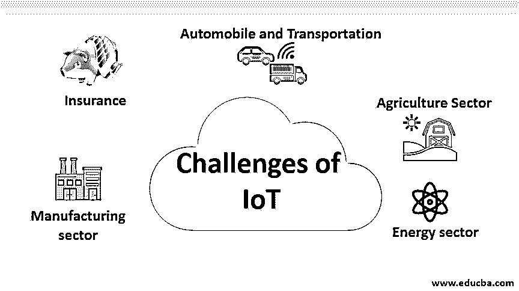
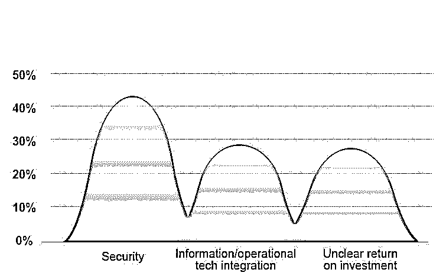

# 物联网的挑战

> 原文：<https://www.educba.com/challenges-of-iot/>

## 物联网实施挑战简介

物联网(IoT)是一种基于技术的互联智能设备，有可能大规模改变行业格局。在廉价计算资源、无限带宽和全天候连接设备的时代，物联网涵盖了从农业到太空的所有行业。根据 IDC(国际数据公司)最近的预测，2019 年全球物联网支出将超过 7450 亿美元，比上一年增长 15.4%。预计到 2020-2022 年底，全球支出将突破 1 万亿美元大关。像历史上的每一次创新一样，物联网也经历了自己的一系列挑战。在本文中，我们将讨论工业物联网解决方案的实施和面临的负面挑战。

### 行业智能物联网用例及其挑战

让我们讨论整合物联网解决方案如何在整个行业中面临挑战。

<small>Hadoop、数据科学、统计学&其他</small>

#### 1.制造业面临的挑战

智能传感数据用于防止异常故障、需求分析和资源优化。IIoT 解决方案可帮助组织进行智能资产管理和性能监控，从而减少资产停机时间并提高硬件可读性。

物联网传感器的维护和大规模非结构化数据的预处理一直是该领域物联网用例的痛点。此外，确定适当的使用案例和开发适当的物联网基础设施、定义范围和 KPI 将是需要解决的最大挑战之一。

#### 2.农业部门面临的挑战

物联网被认为是未来几年农业行业最大的变革力量。据研究人员称，物联网可能将成为农业和种植业应对环境变化、巨大的供需缺口和人类干预需求的最有力武器。物联网使农场管理者能够进行实时企业监控、精准农业、牲畜管理、智能温室管理等。

不幸的是，从农业到其他部门的劳动力流失率太高。与其他行业相比，安装和维护[物联网设备](https://www.educba.com/iot-devices/)有点棘手，需要大量投资。

#### 3.保险业面临的挑战

IIoT 解决方案可用于自动索赔处理，作为保费计算、自动准备金设置、损失评估等的一个因素。

保险行业的 IIoT 用例面临的主要挑战是，作为一个行业，它需要更高级别的隐私和数据治理。保险组织仍然很难为分析用例共享数据。

#### 4.汽车和交通面临的挑战

在廉价互联网和互联设备的时代，升级可以按需进行。现代汽车配备了基于物联网的智能传感器，有助于实时汽车跟踪、速度控制、油耗控制、汽车租赁解决方案等。物联网和深度学习有助于开发自动停车系统、半自动驾驶甚至自动驾驶汽车。

维护安全和隐私基准是汽车行业的主要挑战。数据容易受到从硬件端点到分析中心和区块链的中断和协同恶意软件攻击。适当的数据治理和防火墙对于克服这些挑战至关重要。

#### 5.能源部门的挑战

IIoT 解决方案可以为能源行业带来变革，提供关于功耗、硬件维护、预测动态定价等方面的宝贵见解。

传统上，能源和电力行业被视为具有非结构化数据的行业。部署合适的硬件、获取和管理海量数据、预处理和获得有价值的见解将是将物联网解决方案纳入能源领域的关键挑战。

### 共同的挑战

除了特定领域的挑战之外，整个行业还存在一些共同的制约因素。

*   **期望与现实的差异:**对于很多行业来说，物联网仍处于早期阶段；对物联网的期望和可行之间存在差距。组织数据成熟度处理这里的主要角色。
*   **缺乏正确定义的用例:**在大量的案例中，用例的范围和最终期望是不明确的。这导致了没有任何商业价值的失败用例。
*   **实施安全措施和数据治理:**管理海量数据并确保隐私和适当的安全措施是整合物联网解决方案的一大挑战。假设你用的是自动或半自动汽车。现在，如果汽车物联网基础设施遭到破坏，将导致真正的威胁。
*   **改变的商业模式:**基于互联设备的物联网和分析正在改变商业能力和交付模式。对于企业来说，找到具备合适技能的资源并相应地设定路线是一项挑战。

以下是 Allocadia 关于将物联网解决方案融入行业所面临的挑战的报告

来源:2017 年 Allocadia 报告

### 结论

在本文中，我们讨论了整合物联网解决方案的一般和特定行业限制。我们还了解了各种因素，如隐私和安全问题、技术和业务挑战、用例的范围和 ROI 等。根据专家预测，到 2022 年，物联网将克服早期的挑战，到 2025 年，它将几乎无处不在。

### 推荐文章

这是关于物联网挑战的指南。在这里，我们将讨论物联网的挑战、行业级物联网用例及其挑战，以及物联网中的常见挑战。您也可以浏览我们推荐的其他文章，了解更多信息——

1.  [物联网安全问题](https://www.educba.com/iot-security-issues/)
2.  [物联网的优势](https://www.educba.com/benefits-of-iot/)
3.  [物联网的缺点](https://www.educba.com/iot-disadvantages/)
4.  [物联网安全挑战](https://www.educba.com/iot-security-challenges/)

