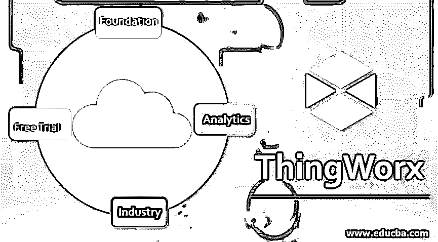

# ThingWorx

> 原文：<https://www.educba.com/thingworx/>

## ThingWorx 简介

ThingWorx 平台提供了一种工具来设置和构建基于物联网(IoT)和增强现实(AR)的应用程序，并帮助商业机构充分利用物联网生态系统。其平台由灵活、可靠和敏捷的开发组件组成，商业组织可以使用这些组件来部署基于物联网的应用。该平台是专门为商业机构和工业部门设计的完整的端到端业务技术。这是第一个连接物、系统、人、产品和设备的平台，被商业机构广泛应用于全球多个领域。

### ThingWorx 是如何工作的？

*   PTC 的 ThingWorx 在 KepserverEX 的帮助下连接设备，KepserverEX 是 Kepware 提供的组件之一。这就以云服务、API 等多种方式建立了与设备的连接。无论网络架构如何，ThingWorx Edge 微服务器都能在事物和 ThingWorx 服务器之间提供双向通信。用户可以选择他们喜欢的公共云提供商，亚马逊网络服务或微软的 Azure 物联网中心，来连接设备，在设备之间发送数据，并自动提供网络。
*   连接设备的性能监控和交付由 it 内部的实用程序管理。这些实用程序允许非开发人员编辑、创建和管理连接设备的业务流程。警报、触发器或预定义的规则有助于激活这些流程。
*   分析提供了四个主要功能:适应、优化、监控和预测。分析工具跟踪设备，并提供实时数据流的趋势和异常识别；提供预测模型，提供导致预期结果的信息，并提供如何改变结果的指导方针；并为用户提供预测和模拟知识。

### ThingWorx 的组件

ThingWorx 平台分为三个主要组件:

<small>Hadoop、数据科学、统计学&其他</small>

*   事物核心
*   Thing Worx 连接服务
*   ThingWorx 边缘

**让我们看看工作部件**

*   物联网核心为用户设计和运行基于物联网的应用提供了一个平台。该应用程序旨在控制传感器、设备或任何电子设备等典型设备。它使用基于对象的表示体系结构。
*   在这种类型的架构中，物联网设备由软件对象表示，属性和数据包含在表示中。然后，用户可以使用这些对象来构建应用程序，这些应用程序可以跟踪物联网设备并控制它们。用户还可以构建动态仪表板、应用业务逻辑和整合来自第三方的应用程序。
*   该系统的核心是 ThingWorx 中心，用户可以在 ThingWorx 环境中定义物联网设备或远程资产之间的行为和关系。其核心由两个主要工具组成，帮助用户创建物联网解决方案，它们是 ThingWorx composer 和 mashup builder。
*   Composer 提供了一个可以设置业务逻辑、安全权限和存储需求的环境，而 mashup builder 是一个易于使用的拖放工具，非 IT 背景的用户可以在其中创建动态仪表板和用户界面，而无需实际编写任何代码。
*   他们的连接服务负责远程资产和核心之间的通信。组件可以使用不同的协议和网络云来处理通信。他们管理与远程设备之间的消息路由，并在需要时翻译消息。
*   连接器服务的组件有一个中央通信数据库和一个适配器。它的文档将这两个称为连接器。它们一起被打包和安装。
*   每个连接器都支持特定的协议，该协议将入站消息转换为 ThingWorx 格式，并将它们发送到核心。他们基金会的第三个元素由两个运行在物联网网络边缘的软件产品组成。第一个在一个集中的系统上作为一个小型服务器运行，并作为一个集线器将数据传输回核心单元。

### 为 ThingWorx 提供的不同服务

根据用户的需求，ThingWorx 有许多服务可供用户使用。人们可以很容易地在他们的桌面上安装它，使用 90 天的免费试用。

让我们看看提供的各种服务:

#### 1.ThingWorx 基金会

ThingWorx Foundation 使用最少的编码，并使用 mash builder(一种拖放工具)来执行操作。在其基础的帮助下，创建网页或移动 GUI 可以很容易地完成。使用 ThingWorx Foundation 可以轻松监控和管理互联资产，此外，还可以快速访问关键信息和历史数据。

#### 2.ThingWorx 分析

ThingWorx Analytics 提供了一个平台，可以在没有任何统计经验的情况下执行复杂的分析和数学运算。这一分析解决方案中嵌入的机器学习和人工智能技术自动化了大多数复杂的流程。预测建模算法快速分析从连接的设备获得的数据，以预测和检测数据中的模式。

#### 3.工业用物品

ThingWorx for Industrial connectivity 管理、监控工厂中使用的机器以及用于运行它们的软件应用程序。它是一种工业解决方案，可连接制造业、电力和公用事业、石油和天然气等众多行业的大量设备和系统。工业连接提供了 OPC 事件和通信诊断的实时和历史视图。

#### 4.ThingWorx 免费试用

这项服务连接各种拓扑结构的设备，并使用[亚马逊网络服务](https://www.educba.com/what-is-aws/)物联网 SDK 快速开发物联网解决方案。免费试用服务进一步提供了对连接资产的监控和管理，进一步使用户能够快速访问关键和历史数据。

### ThingWorx 的优势

使用 ThingWorx 解决方案的一些优势:

*   改善客户服务和体验
*   物联网生态系统的最大化利用
*   增加商业机构的收入
*   自动化和优化业务流程

### 结论

在本文中，我们看到了组织如何在 ThingWorx 平台的帮助下充分利用物联网生态系统的潜力。thingWorx 如何在实时环境中工作的详细解释，它的组件和优点已经在本文中讨论过了。它是第一个提供全面物联网支持的平台，广泛用于商业机构，并且仍然是物联网集成的顶级平台之一。

### 推荐文章

这是 ThingWorx 的指南。在这里我们讨论介绍，它是如何工作的，组件，以及为 ThingWorx 提供的不同服务。您也可以浏览我们推荐的其他文章，了解更多信息——

1.  [物联网公司](https://www.educba.com/iot-companies/)
2.  [Tableau 仪表板创建](https://www.educba.com/tableau-dashboard-creation/)
3.  [物联网技术](https://www.educba.com/iot-technology/)
4.  [我们为什么使用 VPN？](https://www.educba.com/why-we-use-vpn/)

