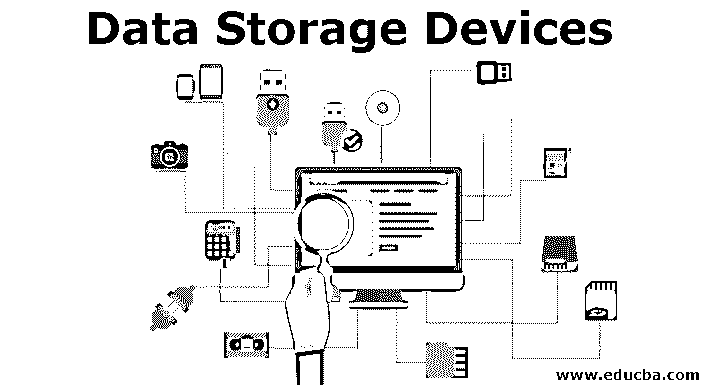
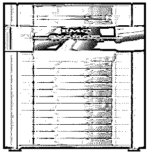
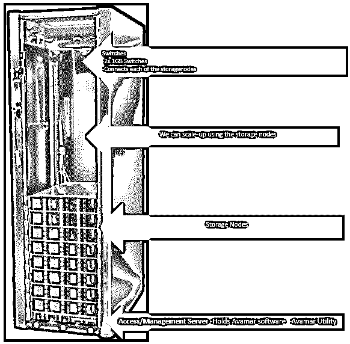
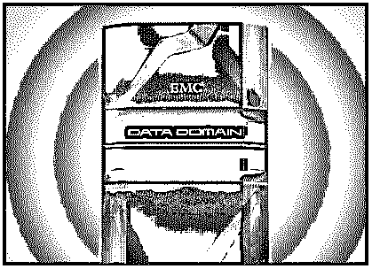
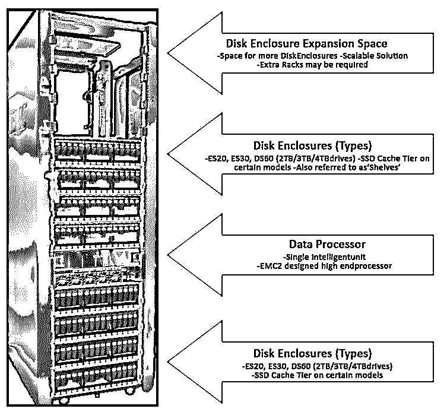

# 数据存储设备

> 原文：<https://www.educba.com/data-storage-devices/>

## 数据存储设备介绍

以下文章概述了数据存储设备。现在我们生活在一个数字世界——一个完全依赖数据的世界。存储设备是我们可以存储数据(信息)的设备。大量数据通过软件不断生成、收集、存储和分析。2014 年，IDC(国际数据公司)对数字世界进行了研究。据估计，全球每年产生约 4.4 万亿千兆字节(GB)的数据，每两年翻一番。如果按此估算，到 2020 年，我们将拥有 44 万亿 GB 的数据，几乎是 2014 年的 10 倍。

**数字世界的发展:**

<small>Hadoop、数据科学、统计学&其他</small>

*   IOT(物联网)也促进了数据增长。IOT 由联网设备和传感器组成。
*   社交媒体和智能设备的使用也为当今世界增加了大量数据。
*   组织依赖于对信息的连续可靠的访问，即数据充足且无误。
*   随着 EMC2、NetApp、IBM 等所有存储产品公司之间的激烈竞争，组织越来越多地实施存储设备。
*   为了有效地存储和管理数据
*   获得新的业务。

### 什么是存储数据设备？

数据存储设备是用于存储任何格式的数据的设备，如非结构化、准结构化、半结构化和结构化形式的数据。

*   **非结构化数据:**没有固有结构(不可分割/未编辑)的数据，因为这些文件可以轻松编辑。它通常以不同的文件格式存储:例如文本文档、PDF、图像和视频。
*   **准结构化:**可以通过努力和软件工具格式化的文本数据。例如:点击流数据(用户的机器，浏览)。
*   **半结构化:**可以分析大量数据的文本数据。例如电子表格和 XML 文件。
*   **结构化:**具有规定格式和结构的数据。例如数据库。

### 存储设备的类型

数据存储设备主要分为两类:

#### 1.客户

客户的产品用于本地存储。一个产品只能存储几 GB 的数据，即它只能存储 2-3 个人的数据，从数据存储的角度来看，它不会对组织的业务产生很大影响。

**例如:**笔记本电脑和台式机–Precision 笔记本电脑、Optiplex 和 Latitude、固定工作站。

#### 2.企业

企业产品是组织用来存储大量数据的产品，数据量高达数百万千兆字节。因此，从数据存储的角度来看，它对组织的业务产生了巨大的影响。

**例如:** Data Domain、Avamar 和 Networker。

### 顶级存储设备

下面提到的是顶级存储设备:

#### 1.重复数据删除

重复数据删除是删除重复数据的过程，我们这样做是为了节省存储空间。

*   **Avamar 前端**

EMC Avamar 是一种备份和恢复解决方案，它在目标站点执行重复数据消除。

*   **Avamar 后端**

#### 2.数据域

*   **前端**

EMC Data Domain 是一种备份和恢复解决方案，它在源站点执行重复数据消除。

Data Domain 的类型:DD3000、DD6800、DD6800、DD9300 和 DD9800

*   **后端**

### 结论

因为我们生活在一个完全依赖数据的数字世界。每天都会产生和存储大量的数据。此外，如上所述，每两年后，数据大小会翻倍。因此，我们需要越来越多的存储空间来存储和维护所有这些数据。

以下是观察结果:

*   组织依赖于对信息的持续可靠的访问，即数据充足且无误。
*   组织寻求有效地存储、保护、处理和管理信息。
*   随着竞争的加剧，组织越来越多地实施智能存储解决方案(备份解决方案)

### 推荐文章

这是数据存储设备指南。这里我们分别讨论存储设备的介绍和类型。您也可以阅读以下文章，了解更多信息——

1.  [云数据存储服务](https://www.educba.com/cloud-data-storage-service/)
2.  [免费云计算](https://www.educba.com/free-cloud-computing/)
3.  [使用 NAS 存储的媒体流和备份](https://www.educba.com/nas-storage-device/)
4.  [什么是存储？我们为什么使用？](https://www.educba.com/what-is-storage/)

