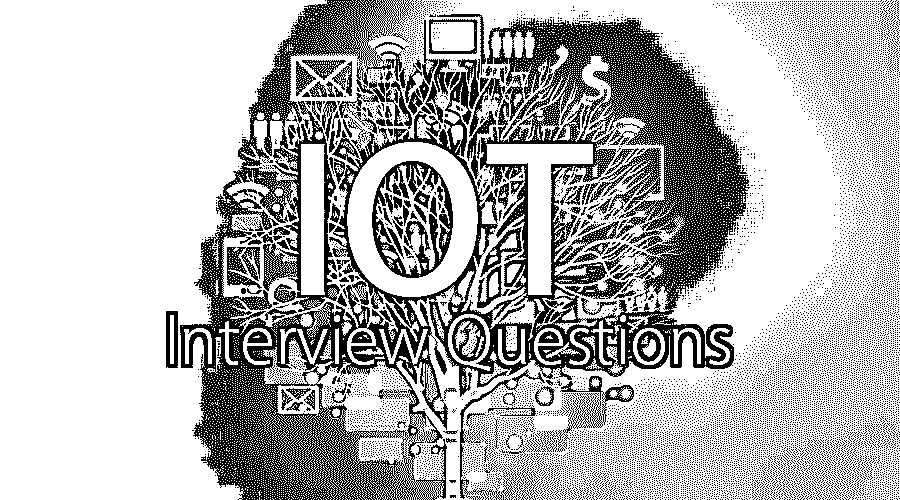

# 物联网面试问题

> 原文：<https://www.educba.com/iot-interview-questions/>

## 物联网面试问答介绍

物联网(Internet of Things)是一种先进的自动化和分析系统，它利用网络、大数据、传感和[人工智能](https://www.educba.com/careers-in-artificial-intelligence/)技术为产品或服务提供一个完整的系统。物联网系统允许用户在系统内实现更深层次的自动化、集成和分析。它利用了软件的最新进展、硬件价格的下降和现代人对技术的态度。

**物联网的优势**

<small>Hadoop、数据科学、统计学&其他</small>

允许 IOT 设备通过互联网进行远程控制，从而创造了直接连接的机会，并利用互联网和传感器将物理世界集成到基于计算机的系统中。

物联网的主要优势包括:

*   **提高客户参与度:**物联网通过自动化操作改善客户体验。例如，汽车中的任何问题都会被传感器自动检测到。司机和制造商都会收到通知。
*   **技术优化:** IOT 帮助改进技术并不断提高。
*   **减少浪费:**我们目前的见解是肤浅的，但物联网提供了实时信息，有助于有效的决策和资源管理。

现在，如果你正在寻找一份与物联网相关的工作，那么你需要准备 2022 年的物联网面试问题。的确，每个面试都因不同的职位而不同。在这里，我们准备了重要的物联网面试问题和答案，将帮助您在面试中取得成功。

在这篇 2022 年物联网面试问题文章中，我们将提出 10 个最重要和最常用的物联网面试问题。这些面试问题分为以下两部分:

### 第 1 部分–物联网面试问题(基础)

这第一部分包括基本的面试问题和答案。

#### Q1。物联网系统主要由哪些部分组成？

**回答** :
物联网系统由三个主要部分组成:

1.  传感器
2.  网络连接
3.  数据存储应用。

#### Q2。物联网有哪些安全顾虑？

**回答** :
这是面试中常见的物联网面试问题。数据安全和隐私是与物联网相关的主要问题。这些设备容易受到黑客攻击，黑客可以利用云端点来攻击服务器。[软件开发商](https://www.educba.com/career-as-a-software-developers/)和设备设计师必须确保足够的安全和隐私措施。

#### Q3。解释物联网协议栈。

**回答** :
物联网有 4 个协议层:

1.  **传感与信息**:包括基于 GPS、RFID、Wi-Fi 等的各种[智能传感设备](https://www.educba.com/sensor-device/)。
2.  **网络连接**:该层基于无线局域网、WMAN、以太网、光纤等有线和无线网络。
3.  **信息处理层**
4.  **应用层**

#### Q4。解释物联网网络的基本架构。

**回答** :
物联网有三个主要部分即传感器、网络连接和数据存储应用。传感器或者直接与中央服务器进行数据存储通信，或者通过网关设备进行通信。网关可以处理各种无线接口，这就是为什么一个网关可以处理多种技术和多个传感器。广泛使用的典型无线技术有 Zigbee、Zwave、RFID、NFC 等。网关使用无线或有线技术(如 Wi-Fi、移动或光纤、DSL)与云连接。

物联网硬件系统可以使用微控制器单元来构建。微控制器的选择取决于片上系统资源、所需功率以及根据不同传感器和存储器要求所需的接口。

为了最终确定物联网硬件架构，需要研究以下几个方面:

*   传感器/执行器的类型。
*   通信接口类型。
*   要捕获和传输的数据量。
*   数据传输的频率。

物联网软件架构基于开源组件，如 Arduino、Linux (Raspberry Pi)

#### Q5。解释 IOT 的蓝牙低能耗协议？

诺基亚最初在 2006 年以 wibree 的名字引入了这个协议。此外，这种被称为蓝牙智能的协议提供了相同的覆盖范围，但由于独特的蓝牙，其强度摄入大大降低。它具有与 ZigBee 利用的窄间隔相当的带宽。较低电延迟和降低的复杂性使得更适合包含在低成本微控制器中。

### 第 2 部分—物联网面试问题(高级)

现在让我们来看看高级面试的问题和答案。

#### Q6。世界上排名前五的机器对机器(M2M)应用程序是什么？

**回答** :
他们如下:

1.  各种形式的资产跟踪和监控(被盗的汽车、车队、建筑系统和许多其他东西)似乎是最大的。
2.  保险远程信息技术是巨大的，因为它使保险集团有可能减少威胁，并迫使更高/额外的有吸引力的价格。
3.  公用事业/自动抄表/智能电网——在此期间，大量监管和资金投入其中。有很多全国性的解决方案，因为需求和商业案例是由很多方式驱动的。
4.  汽车也很大，由消费者需求驱动。
5.  移动健康也存在于小范围内。

#### Q7。互联网地址(IPv6)会如何影响物联网的发展和实施？

**回答** :
这是面试中被问到最多的物联网面试问题。物联网改进的一个障碍是使用最广泛的网络协议(IP)版本的技术边界。IP 是计算机用于通过互联网发送和接收统计数据的一组规则，包括每个连接的设备或项目必须使用的特定地址。模型四(ipv4)目前使用最广泛。它可以容纳大约 40 亿个地址，其里程接近饱和，在该领域的许多地方几乎没有新的地址可用。

第 6 版(ipv6)允许大量增加各种各样的 IP 地址。对于 ipv4，特定地址的最大数量(42 亿)不足以为地球上 73 亿人中的每一个人提供一个交易。据评估，Ipv6 将容纳超过 1038 个地址，超过每个男人或女人一万亿个地址。

#### Q8。无线传感器网络(WSN)和物联网(IoT)网络有什么区别？

**回答** :
**WSN** : Wi-Fi 传感器社区是物联网套餐的基础。WSN 是一个微尘网络，被设计用来观察、审视或监测身体参数的预期效用。

例如部署在农业用地中的尘粒、屏幕温度-湿度或者可能是土壤湿度，谁收集统计数据和理想的统计数据分析过程结果大约是作物产量-高质量或高产量。

物联网:物联网是一个通过互联网管理和监控的物理对象社区。现在就像 win 一样，在它的应用中，你会偶然发现对物理参数的监控。但是首选结果几乎没有什么不同。物联网是关于 M2M 的，它远不止是将智能带入日常设备。

例如，连接在恒温器上的设备会监控周围的温度，并将其调节到最适宜的位置。

#### Q9。关于物联网，智慧城市意味着什么？

**回答** :
对于物联网和不同的流行术语，没有公认的定义或标准来描述什么是智能大都市。精确的描述千差万别，但在时尚中，它们涉及使用物联网和相关技术来改善能源、交通、治理和其他市政产品，以满足某些需求，包括可持续发展或先进的生活方式。

#### Q10。什么是物联网的 Bluegiga APX4 协议？

**答** :
Bluegiga 和 wireless 可以一起使用而不会相互干扰，因为它们符合共存协议。bluegiga apx4 支持蓝牙和 Wi-Fi，基于 450mhz arm9 处理器。

### 推荐文章

这是物联网面试问题和答案列表的指南，以便候选人可以轻松解决这些面试问题。在本帖中，我们研究了在面试中经常被问到的顶级物联网面试问题。您也可以阅读以下文章，了解更多信息——

1.  [CakePHP 面试问题](https://www.educba.com/cakephp-interview-questions/)
2.  [电源 Bi 面试问题](https://www.educba.com/power-bi-interview-questions/)
3.  [ITIL 面试问题](https://www.educba.com/itil-interview-questions/)
4.  [WinForms 面试问题](https://www.educba.com/winforms-interview-questions/)
5.  [物联网框架的各种列表](https://www.educba.com/iot-framework/)

