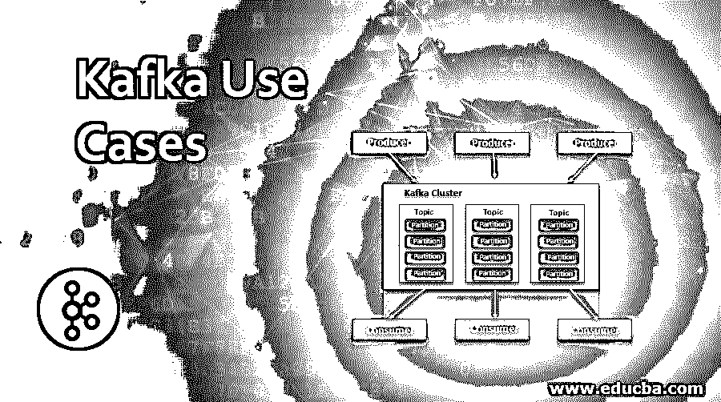

# 卡夫卡用例

> 原文：<https://www.educba.com/kafka-use-cases/>

## Kafka 用例介绍

Apache Kafka 是一个开源流平台，用于以容错(在出现故障时运行)和顺序的方式发布或订阅记录流。它也可以被称为分布式持久日志系统。Kafka 作为一个集群在多个服务器上运行，存储主题中的记录流。数据由生产者发布到主题，由消费者消费。在这个主题中，我们将学习 Kafka 用例。

<small>Hadoop、数据科学、统计学&其他</small>

Kafka 每天处理数万亿(Pb)的数据，在行业中有各种各样的使用案例。Twitter、LinkedIn、网飞、Mozilla、Oracle 等主要 IT 巨头都使用 Kafka 进行数据分析。从核心 IT 到制造业，企业都在整合 Kafka，以利用其庞大的数据。以下是主要的使用案例。

*   交通数据监控
*   实时欺诈检测
*   服务之间的通信
*   将 ETL 管道转换为实时流管道
*   网站跟踪

### 为什么我们需要卡夫卡来使用用例？

*   它支持多种语言，并提供与旧客户端的向后兼容性。
*   以高吞吐量处理大量数据，即使在节点出现故障的情况下也能继续处理。
*   通过提供内置分区和数据复制，克服了 RabbitMQueue、ActiveMQ 等传统消息传递系统的问题。
*   使用提交日志数据结构在节点之间存储消息和复制数据。此外，还实施消息保留策略以避免数据丢失。
*   Kafka 服务器不维护消费者/下游数据信息，因此节省了复杂性开销。
*   保证消息的排序。
*   有效地用于监控操作数据。

### 详细的使用案例

以下是下面提到的详细用例

#### 1.交通数据监控

物联网创建了一个更好、更高效的道路联网车辆网络，可生成增强的导航系统、实时交通更新、天气警报等。IOT 和包括 Kafka 在内的大数据应用程序可用于生成和监控基于不同路线的实时交通数据。下面的用例说明了这种技术。

*   连接的车辆生成 IOT，由 Kafka message broker 捕获并发送到流媒体应用程序进行处理。
*   Spark 流应用程序消耗 IOT 数据流，并处理/转换它们以进行交通数据分析。
*   在 Spark 应用程序中，不同车辆的车辆总数被计数并存储在 NoSQL 数据库中。
*   最后，创建一个 UI 仪表板，它从数据库获取数据并发送到 web 页面。Bootstrap.js 可用于在移动/桌面设备上显示数据。

#### 2.实时欺诈检测

欺诈检测是许多金融、零售、政府部门的主要用例。代理机构。随着数字交易的兴起，网上欺诈不断增加。在这里，可以根据用户的消费活动来跟踪信用卡交易。在这方面，Kafka 以及其他大数据应用程序和机器学习模型可用于根据可用的实时数据捕捉和预测欺诈活动。

在用例中，

*   卡夫卡吸收了交易事件。这些事件在卡夫卡的《主题》中被写成非虚构的。
*   Spark Streaming 接收流数据，并对流数据执行转换，以获得必要的信用卡详细信息。
*   交叉检查历史数据和实时数据，以分析任何差异。如果交易超过常规支出的限额，则写入欺诈卡夫卡主题。
*   被贴上欺诈标签的主题被进一步分析，以研究客户行为，并存储在 HBase 等 NoSQL 数据库中。

#### 3.实时数据管道

Linkedin 是一个为全球众多专业人士管理数据的专业网站。Linkedin 最初认识到 Kafka 可以利用大量数据并创建流畅的用户体验。下面是 Linkedin 的用例。

*   使用 Kafka connect 创建集中式数据管道，连接各种组件，包括运营指标、数据仓库、安全性、用户跟踪等。
*   数据被发送到本地 Kafka 集群，并被复制到其他集群
*   Kafka 由一个聚合的提交日志组成，这有助于提高吞吐量。
*   根据 Linkedin 记录，Kafka 每天处理超过 100 亿条消息，每秒 172000 条消息，延迟最小。
*   这种基于实时的方法已经有效地取代了 Linkedin 早期用来管理服务及其数据的 ETL 方法。

#### 4.服务之间的通信

如今，传统的独立软件架构正在被微服务所取代。从核心 IT 到银行再到制造部门，所有的整体系统都在退役，以纳入云。

微服务将单例架构解耦，以创建多个独立的服务。因此，组件之间的通信变得很重要，Apache Kafka 是创建这种通信桥梁的合适选择。该用例展示了创建微服务和使用 Kafka 的步骤。

*   配置 Kafka 实例，并配置 Producer Api 以 JSON 格式向代理服务器发送数据。
*   配置消费者 Api 以将 JSON 数据反序列化为 Java 对象，并设置 Kafka 监听器来监听主题。
*   为业务流程设置 Zookeeper。
*   测试和实现服务以检查应用程序的流程。

#### 5.网站活动跟踪

对于大数据分析来说，电子商务是一个非常赚钱的行业。在线零售商倾向于分析用户行为来改进他们的产品。此外，客户根据他们的观点和选择进行分类，因此可以优化产品放置。

*   点击流用于通过记录用户点击和点击活动来跟踪用户活动。
*   记录的数据以 JSON 格式存储在 Hdfs 上。
*   卡夫卡习惯于摄取主题中的记录数据，并对数据进行处理。例如，接受一个销售输入流，处理一个再订购和流程调整输出流。
*   这些主题可供多个使用者实时读取和监控数据。
*   使用 spark streaming 处理或转换点击流数据以供进一步分析。
*   在工作表和图表中使用 Tableau 可视化数据。

### 结论

Apache Kafka 广泛用于大数据应用程序，主要用于处理实时数据。它有效地转变了以前的 ETL(提取转换加载)管道方法。据预测，由于其可靠性、可伸缩性和吞吐量，这个流平台可以像关系数据库一样大。

### 推荐文章

这是卡夫卡用例指南。这里我们讨论为什么我们需要 Kafka 来使用用例，并且解释主要的和详细的用例。您也可以看看以下文章，了解更多信息–

1.  [卡夫卡式建筑](https://www.educba.com/kafka-architecture/)
2.  [卡夫卡的应用](https://www.educba.com/kafka-applications/)
3.  [卡夫卡面试问题](https://www.educba.com/kafka-interview-questions/)
4.  [卡夫卡的替代品](https://www.educba.com/kafka-alternatives/)

