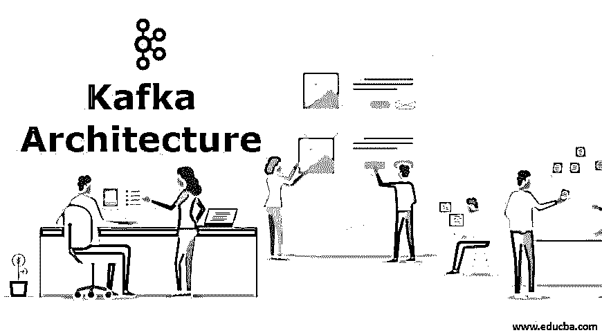
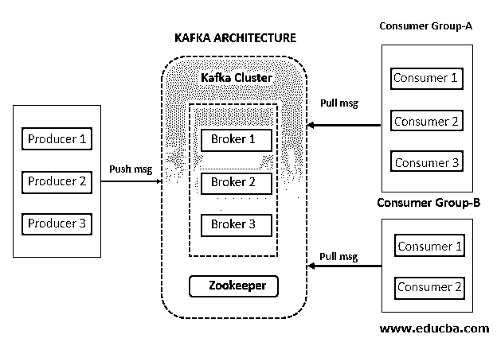
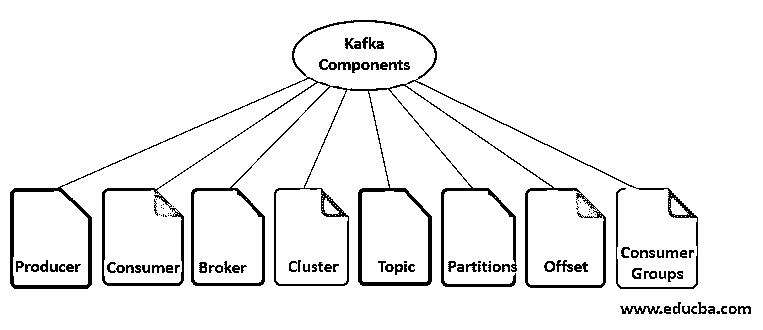

# 卡夫卡建筑

> 原文：<https://www.educba.com/kafka-architecture/>

## 卡夫卡建筑概论

下面这篇文章提供了卡夫卡建筑的概要。Kafka 是一个开源的分布式流媒体平台。它是由 LinkedIn 开发的，并捐赠给了 Apache 软件基金会。它充当发布-订阅消息传递系统。但是它不像普通的消息传递系统；它有助于构建实时数据管道和流媒体应用，能够处理海量数据。

消息的主要目标是将消息从发送者发送到接收者，反之亦然。在卡夫卡那里，发送者被称为生产者，接受者被称为消费者。但是需要注意的是，生产者并不直接向消费者发送信息。生产者将消息推送到 Kafka 服务器或 Kafka 主题的代理。感兴趣的消费者订阅所需的主题，并开始使用来自 Kafka 服务器的消息。

<small>Hadoop、数据科学、统计学&其他</small>

### 卡夫卡建筑

卡夫卡有一个简单但强大的架构。在 Kafka 中，制作人向 Kafka 经纪人推送给定主题的消息。Kafka 集群包含一个或多个代理，这些代理将从 Kafka 生产者接收的消息存储到 Kafka 主题。之后，消费者或消费者群体订阅 Kafka 主题，并开始接收来自 Kafka 经纪人的消息。由于 Kafka 是一个分布式系统，有多个组件，动物园管理员帮助管理和协调。我们将在下一节中逐一介绍卡夫卡的各个组成部分。

### Kafka 组件

以下是可用组件的列表。让我们逐一检查所有组件的功能:

#### **1。**卡夫卡制片人

生产者充当发送者。它负责发送消息或数据。它不直接向消费者发送消息。它将消息推送到 Kafka 服务器或代理。消息或数据存储在 Kafka 服务器或代理中。多个生产者可以向同一个 Kafka 主题或不同的 Kafka 主题发送一个消息。

#### 2.卡夫卡消费者

消费者充当接收者。它负责接收或消费消息。但它不消费或直接接收来自卡夫卡生产者的信息。Kafka Producer 将消息推送到 Kafka 服务器或代理。消费者可以向 Kafka 经纪人请求消息。如果 Kafka 消费者拥有足够的权限，那么它将从 Kafka 代理那里获得一条消息。

#### 3.卡夫卡经纪人

Kafka Broker 只不过是一个服务器。简而言之，代理只是生产者和消费者之间交换消息中间实体。对卡夫卡生产者来说，它充当的是接受者，对卡夫卡消费者来说，它充当的是发送者。在 Kafka 集群中，可以有一个或多个 Kafka 经纪人。

#### 4.卡夫卡集群

现在先了解一下，什么是集群？集群是分布式计算系统中的常用术语。它只不过是一组为共同目的而工作的计算机。Kafka 也是一个分布式系统，因此它也有一个包含一组称为代理的服务器的集群。

Kafka 集群中可以有一个或多个代理。

*   **单经纪人集群:**只有一个经纪人的 Kafka 集群称为单经纪人集群。
*   **多代理集群:**拥有两个或两个以上代理的 Kafka 集群称为多代理集群。

#### **5。**卡夫卡**一个**话题

它是卡夫卡最重要的组成部分之一。Kafka Topic 是赋予数据流或消息流的唯一名称。

现在让我们明白这样做的必要性。如您所知，Kafka Producer 向代理发送消息流，Kafka Consumer 从该代理接收消息流。

假设消费者想要使用来自 Broker 的消息，但问题是，来自哪个消息流？同一个代理上可以有多个不同的消息流，来自不同的 Kafka 生产者。这里出现了主题的概念，它是消息流的唯一标识。生产者将消息发送到一个唯一的名称，该名称称为该消息流的主题。多个生产者也可以发送到同一个主题。如果任何消费者想要消费该消息，那么它订阅 Kafka Broker 中的主题。现在，所有与该主题相关的消息都将被传递给消费者。

#### 6.卡夫卡隔断

现在我们知道，生产者用一个称为主题的惟一标识向代理发送数据，代理用该主题存储消息。现在，假设您有大量的数据，对于代理来说，在一台机器上存储数据是非常具有挑战性的。我们已经知道，卡夫卡是一个分布式系统。在这样的场景中，我们可以将 Kafka 主题分解成分区，并将分区分布在不同的机器上进行存储。基于用例和数据量，我们可以在 Kafka 主题创建期间决定主题的分区数量。

#### 7.抵消

在 Kafka 中，Kafka 主题的每个分区中的每个消息都被分配了一个序列号。这个序列号称为偏移量。任何消息一到达分区，就给该消息分配一个编号。对于给定的主题，不同的分区有不同的偏移量。偏移量始终位于主题分区的本地。对于主题或主题的每个分区，没有任何全局偏移。最初，偏移指针指向第一条消息。一旦消费者读取该消息，偏移指针就移动到序列中的下一条消息，依此类推。

因此，主题名、分区号和偏移量的组合是任何消息的唯一标识。换句话说，您可以找到基于以下三个组成部分的任何消息。

[Topic Name] -> [Partition Number] -> [Offset Number]

#### 8.卡夫卡消费群体

顾名思义，[卡夫卡消费群体](https://www.educba.com/kafka-consumer-group/)是一群消费者。多个消费者联合起来分担工作负载。这就像将一项大任务分配给多个个体。可以有多个消费者团体订阅相同或不同的主题。属于同一消费者组的两个或更多消费者没有接收到共同的消息。他们总是收到不同的消息，因为一旦消息被该消费者组中的任何消费者消费，偏移指针就移动到下一个数字。

#### 9.动物园管理员

动物园管理员是卡夫卡的先决条件。Kafka 是一个分布式系统，它使用 Zookeeper 进行协调，并跟踪 Kafka 集群节点的状态。它还跟踪 Kafka 主题、分区、偏移量等。

### 结论

正如我们所见，Kafka 是一个引人注目的分布式流媒体平台。它充当发布-订阅消息传递系统。但是它不像普通的信息系统。它帮助各行业构建他们的[大数据流](https://www.educba.com/what-is-big-data/)管道和流应用。我们还看到，生产者并不直接向消费者发送消息。代理充当一个集中式组件，帮助在生产者和消费者之间交换消息。

### 推荐文章

这是卡夫卡建筑的指南。这里我们也讨论一下卡夫卡的简介、架构和组成部分。您也可以看看以下文章，了解更多信息–

1.  [卡夫卡的应用](https://www.educba.com/kafka-applications/)
2.  [卡夫卡 vs 火花](https://www.educba.com/kafka-vs-spark/)
3.  [大数据架构](https://www.educba.com/big-data-architecture/)
4.  [如何安装卡夫卡？](https://www.educba.com/install-kafka/)

