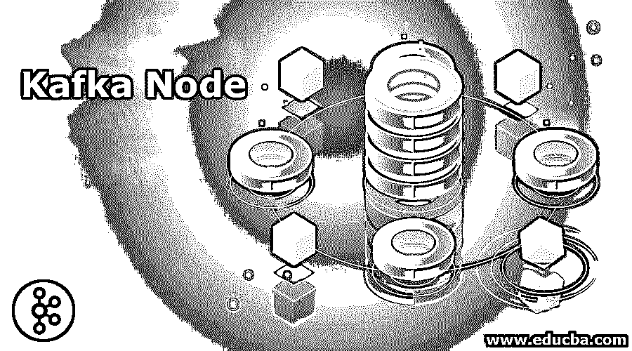
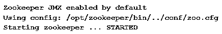
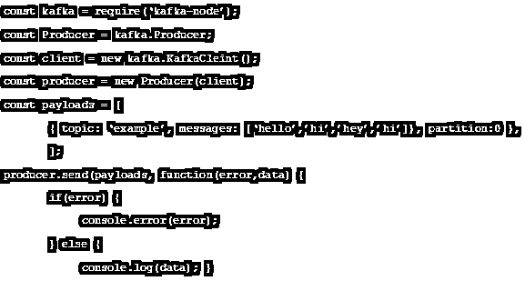
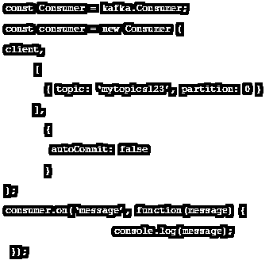
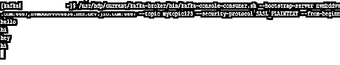
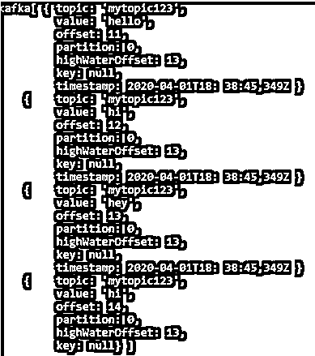

# 卡夫卡节点

> 原文：<https://www.educba.com/kafka-node/>

## 卡夫卡节点简介

这些年来，卡夫卡在许多方面都发生了巨大的变化。Kafka Node 只不过是 0.9 及更高版本的 Apache Kafka 的 Node.js 客户端。我们将进一步了解 Kafka 节点及其示例。

**让我们进一步了解卡夫卡节点:**

<small>Hadoop、数据科学、统计学&其他</small>

修正一下，Kafka 是一个分布式、分区和复制的发布-订阅消息系统。Kafka 将消息存储在主题中(跨多个代理进行分区和复制)。生产者向消费者或其消费者群体阅读的主题发送消息。在我们讨论 Kafka-node 如何操作之前，首先理解微服务是很重要的。我们主要处于成长的微服务时代。许多企业喜欢使用微服务来开发他们的应用程序。

微服务软件架构是软件工程和开发的重要模式。随着应用程序规模的增加，即数据的消耗、处理和生成，找到容错、可靠的方法来管理系统和处理的数据变得越来越重要。顾名思义，微服务是与其他系统组件交互以执行某项功能的软件。许多用例是微服务的事件源。我们将使用 Node.js 客户端为事件源实现 Kafka。

这是一个通过 Kafka 的微服务和另一个微服务对话最常见的情况之一。

### 卡夫卡与 NodeJS 的融合

让我们构建一个 NodeJS API，它将充当 Kafka 生成器。然后，我们将在 NodeJS 中创建另一个消费者，他将消费我们首先要创建的主题。让我们遵循使用命令行消费来自主题的消息所需的步骤。

#### 1.启动动物园管理员

没有动物园管理员，一切都不会开始；卡夫卡需要一个动物园管理员。使用命令 zkServer.sh 启动 Zookeeper。

**命令:**

`$bin/zkServer.sh start`

**输出:**

#### 2.启动 Kafka 服务器

使用以下命令启动 Kafka 服务器:

**命令:**

`$ bin/kafka-server-start.sh -daemon $ config/server.properties`

#### 3.话题创作

让我们用一个分区和一个副本创建一个名为“example”的主题:

**命令:**

`$bin/kafka-topics.sh --create --zookeeper localhost:2181 -- replication-factor 1 --partitions 1 --topic example`

复制因子决定了将产生多少份数据拷贝。因为我们使用的是单个实例，所以将该值保持为 1。将分区设置为您希望在其中划分数据的代理数量。因为我们只运行一个代理，所以将这个值保持为 1。

#### 4.卡夫卡与 NodeJS 的融合

下一步是使用 Node.js 创建单独的生产者和消费者。

`npm install kafka-node –save`

**构建了以下配置文件:**

`module.exports = {'example',kafka_server: 'localhost:2181',};`

#### 5.创建生产者

我们需要一个生产者来实例化用 Kafka-node 发布消息。使用以下函数发布关于给定主题的消息。

**代码:**

`const kafka = require (‘kafka-node’);
const bp = require('body-parser');
const config = require('./config');
try {
const Producer = kafka.Producer;
const client = new kafka.Client(config.kafka_server);
const producer = new Producer(client);
const kafka_topic = 'example';
console.log(kafka_topic);
let payloads = [
{
topic: kafka_topic,
messages: config.kafka_topic
}
];
producer.on('ready', async function() {
let push_status = producer.send(payloads, (err, data) => {
if (err) {
console.log('[kafka-producer -> '+kafka_topic+']: broker failed');
} else {
console.log('[kafka-producer -> '+kafka_topic+']: broker success');
}
});
});
producer.on('error', function(err) {
console.log(err);
console.log('[kafka-producer -> '+kafka_topic+']: connection error');
throw err;
});
}
catch(e) {
console.log(e);
}`

#### 6.创建消费者

我们将实例化一个客户来收听特定主题的消息。以下功能从主题中使用。

**代码:**

`const kafka = require (‘kafka-node’);
const bp = require('body-parser');
const config = require('./config');
try {
const Consumer = kafka.HighLevelConsumer;
const client = new kafka.Client(config.kafka_server);
let consumer = new Consumer(
client,
[{ topic: config.kafka_topic, partition: 0 }],
{
autoCommit: true,
fetchMaxWaitMs: 1000,
fetchMaxBytes: 1024 * 1024,
encoding: 'utf8',
fromOffset: false
}
);
consumer.on('message', async function(message) {
console.log('here');
console.log(
'kafka-> ',
message.value
);
})
consumer.on('error', function(err) {
console.log('error', err);
});
}
catch(e) {
console.log(e);
}`

### 卡夫卡节点的例子

让我们按照下面的步骤在 Node.js 中创建一个简单的生产者和消费者应用程序。

**1。**在已经创建了“mytopics123”主题的情况下，在节点外壳中使用下面的代码创建一个生成器。

生产者. js

**2。**在 consumer.js 文件的节点 shell 中使用下面的代码创建一个消费者。

消费者. js

所有可用的消息都将显示在节点终端上。下面是我们运行上面的 consumer.js 时的输出。

运行 consumer.js:

如果您没有创建 consumer.js 并使用 Kafka-console-consumer.sh 进行消费，那么您将获得以下输出:

让我们运行 Kafka-console-consumer.sh 并使用前一个生产者发送的所有消息。

运行 Kafka-控制台-消费者:

### 推荐文章

这是一本卡夫卡节点指南。这里我们讨论 Kafka-node 是什么，以及如何将 NodeJS 与 Kafka 及其示例集成。您也可以浏览我们推荐的其他文章，了解更多信息——

1.  [卡夫卡的另类|前 5 名](https://www.educba.com/kafka-alternatives/)
2.  [rabbit MQ vs Kafka——最大差异](https://www.educba.com/rabbitmq-vs-kafka/)
3.  [10 个最好的卡夫卡面试问题](https://www.educba.com/kafka-interview-questions/)
4.  [快速浏览 Kafka 控制台消费者](https://www.educba.com/kafka-console-consumer/)
5.  [卡夫卡复制指南](https://www.educba.com/kafka-replication/)

