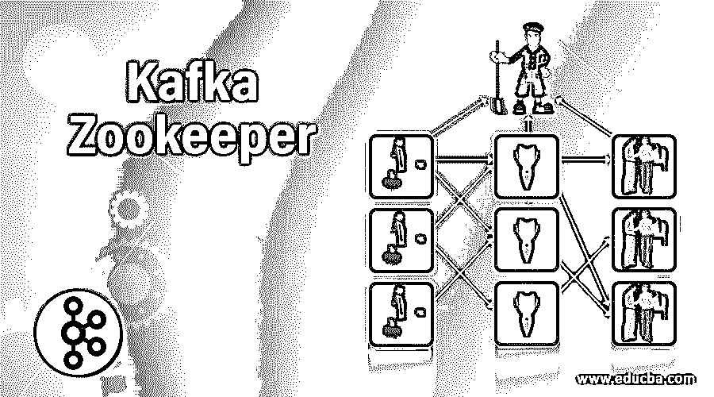
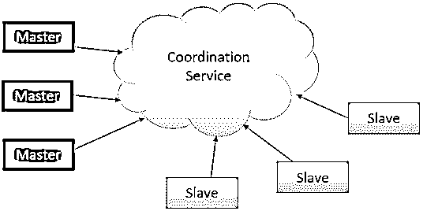
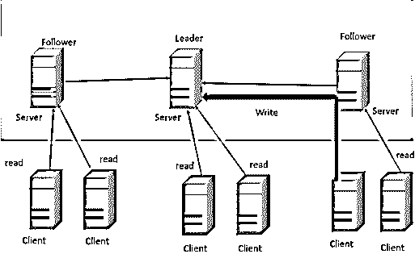

# 卡夫卡动物园管理员

> 原文：<https://www.educba.com/kafka-zookeeper/>

## 卡夫卡动物园管理员简介

动物园管理员是阿帕奇卡夫卡的重要组成部分。Zookeeper 是许多分布式应用程序的基石，因为它提供了奇妙的功能。Apache Kafka 使用 zookeeper 来存储关于 Kafka 集群和用户信息的信息；简而言之，我们可以说 Zookeeper 存储了关于 Kafka 集群的元数据。理解《动物园管理员》是什么以及卡夫卡如何与之契合，对我们来说很重要。我们将深入了解 Zookeeper 的功能，并了解我们为什么需要使用它。

### 卡夫卡动物园管理员是什么？

Zookeeper 是一个管理分布式应用程序的集中式开源软件。它提供了一个基本的原语集合来实现更高级别的同步、框架管理、组和命名服务。它计划是可编程的和简单易用的。使用 Zookeeper 的知名公司有雅虎、推特、网飞和脸书。这只是几个名字。

<small>Hadoop、数据科学、统计学&其他</small>

它跟踪需要在集群中同步的信息。诸如以下信息:

*   哪个节点是主节点？
*   哪些工人将执行哪些任务？
*   目前有哪些工人？

它是一个工具，应用程序可以使用它从集群中的部分故障中恢复。它也是 HBase、高可用性(HA) MapReduce、Drill、Storm、Solr 等等不可或缺的一部分。Zookeeper 本身是一个分布式应用程序，提供自动代码编写功能。

Zookeeper 提供的具体服务如下:

*   **命名服务:**通过名称识别 a 中的节点，这类似于 DNS，除了节点。
*   **配置监控:**加入的节点的系统当前和最新配置详细信息。
*   **集群控制:**实时连接/离开集群中的节点和节点
*   **领导者选举:**选择一个节点作为领导者

### 为什么我们需要卡夫卡动物园管理员？

在了解我们为什么需要使用 zookeeper 之前，让我们先了解一下协调服务。将通信服务集成到分布式环境中的过程称为协调服务。这些服务很难做好。它们特别容易出现竞争条件和死锁之类的错误。

*   **竞争条件:**两个或多个系统试图执行相同的任务，该任务需要由单个系统在给定的时间内完成
*   **死锁:**两个或多个操作无限期地互相等待

因此，为了使协调服务的分发变得容易，实现了 Zookeeper。这样我们就可以从实现协调服务的责任中解脱出来

是的，动物园管理员非常重要，因为卡夫卡离不开动物园管理员。它用于在各种节点的集群内建立协调。Kafka 最重要的事情之一是，它使用 zookeeper 定期提交偏移量，以便在节点故障的情况下，它可以从之前提交的偏移量重新启动(想象一下自己处理所有这些)。

Zookeeper 在实现许多其他功能方面也起着至关重要的作用，例如，领导者检测、配置控制、同步、检测新节点何时进入或离开集群等。

### 卡夫卡如何使用《动物园管理员》？

以下是在卡夫卡中使用动物园管理员的要点:

*   **选举领导者:**维护所有分区的领导者和追随者之间的关系由控制器处理，控制器是代理之一。如果一个节点关闭，要求其他追随者成为分区领导者以取代失去的动物园管理员的控制器只选择一个新的领导者，以确保只有一个领导者。
*   **集群成员:**哪些代理和集群成员是活动的？动物园管理员处理它。
*   **话题的配置:**每个话题有多少个分区，话题是否存在，如果存在，那么作为领导者的追随者在哪里。
*   **配额:**每个客户端读取和写入的数据量是多少
*   **ACL:** 谁有权读写和访问哪个主题，存在多少个用户组及其成员，以及关于每个用户组的最新偏移的信息

### 《动物园管理员》在卡夫卡中是如何工作的？

Zookeeper 以两种模式运行

**1。独立**

*   只有一台服务器
*   用于测试
*   没有高可用性

**2。复制的**

*   运行在一个叫做集合的机器集群上
*   使用 Paxos 算法
*   高可用性
*   容忍大多数人

### 动物园管理员模型

zookeeper 的数据模型遵循层次结构的名称空间，其中每个节点称为一个 ZNode。节点是在集群上运行的机器。每个节点都有信息。它可能有孩子，也可能没有。

有三种形式的锌电极。

*   持久化:这样的 znode 会保留在 Zookeeper 中，直到客户端生成的特定 znode 断开连接，这种形式的 znode 仍然存在。默认情况下，所有节点在 zookeeper 中都是持久的，除非指定。
*   **短暂:**如果生成该节点的会话终止，则该节点将被移除，这意味着 znode 将保持活动，直到客户端终止
*   **Sequential:** 创建一个名称中带有序号的节点；号码是自动的。这些连续的节点可以是持久的，也可以是短暂的。

每个动物园管理员都被告知所有其他动物园管理员的信息；如果集合中所有机器上的 zookeeper 服务器都打开，第一阶段开始，这是首领选择。

#### 阶段 1:领导者选择(Paxos 算法)

*   机器选举一个成员作为领导者，其他人被称为
*   当大多数将其状态与同步时，此阶段结束
*   如果领导者失败了，剩下的机器会在
*   如果多数人在任何时间点都不可用，则领导者会采取措施。

### 结论

所以我们可能会得出结论，我们已经看到了什么是动物园管理员，它的工作方式意味着它的架构，以及卡夫卡与它交流是多么必要。

### 推荐文章

这是一本卡夫卡动物园管理员指南。这里我们分别讨论介绍 Kafka zookeeper，我们为什么需要它，如何使用它，以及 zookeeper 架构。您也可以浏览我们的其他相关文章，了解更多信息——

1.  [卡夫卡控制台消费者](https://www.educba.com/kafka-console-consumer/)
2.  [卡夫卡镜子制造者](https://www.educba.com/kafka-mirrormaker/)
3.  [卡夫卡的替代品](https://www.educba.com/kafka-alternatives/)
4.  [卡夫卡的应用](https://www.educba.com/kafka-applications/)

