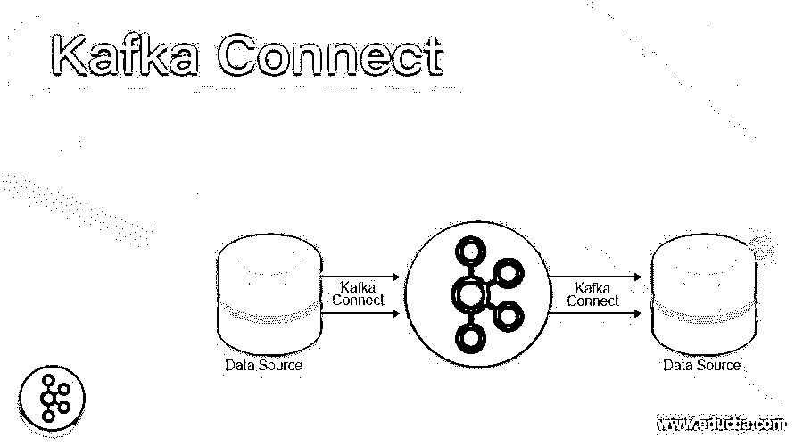
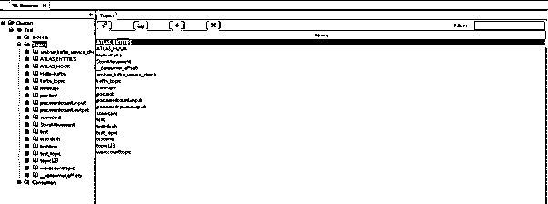
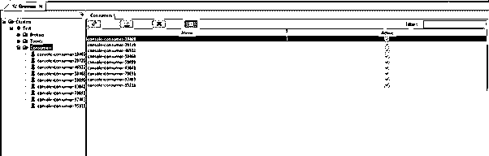
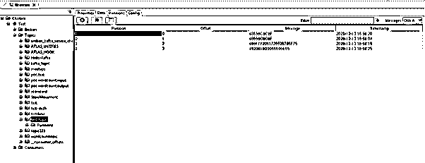
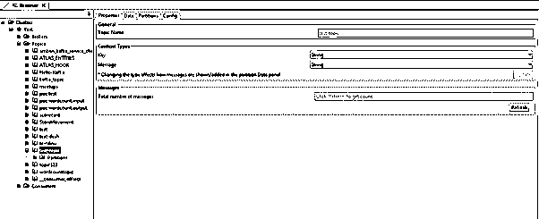
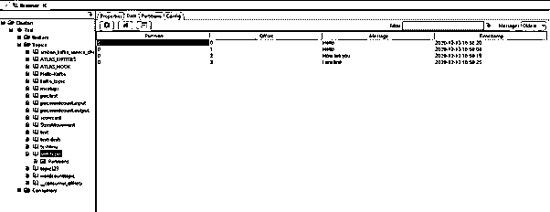

# 卡夫卡连接

> 原文：<https://www.educba.com/kafka-connect/>

## 卡夫卡连接简介

Kafka Connect 充当 apache Kafka 和不同或其他数据驱动系统之间的中介。Kafka connector 只不过是一个可靠且可扩展的流媒体解决方案的工具。它将有助于将大量数据或大型数据集从 Kafka 的环境移动到外部世界，反之亦然。Kafka 连接器有助于数据传输，也有助于数据接收。它会将所有数据吸收到卡夫卡主题中。Kafka 连接器提供了低延迟的数据访问功能。根据要求，我们可以使用 Kafka 导出连接器。这将有助于将 Kafka 主题的数据传递到二级目录，如 ELK stack、elastic search、solr 等。

**卡夫卡连接的语法**

<small>Hadoop、数据科学、统计学&其他</small>

因此，Kafka connect 没有特定的语法。通常，我们对 Kafka connect 使用安装命令。

**注:**

1.在和卡夫卡连线一起工作的时候。我们使用核心 Kafka 命令，并在其中使用连接或连接参数。

2)在安装 Kafka connect 时，我们使用的是 CLI 方法。但是一般来说，我们只使用 UI 工具。

### Kafka Connect 如何工作？

Kafka connect 是 Kafka 系统与外部分析世界之间的调节者。但是 Kafka 连接器的范围较低。它主要关注的是从 Kafka 输入和输出的流数据拷贝。它不会处理或负责 Kafka 环境中的任何其他任务。开发人员的主要工作是编写或创建高质量的代码、可靠且高性能的 Kafka 连接器插件等。通过流处理框架，它避免了重复的功能。但是 Kafka connect 不是 ETL 管道。当流处理框架和 Kafka 结合的时候，只有我们可以说 Kafka 连接了 ETL 组件的一部分。

以下是与 Kafka connect 兼容的键值选项列表。

| **服务请求编号** | 键- **值** | **类型** | **重要性** |
| One | 引导程序.服务器 | 目录 | 它将是主机和端口对的组合。这将有助于使用与 Kafka 集群建立连接。引导服务器帮助消费者和生产者进行通信。这也将有助于连接外部环境和卡夫卡的主题。正如 Cloudera 所建议的，我们在集群环境中至少需要 3 个 Kafka 代理。 |
| Two | 按键转换器 | 班级 | 这将有助于转换关键数据连接的类。这将有助于转换数据。它将为源连接器编写 Kafka。密钥转换器的公共格式是 JSON 和 Avro。 |
| Three | 价值转换器 | 班级 | 这将有助于将值数据转换为连接。这将有助于转换数据。它将为源连接器编写 Kafka。密钥转换器的公共格式是 JSON 和 Avro。 |
| Four | 内部.密钥.转换器 | 班级 | 这将有助于转换内部关键数据，以连接和执行转换器接口。这将有助于转换数据，即偏移和配置。 |
| Five | 内部值转换器 | 班级 | 这将有助于转换偏移值数据和执行转换器接口。这将有助于转换数据，即偏移和配置。 |
| Six | offset.flush.timeout.ms | 长的 | 这些属性的值以毫秒为单位。这将是等待记录刷新的最大毫秒数。但是在对进程执行取消操作之前，要提交给存储偏移量的分区数据偏移量。我们还可以在将来的操作或尝试中恢复数据偏移。 |

### 实施或检查 Kafka Connect 的示例

下面举几个例子

#### 例子# 1——检查卡夫卡主题列表

在 Kafka 环境中，所有数据或消息都存储在 Kafka 主题中。关于主题的数据存储策略取决于 Kafka 数据保留期。在 Kafka connect 的帮助下，我们可以找到环境中可用的主题列表。

**方法:**

我们需要点击卡夫卡的主题，并通过点击“+”符号展开它们。

**说明:**

根据下面的截图，我们将连接名称设置为“测试”。我们可以在 UI 屏幕上列出所有的卡夫卡主题。这将有助于快速确定 Kafka 环境中可用主题的数量。

**输出:**

#### 例 2–检查 Kafka 消费者列表

在 Kafka 环境中，所有数据或消息都由 Kafka 消费者消费。根据需要，我们可以设置单个或多个消费者来消费 Kafka 数据。在 Kafka connect 的帮助下，我们可以找到环境中可用的消费者列表。

**方法:**

我们需要单击 Kafka 消费者，并通过单击“+”符号展开它。

**说明:**

根据下面的截图，我们列出了 Kafka 环境中的消费者数量。

**输出:**

#### 例 3–捕捉卡夫卡的信息

在 Kafka 中，我们可以生成消息并在 UI 级别进行检查。

**命令:**

./Kafka-console-producer . sh–broker-list 10 . 10 . 132 . 152:6667–topic test _ topic

**说明:**

根据截图 1(A ),我们正在“test_topic”上生成消息。在屏幕截图 1 (B)中，我们在 UI 级别和字节格式消息上捕获了相同的消息。在截图 1 (C)中，我们将格式从字节改为字符串。截图 1 (D)，改变格式后。我们可以看到生产者的信息。

**输出:**

截图 1 (A)

截图 1 (B)

截图 1 (C)

截图 1 (D)

### 结论

我们已经看到了“卡夫卡连接”的未切割的概念，带有适当的例子、解释和具有不同输出的方法。根据需要，我们可以使用 Kafka Connect 将 Kafka 环境与外部世界连接起来。在 Kafka connect 的帮助下，我们可以进出 Kafka 数据。

### 推荐文章

这是一个卡夫卡连接指南。在这里，我们讨论卡夫卡的概念与适当的例子，解释，和方法与不同的输出。您也可以看看以下文章，了解更多信息–

1.  [卡夫卡主机生产商](https://www.educba.com/kafka-console-producer/)
2.  [卡夫卡复制](https://www.educba.com/kafka-replication/)
3.  [卡夫卡镜子制造者](https://www.educba.com/kafka-mirrormaker/)
4.  [卡夫卡工具](https://www.educba.com/kafka-tools/)

