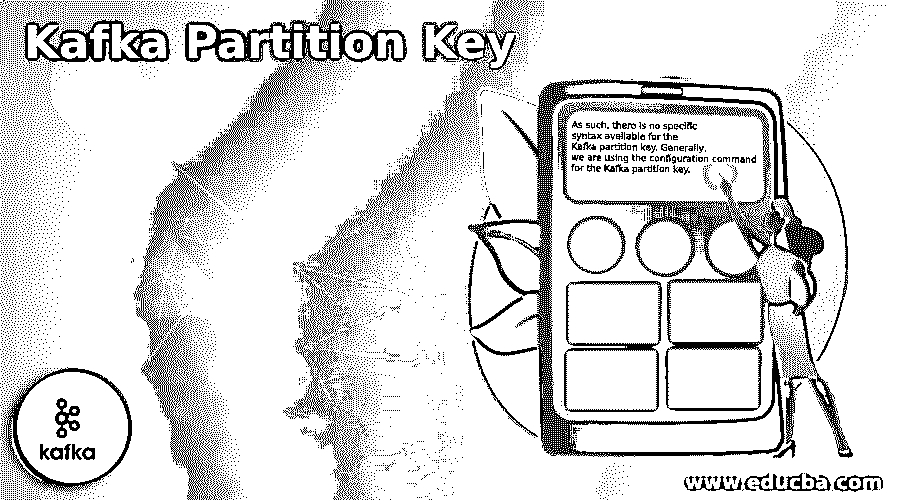
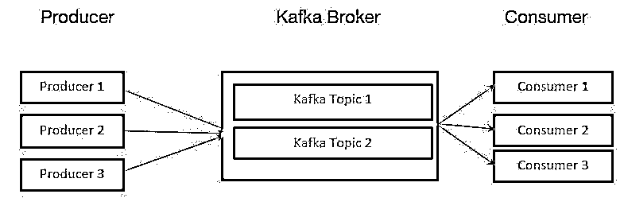
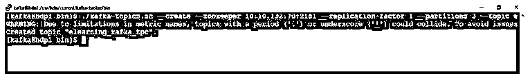

# 卡夫卡分区键

> 原文：<https://www.educba.com/kafka-partition-key/>

## 卡夫卡分区键简介

在 Kafka 中，数据存储在键-值组合或对中。在分区级别，存储发生。关键价值不过是一个消息传递系统。在同样的基础上，卡夫卡也在工作。定义消息的目的分区是很有用的。根据需求或配置，我们也可以定制或修改 Kafka 分区。在 Kafka 中，哈希基分区用于标识分区 id(根据提供的密钥)。如果我们没有在环境中设置它或者保持它为 null，那么 Kafka producer 将选择任意一个分区，并将消息或数据保存在其中。

**语法:**

<small>Hadoop、数据科学、统计学&其他</small>

因此，它没有特定的语法。通常，我们使用 Kafka 分区键的配置命令。

**Note:** While working with the Kafka partition key. We are using the core Kafka commands and Kafka partition key command for the troubleshooting front. At the time of Kafka partition key configuration, we are using the CLI method. But generally, we are using the UI tool only.

### 卡夫卡分区键是怎么工作的？

*   正如我们已经看到的，定义消息的目的分区是有用的。根据定义的密钥，Kafka 生产者将选择特定的分区，并将 Kafka 消息或数据推入该分区。如果我们没有提供，Kafka 将使用默认的散列键分区并将消息推入其中。卡夫卡式的划分主要是处理并行性。如果我们增加分区的数量，那么并行进程也会增加。在生产者和代理端，写操作将在不同的分区主题上执行。该操作将处理并行方法。
*   Kafka 将只允许 Kafka 消费者端的单个消费者线程消费单个分区上的数据。因此，消费者的并行度将受到分区数量(将被消费)的限制。如果要增加或提高吞吐量，我们需要增加 Kafka broker 的数量。

### Kafka 分区/分区密钥计算

在计算 Kafka 吞吐量时，我们需要考虑 Kafka 中的分区公式。为了计算它，我们需要考虑一些公式化的值。让我们考虑按照生产者的单个 Kafka 分区计算吞吐量(假设为“p”)。对于消费前端，姑且说是“c”。对于目标吞吐量，假设是“t”。根据最大分区，它将是“t/p 和 t/c”。根据压缩编解码器、复制因子、批处理大小、确认类型等，单个吞吐量可以取决于生产者。在单个分区上，一个生成器可以以每秒 10 兆字节的速度生成消息。

**Note:** The Kafka partition will deal with parallelism, i.e., designing the Kafka environment, and we need to run the parallel jobs on Kafka. Then we need to take care of the Kafka partition. As per the standard documentation, we need to keep at least 3 Kafka brokers. The partition key will be unique in a single topic.

**

** 

根据上图，Kafka 代理将管理 Kafka 环境中的主题数量。卡夫卡的主题被分成许多部分。主题中的记录处于不可更改的顺序中。在 Kafka 环境中，分区中的每个消息或记录都是通过其独特的偏移值来分配和标识的。Kafka 分区值的数量会增加 Kafka 环境中的并行性进程。

虽然制作人将发布关于该主题的记录或消息的数量，但它将仅在领导者的帮助下帮助发布。分区领导者会将该记录附加到其提交日志中。它将提高或增加记录偏移量。在消费者承诺之后，卡夫卡将记录或信息暴露给消费者。数据以集群的形式出现。

在生产者发送数据之前，它将请求 Kafka 集群代理的元数据信息。该元数据具有各个部分的领导代理信息。根据元数据信息，生产者将知道谁是分区领导者，并且仅在分区领导者的帮助下写入数据。

Kafka producer 将使用分区键来获取数据需要写入哪个分区。默认操作是使用哈希键计算分区。

### 例子

下面给出了实现或检查 Kafka 分区密钥的示例:

在 Kafka 环境中，生产者将产生数据。生产者将知道数据需要写入哪个分区。它将根据生产商负责人的意见做出决定。在这里，没有经纪人参与进来。生产者将把密钥附加到记录上，并允许在特定的 Kafka 主题或分区上存储数据。具有相同键的所有记录将到达相同的 Kafka 分区。

**Note:** The default port of the Kafka broker in the cluster mode may verify depend on the Kafka environment.

*   集群 Kafka 代理端口为“6667”。
*   单一 Kafka broker 端口为“9092”。
*   在 TLS 或 SSL Kafka 环境中，端口将是“9093”。

**代码:**

`./kafka-topics.sh --create --zookeeper 10.10.132.70:2181 --replication-factor 1 --partitions 3 --topic elearning_kafka_tpc`

**说明:**

*   按照上面的命令，我们创建了“elearning _ Kafka _ TPC”Kafka 主题。它会给出默认的分区键。

**输出:**

### 结论

我们已经看到了“卡夫卡分割键”这个未切割的概念，有了恰当的例子、解释和方法，有了不同的输出。根据需求，我们可以在主题中创建多个分区。在一个键的帮助下，我们可以有力地说数据或消息需要移动到特定的分区。

### 推荐文章

这是一本卡夫卡分区键指南。在这里我们讨论介绍，工作，Kafka 分区/分区密钥计算和例子。您也可以看看以下文章，了解更多信息–

1.  [卡夫卡动物园管理员](https://www.educba.com/kafka-zookeeper/)
2.  [卡夫卡主机生产商](https://www.educba.com/kafka-console-producer/)
3.  [卡夫卡监控](https://www.educba.com/kafka-monitoring/)
4.  [卡夫卡镜子制造者](https://www.educba.com/kafka-mirrormaker/)

