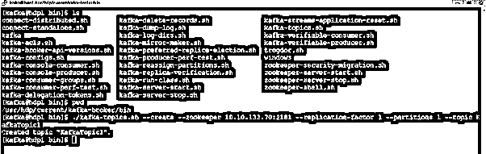
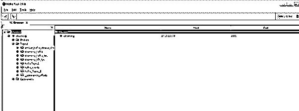
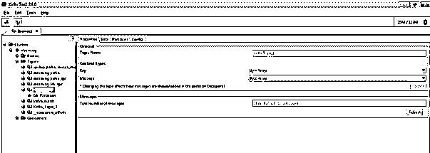

# 卡夫卡主题

> 原文：<https://www.educba.com/kafka-topic/>

## 卡夫卡主题介绍

Kafka，我们有很多对实时数据处理有用的东西。存储记录或数据并发布是有用的。该主题将在分区级别上进一步分发。相同的功能将有助于提高数据的可靠性。这也有助于数据或记录复制(取决于集群配置)。根据需要，我们可以将记录或数据存储在主题分区上。在存储数据时，偏移键起着重要的作用。在此帮助下，我们能够使用不同的偏移键在不同的分区上存储数据或记录。

**语法:**

<small>Hadoop、数据科学、统计学&其他</small>

`./kafka-topics.sh --create --zookeeper 10.10.132.70:2181 --replication-factor 1 --partitions 1 --topic kafka_topic`

*   Shell 脚本:要创建 Kafka 主题，我们需要使用 Kafka-topics.sh 文件或脚本。我们也可以使用默认的 Kafka 主题变量。
*   Zookeeper:在主题命令中，我们需要传递 zookeeper 服务器的详细信息。
*   复制:我们需要定义复制值。根据推荐值，我们需要将其定义为 3。
*   分区:我们也可以在创建主题时定义分区。
*   主题名:在最后，我们需要定义主题名。

**注意:**在 HDP 环境中，我们需要使用默认路径来创建主题。路径:/usr/HDP/current/Kafka-broker/bin

### 卡夫卡主题如何运作？

存储特定主题的记录或消息非常有用。对于适当的数据操作，我们可以使用不同的 Kafka 分区。这里，我们可以使用不同的组合键在特定的 Kafka 分区上存储数据。

以下是配置选项列表:

**1。创造。话题。enable:** 这将有助于在集群或服务器环境中创建自动创建。

类型:布尔
默认值:真
有效值:不适用
重要性:高
更新模式:只读

**2。话题。启用:**启用删除主题会有帮助。我们可以用卡夫卡工具来删除。如果我们禁用带有偏移的配置，则不会有任何影响。

类型:布尔
默认值:真
有效值:不适用
重要性:高
更新模式:只读

**3。话题。compression.codec:** 借助本主题，我们可以为 offset 主题压缩 codec。为了获得自动提交选项，我们需要使用这个配置属性。

Type: int
默认值:0
有效值:不适用
重要性:高
更新模式:只读

**4。话题。num.partitions** :它将有助于确定主题分区的数量(指向偏移提交主题)。一旦在部署时完成了配置。之后就不会改变了。

Type: int
默认值:50
有效值:[ 1，… ]重要性:高
更新方式:只读

**5。话题。replication.factor:** 它将帮助设置卡夫卡偏移主题的复制因子。如果我们选择更高的复制值，那么我们将获得更高的数据可用性。在创建内部 Kafka 主题时，如果我们没有设置适当的复制因子，那么在创建 Kafka 主题时可能会出错。

类型:短
默认值:3
有效值:[1，…]重要性:高
更新方式:只读

**6。话题。segment.bytes:** 我们需要以字节的格式设置 offsets 主题段值。它应该保持相对较小。相同的值有助于更快的缓存加载和日志压缩。

Type: int
默认值:104857600 (100 兆字节)
有效值:[1，…]重要性:高
更新方式:只读

7 .**。replication.factor:** 帮助设置默认的复制因子。它将实现自动的卡夫卡主题创作。

Type: int
默认值:1
有效值:
重要性:中
更新方式:只读

**8。分区:**这将有助于为每个 Kafka 主题设置默认的日志分区数量。

Type: int
默认值:1
有效值:[1，…]重要性:中
更新方式:只读

**9。topic.policy.class.name:** 借助这个属性，我们可以创建主题策略类。基本上，它将用于验证目的。相同的配置将有助于该类(org . Apache . Kafka . server . policy . createtopicpolicy 接口的实现)。

类型:类
默认值:null
有效值:不适用
重要性:低
更新模式:只读

### 卡夫卡主题的例子

**概述**

正如我们在 Kafka 环境中讨论的多个组件。我们将以多种方式创建 Kafka 主题，如脚本文件、变量路径等。根据生产 Kafka 环境，建议我们使用 Kafka 主题复制值 3。

**语法:**

`./kafka-topics.sh --create --zookeeper 10.10.132.70:2181 --replication-factor 1 --partitions 1 --topic KafkaTopic1`

**说明:**

按照上面的命令，我们正在创建 Kafka 主题。这里我们使用 zookeeper 主机和端口(主机名:10.10.132.70，端口号:2181)。需要定义复制因子，即 1，并定义主题中的分区数量。最后，我们需要提供主题名，即 KafkaTopic1。

根据下面的截图 1 (A ),我们可以创建一个新的卡夫卡主题。

根据下面的截图 1 (B ),我们已经用 Kafka 工具连接了环境。这里，我们需要在工具中定义 zookeeper 配置。

根据下面的截图 1 (C ),我们可以在 Kafka 工具中获得新创建的 Kafka 主题。我们将获得卡夫卡主题的详细信息，如分区信息等。

**输出:**

**截图 1 (A)**

**截图 1 (B)**

**截图 1 (C)**

### 结论

我们已经看到了“卡夫卡主题”的完整概念，以及适当的例子、解释和聚类方法。就卡夫卡环境而言，这是非常重要的。它将有助于存储有关卡夫卡主题的消息或记录。我们可以创建多个分区。我们可以使用不同的偏移键将记录或消息存储到不同的 Kafka 分区中。

### 推荐文章

这是一个引导卡夫卡的话题。这里我们讨论一下引言，句法，卡夫卡主题是如何工作的？以及代码实现的例子。您也可以看看以下文章，了解更多信息–

1.  [卡夫卡事件](https://www.educba.com/kafka-event/)
2.  [卡夫卡隔断](https://www.educba.com/kafka-partition/)
3.  [卡夫卡的听众](https://www.educba.com/kafka-listener/)
4.  [卡夫卡动物园管理员](https://www.educba.com/kafka-zookeeper/)

