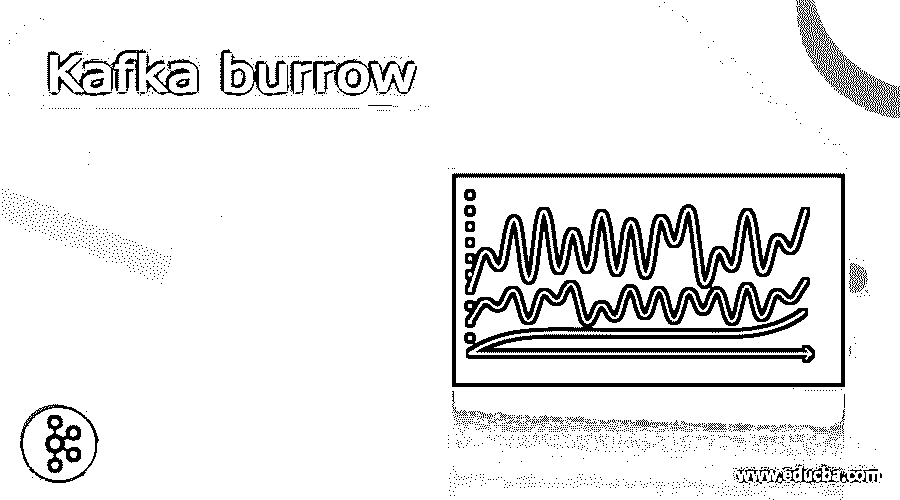
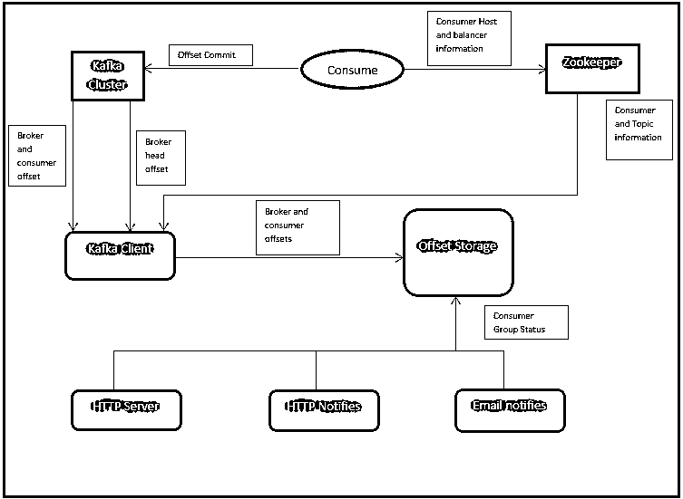

# 卡夫卡洞穴

> 原文：<https://www.educba.com/kafka-burrow/>

## 卡夫卡陋居简介

Kafka 的 basic 最初是由 LinkedIn 开发的。同样，Kafka 陋居也只在 LinkedIn 项目下。Kafka burrow 为 Apache Kafka 提供监控解决方案。主要是，它将为消费者滞后检查提供监控解决方案。在这里，卡夫卡陋居提供的是一种服务。在陋居中，不需要指定任何阈值。它将监控卡夫卡消费者的承诺补偿。根据需要，它还将计算卡夫卡消费者的状态。为了满足按需需求，我们需要使用 HTTP API 调用，并需要提供 Kafka 集群的其他信息，如 zookeeper 信息、集群细节、端口信息等。在卡夫卡的洞穴中，我们有其他的通知，如电子邮件通信等。

**卡夫卡地洞的句法**

<small>Hadoop、数据科学、统计学&其他</small>

因此，不存在针对卡夫卡式的特定语法。为了研究卡夫卡的洞穴，我们需要了解它的完整架构。同样，我们也需要了解它的工作流程。在 Kafka burrows 中，我们也使用了 HTTP 组件的数量。根据要求或需要，我们将安装 Kafka burrow 环境并对其进行相应的配置。在安装 Kafka burrows 环境时，我们需要为 GitHub repo 获取必要的文件。要配置它，我们需要使用 install 和 go 实用程序。但是我们主要需要使用 docker 概念来运行 Kafka the burrow 环境。一旦安装完成，我们需要配置 Kafka burrow 环境，并从浏览器访问该环境。

**注意:**一般我们都是使用 8000 端口访问 Kafka burrow 环境。

### 卡夫卡《陋居》是如何运作的？

正如我们所讨论的，Kafka burrows 为 Kafka 环境提供了监视功能。检查卡夫卡《消费者》的滞后性是非常有用的。我们将 Kafka 生态系统用于流媒体目的。在流中，我们需要生产者和消费者(使用数据的应用程序或工具)的快速响应。在这里，如果我们将面临任何滞后或延迟，那么最终我们将得不到有价值的数据。因此，我们需要修复它，并需要确定在获取数据或消费数据时是否有任何延迟。在这里，卡夫卡的洞穴进入了画面。它将提供用户界面。在同一个用户界面上，它将显示滞后的详细信息，如是否存在任何滞后。

Kafka burrow 项目由数据基础设施流 SRE 团队负责。该团队被归入 LinkedIn。上面的数据流代表了卡夫卡地洞的工作方式。陋居将自动监控所有 Kafka 消费者和他们正在消费的分区。然后陋居会将卡夫卡消费者的所有详细信息集中保存。该信息与单个消费者信息相比是不同的。这里有一个滑动窗口的概念。根据评估，消费者地位是由卡夫卡的消费者行为决定的。在每个 Kafka 分区中，将检查以下信息的基础，如消费者是否承诺偏移，消费者偏移值是否增加，滞后是否增加，滞后是否频繁增加或恒定。根据这一检查，他们可以声明消费者状态，如 OK(如果状态为 OK，则不需要任何操作)，如果状态为 WARNING(如果状态为 WARNING，则它正在下降，但消费者工作正常)。如果状态为错误(如果状态为错误，则消费者没有工作)。所有这些都由简单的 HTTP 调用来处理。根据 API 调用，我们将获得必要的警报。

以下是卡夫卡地洞的特征

1.在 Kafka burrow 环境中，不需要定义阈值。各组将在滑动窗口内进行评估。

2.Kafka 陋居将支持多个 Kafka 集群和不同的 Kafka 环境。

3.在 Kafka 环境中，它会自动监控所有 Kafka 消费者。对于监控，它将使用 Kafka 提交的偏移值。

4.类似于 Kafka，我们能够配置 Zookeeper 提交的偏移量。

5.与 zookeeper 类似，我们能够配置 Storm committed 偏移量。

6.它还将支持消费者组状态的 HTTP 端点。类似地，它还将支持代理以及消费者信息。

7.卡夫卡地洞也将提供警报功能。我们还可以配置电子邮件提醒。我们还可以为各自的利益相关者设置相同的电子邮件提醒。

8.在 Kafka 陋居警报中，我们还可以配置 HTTP 客户端警报。我们可以向其他应用程序、工具或系统发送相同的警报，通知所有组和各自的利益相关者。

**理解卡夫卡陋居的例子**

Kafka 陋居概念
因此，有一个特定的命令可用于处理 Kafka 陋居。这只是一个监测平台，它将有助于监测卡夫卡消费者。这将有助于检查，是否有任何滞后。这些信息在用户界面上是可见的。

### 结论

我们已经看到了带有适当解释的“卡夫卡洞穴”的未切割概念。卡夫卡洞穴只不过是卡夫卡消费者的一个监控工具。它将自动监控用户延迟，而无需在其中设置阈值。如果发生任何问题，它将向各自的利益相关者发送警报通知。

### 推荐文章

这是卡夫卡陋居指南。在这里，我们讨论定义，语法，卡夫卡陋居如何工作？代码实现示例。您也可以看看以下文章，了解更多信息–

1.  [卡夫卡的听众](https://www.educba.com/kafka-listener/)
2.  [卡夫卡动物园管理员](https://www.educba.com/kafka-zookeeper/)
3.  [卡夫卡主机生产商](https://www.educba.com/kafka-console-producer/)
4.  [卡夫卡节点](https://www.educba.com/kafka-node/)

