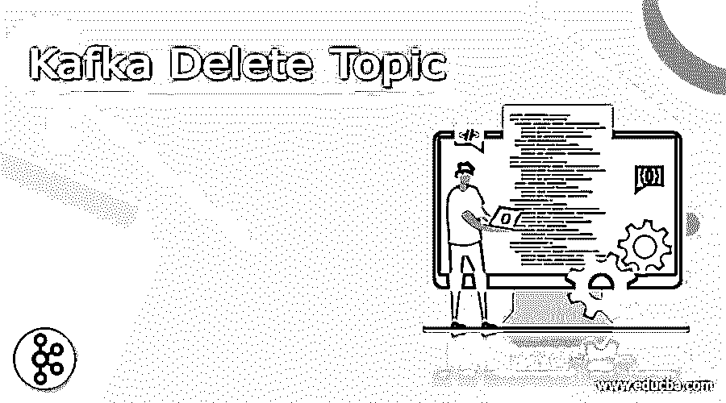
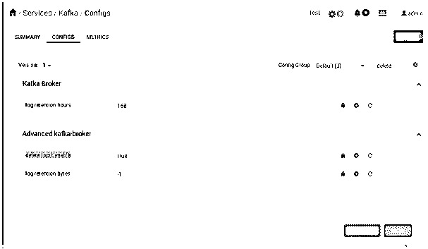
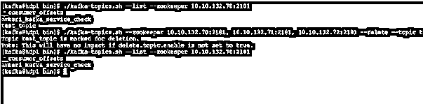

# 卡夫卡删除主题

> 原文：<https://www.educba.com/kafka-delete-topic/>

## 卡夫卡简介删除主题

众所周知，卡夫卡提供的是流媒体解决方案。根据需求，我们可以以这样一种方式设计 Kafka 架构，即数据应该在任何时候都可用，并且它将在任何时候都被处理。卡夫卡中有一个生产者概念；这将有助于生成卡夫卡中的数据。一旦数据生成，就有一个机制来消费数据。但是生成的数据将只存储在特定的 Kafka 主题上。Kafka 主题负责按照默认的数据保留期保存数据。根据与 Kafka 的日常工作，我们也需要对 Kafka 主题进行适当的管理。在卡夫卡的几个版本中，主题的删除是非常容易的。有不同的方法来删除卡夫卡主题，如手动删除卡夫卡主题，借助动物园管理员等。

**语法:**

<small>Hadoop、数据科学、统计学&其他</small>

`kafka-topics.sh --zookeeper [ zookeeper host ] [ option | delete ] --topic [topic name]`

**1) Kafka-topics.sh:** 这里，我们使用的是 Kafka 主题脚本。我们可以使用主题脚本作为语法或 Kafka delete 命令中的关键字。它将接受不同的参数，如 zookeeper 主机、不同的选项、主题名称等。根据提供的输入，Kafka 主题脚本将删除命令中提供的相应主题。它将从卡夫卡生态系统中删除相应的主题。Kafka 主题脚本将帮助从 Kafka 环境中删除 Kafka 主题。

**注意:**Kafka 主题脚本的默认路径是/usr/HDP/current/Kafka-broker/bin。

**2) Zookeeper 节点和端口:**删除 Kafka 主题时，必须提供 Zookeeper 主机和端口号

**注意:**Zookeeper 服务的缺省值是 2181。

**3)选项:**根据需要，我们可以提供不同的标志作为与 Kafka 主题脚本兼容的选项。

**4)主题名称:**根据要求或需要，我们可以提供需要从 Kafka 环境中删除的主题名称。

### 卡夫卡如何删除主题作品？

正如我们所讨论的，有不同的方法来删除 Kafka 主题，例如我们可以手动删除 Kafka 主题，从工具中删除 Kafka 主题，从脚本或应用程序作业中删除 Kafka 主题，等等。根据需求，我们可以选择需要使用哪种方法来删除 Kafka 主题。理想情况下，我们使用手动方法删除卡夫卡主题。这里，我们使用的是 zookeeper 主机和 zookeeper 主机。但是请记住，在删除这样一个话题的同时。我们需要确保“delete.topic.enable”属性应该在 Kafka 核心配置中可用。在同一 configure 配置中，属性的值应该仅为 true。它不会被设置为真。

一旦属性将为真，它将表明我们能够轻松地删除卡夫卡主题。现在，我们需要使用在 Kafka 环境中使用的 zookeeper 主机。我们需要同时使用 zookeeper 主机和端口。在删除 Kafka 主题时，我们需要在与 delete 相同的命令中使用选项。我们需要使用 Kafka 的主题名称，也需要删除。所有的命令和选项都应该用 Kafka 主题脚本来操作，并且需要运行它。根据提供的值，它将在动物园管理员的帮助下与 Kafka 环境连接，然后从 Kafka 环境中删除相应的 Kafka 主题。

### 例子

卡夫卡删除主题:如何删除卡夫卡主题

在卡夫卡的环境中，我们有不同的方式来删除卡夫卡的主题。根据我们的要求，我们需要选择我们需要检查和采用的合适选项。在删除 Kafka 主题之前，我们需要注意一些事情，比如配置级别。我们需要对 Kafka 配置进行更改，并添加一些属性。一旦属性被添加到配置中。我们能够从 Kafka 环境中删除 Kafka 主题。

**注意:**对于这个例子，我们使用 Kafka 集群。因此，我们正在从 UI 前端进行配置级别的更改。因为我们有 Ambari 集群管理器，所以配置将集中处理。

**命令:**

`Property value
delete.topic.enable = true
./kafka-topics.sh --zookeeper 10.10.132.70:2181, 10.10.132.71:2181, 10.10.132.72:2181 --delete --topic test_topic`

**说明:**

根据上述命令，我们有两个部分。在第一部分中，我们将在 Kafka 配置中添加配置属性。根据下面的截图 1 (a ),我们已经在 Kafka 集中配置中添加了配置属性。该值被删除。topic.enable。我们需要将该属性的值设置为 true。默认情况下，该值仅在配置中可用。但是在某些情况下，当我们使用独立的 Kafka 环境时，我们需要手动添加配置属性。

在截图 1 (b)中，我们实际上是在删除卡夫卡的话题。在同一个屏幕截图中，首先，我们在 Kafka 环境中使用下面的命令列出主题列表，然后它将打印 Kafka 环境下可用的主题数量。这里我们删除了“test_topic”主题。
卡夫卡列表主题:。/Kafka-topics . sh–list–zookeeper 10 . 10 . 132 . 70:2181

**输出:**

**截图 1 (a)**

**截图 1 (b)**

### 结论

我们已经看到了“Kafka delete topic”的未删节概念，带有适当的示例、解释和带有不同输出的命令。在 Kafka 环境中，我们能够从 Kafka 环境中删除任何主题。在删除卡夫卡主题之前，我们需要确保删除。话题。“启用配置”属性应该在 Kafka 配置中可用。同一属性的值只能是“true”。

### 推荐文章

这是卡夫卡删除话题的指南。在这里我们讨论引言、句法、卡夫卡如何删除主题的作品？代码实现示例。您也可以看看以下文章，了解更多信息–

1.  [卡夫卡用例](https://www.educba.com/kafka-use-cases/)
2.  [卡夫卡主题](https://www.educba.com/kafka-topic/)
3.  [卡夫卡集群](https://www.educba.com/kafka-cluster/)
4.  [卡夫卡事件](https://www.educba.com/kafka-event/)

