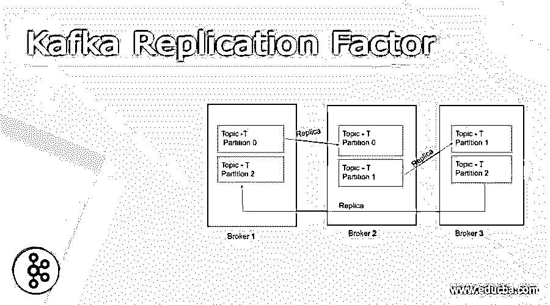
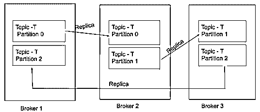

# 卡夫卡复制因子

> 原文：<https://www.educba.com/kafka-replication-factor/>

## 卡夫卡复制因子的定义

Kafka 中的复制因素基本上是通过多个代理的多个数据副本。进行复制是为了确保数据的高可用性，并在代理无法满足请求时防止数据丢失。出于安全原因，复制因子的值应大于 1，这表明文件的副本存储在其他代理中，用户可以在发生故障切换时从这些代理中访问它。Apache Kafka 遵循领导者-追随者的概念，以确保在任何情况下都有数据可用。在 Apache 中，Kafka 复制发生在分区粒度级别，这意味着数据的多个副本将出现在使用特殊分区提前日志的不同代理上。

### 卡夫卡中的复制因子是如何起作用的？

通过复制原理，Kafka 保证在任何情况下都不会丢失数据。如果一个代理出现故障，则可以从拥有该数据副本的其他代理检索数据。让我们一步步了解复制因子及其在卡夫卡中的作用:

<small>Hadoop、数据科学、统计学&其他</small>

1.每个分区中都有一个特殊的预写日志，它将消息存储在它们唯一的偏移量处。

**分区机制的预写日志**

2.Kafka 中的每个主题分区都被复制“n”次(其中 n 是用户定义的复制因子)，这意味着该分区的 n 个副本将出现在集群中的不同代理上。

3.正如阿帕奇卡夫卡遵循领导者-追随者机制一样，每个主题分区都有一个领导者。在主题分区的“n”个副本中，一个被选为领导者，其余的被选为追随者。

4.Leader 从生产者那里获取所有数据，并处理分区的所有读写操作。

5.追随者-只追随领导者并复制领导者拥有的所有数据。

6.为了处理客户端对特定数据的请求，集群可能会搞不清需要从哪个代理提取数据。为了避免这种混淆，已经设定了以下规则:

–对于客户请求，在领导在场的情况下，只有领导会满足请求。没有一个追随者被允许服务。

–如果拥有所请求分区的领导者的代理失败，Kafka 会自动选择一个追随者，该追随者将获得所有权并成为领导者以服务于客户请求。

7.Kafka 中的追随者被称为 ISR(同步副本),并且通过复制因子，多个 ISR 存在于特定分区。

8.Kafka 中的 Leader 会跟踪其同步副本的列表，并不时检查它们的状态。如果同步副本列表中的任何跟随者死亡或在任何情况下都无法复制领导者，它将从列表中删除。卡夫卡笔下的动物园管理员决定了领导者和追随者。

9.当主节点在故障切换后恢复时，它将再次尝试成为主节点，并占据替代主节点的位置。

Kafka 允许生产者在数据写入和检索的情况下选择确认。这些确认可以由生产者根据项目的严重性和要求来设置。对于无数据丢失，需要将确认因子‘aks’设置为‘all ’,以等待领导和所有 ISR 的确认。

需要注意的重要一点是，如果阳极保持与动物园管理员的会话，并且从节点不需要“远远落后于”领导者，则认为阳极是活的。对于远远落后于 follower 节点的场景，在 Kafka 中定义了 replica.lag.max.messages、replica.lag.time.max.ms 等各种条件。

### 例子

让我们借助一个例子来理解上面对卡夫卡的复制因子在其领导者和追随者的帮助下起作用的解释:

考虑一个场景，其中有一个包含 3 个分区的主题 T:分区 0、分区 1 和分区 2。集群中有 3 个代理，分别名为代理 1、代理 2 和代理 3。

如上图所示，某个特定分区有两个副本。对于 Topic -T 的分区 0，代理 1 是领导者，代理 2 是 ISR(同步副本)。类似地，对于分区 1，代理 2 是领导者，代理是 ISR；对于分区 2，代理 3 是领导者，代理 1 是 ISR。一个特定分区可以有“n”个 ISR(但为了简单起见，我们可以考虑每个分区有 1 个 Leader 和 1 个 ISR)。

1.对于与分区 0 相关的任何数据，代理 1 将从生产者处获取，并且代理 2 (ISR)的分区 0 的读写操作将从生产者处发生。制作人将直接与负责人联系任何更新。

2.对于分区 0 的任何客户端请求，代理 1(领导者)将做出响应。没有 ISR(即，如果代理 1 还活着，代理 2 将响应分区 0 的客户端请求。

3.如果代理 1 不可用，或者存在代理 1 的某种故障转移情形(代理 1 宕机),并且在这种情况下，客户端请求分区 0，那么 Kafka 将自动选择一个 ISR(在这种情况下是代理 2 ),并使其成为将响应客户端请求的领导者。

4.如果代理 1 将在故障转移后返回，它将尝试取代代理 2 的位置，再次成为分区 0 的领导者。

### 结论

上面的描述清楚地解释了 Kafka 复制因子是什么，以及它如何在集群中实际工作，以满足分布在多个服务器上的数据的客户端请求。虽然从理论上讲，这种复制过程似乎很容易，但在实际情况中，当工作负载和客户端请求随时间变化时，这种复制过程非常具有挑战性。当需要将数据分布在多个服务器上时，Kafka 是一个很好的框架，但是在使用它之前很好地理解它是很重要的。

### 推荐文章

这是一本关于卡夫卡复制因子的指南。这里我们讨论定义，复制因子在卡夫卡中是如何起作用的？代码实现示例。您也可以看看以下文章，了解更多信息–

1.  [卡夫卡用例](https://www.educba.com/kafka-use-cases/)
2.  [卡夫卡主题](https://www.educba.com/kafka-topic/)
3.  [卡夫卡集群](https://www.educba.com/kafka-cluster/)
4.  [卡夫卡事件](https://www.educba.com/kafka-event/)

