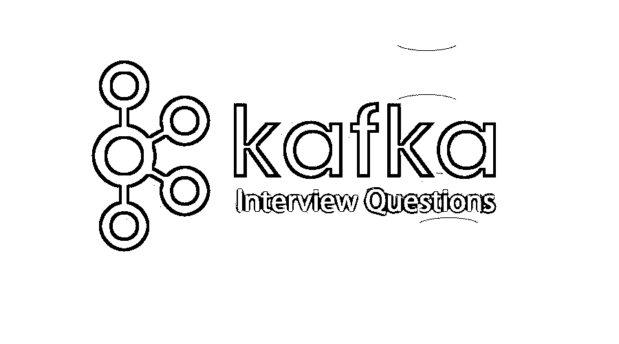

# 卡夫卡面试问题

> 原文：<https://www.educba.com/kafka-interview-questions/>

## 卡夫卡访谈问答介绍

Kafka 是一个开源的发布者-订阅者模型，用 Scala 编写。它是目前数据处理中最流行的工具之一。人们更喜欢 Kafka，因为它提供了广泛的吞吐量和低延迟，更容易有效地处理实时数据。它还支持简单的数据分区、可伸缩性和低延迟。这些特点为精通卡夫卡的人点燃了广泛的就业机会。下面是一些常见问题，可以帮助你在重要的面试中脱颖而出。

如果是找与卡夫卡相关的工作，需要准备 2022 年的卡夫卡面试题。根据不同的职位描述，每次面试都是不同的。在这里，我们准备了重要的卡夫卡面试问答，帮助你面试成功。

<small>Hadoop、数据科学、统计学&其他</small>

在这篇 2022 年卡夫卡访谈问题的文章中，我们将呈现 10 个最重要和最常被问到的卡夫卡访谈问题。这些问题分为以下两部分:

### 第 1 部分——卡夫卡面试问题(基础)

这第一部分涵盖了基本的卡夫卡访谈问题和答案。

#### Q1。什么是卡夫卡，卡夫卡的各个组成部分是什么？

**回答:**
据说 Kafka 是一个使用 Scala 开发的发布-订阅消息模型。这是一个由 Apache software 启动的开源应用程序。Kafka 主要基于事务日志设计。它具有独特的特性，这使得它成为目前数据集成的最佳选择，并且是著名的数据处理工具之一。重要的特性是数据分区、可伸缩性、低延迟、高吞吐量、流处理、持久性、零数据丢失等。卡夫卡的主要成分是:

*   **主题:**一堆相同类型的消息属于同一个主题。
*   **制作人:**制作人，顾名思义，制作消息，并能传达给选定的话题。
*   经纪人:他们充当生产者和消费者之间的渠道。它们是一组存储已发布消息的服务器。
*   **消费者:**消费者是将要消费发布数据的人。它可以订阅不同的主题，然后从经纪人那里获取数据。

#### Q2。卡夫卡中的领袖和追随者是什么？

**答案:**
卡夫卡根据偏置和消费群体进行分区创作。Kafka 中的每个分区都有一个服务器，扮演着领导者的角色。其中一个是领导者，可以没有或有多个服务器充当跟随者。领导者为自己分配了读写分区请求的任务。另一方面，追随者需要跟随领导者并重复领导者所说的话。如果领导者失败了，就像在现实生活中，一个追随者需要接管领导者的角色。这可能在服务器出现故障时发生。这确保了服务器上的负载平衡，也确保了系统的稳定性。

让我们转到下一个卡夫卡面试问题。

#### Q3。什么是复制品？为什么复制在 Kafka 环境中被认为是至关重要的？

**答:**
负责记录任何特定分区的基本节点的列表被称为副本。副本节点扮演领导者还是跟随者的角色并不重要。需要复制的重要原因是，在任何不确定的事件中，机器错误、程序故障或系统由于通常的频繁更新而停机时，都可以再次使用它们，以确保没有数据丢失或损坏。复制确保所有消息都正确发布并且没有丢失。

#### Q4。卡夫卡中的动物园管理员是什么？卡夫卡可以不用动物园管理员吗？

**答案:**
这是卡夫卡面试时问的基本问题。Zookeeper 用于 Kafka 适应的分布式应用程序。它有助于卡夫卡妥善管理所有资源。Zookeeper 是一个开源的、高性能的，并提供完整的协调服务。

不，不可能跳过动物园管理员直接去找卡夫卡经纪人。Zookeeper 管理所有 Kafka 资源，因此如果 Zookeeper 关闭，它将无法为任何客户端服务请求提供服务。zookeeper 的主要工作是作为集群中不同节点之间的通信渠道。卡夫卡中的动物园管理员是用来提交偏移量的。如果一个节点发生故障，可以很容易地从先前提交的偏移量中恢复。zookeeper 还负责领导者检测、分布式同步、配置管理等活动。通过所有这些，它还可以识别离开或加入集群节点的新节点、所有节点的状态等。

#### Q5。卡夫卡笔下的消费者是如何消费信息的？

**答:**
利用发送文件 API，在 Kafka 中完成消息的传递。使用这个文件，通过内核节省空间的副本和内核用户之间的调用以及返回内核，字节从套接字传输到磁盘。

### 第 2 部分-卡夫卡面试问题(高级)

现在让我们来看看卡夫卡的高级面试问题。

#### Q6。SerDes 是什么？

**答案:**
SerDes 代表串行化器和去串行化器。对于任何 Kafka 流来说，在需要时物化数据，为所有数据类型或记录和记录值提供 SerDes 是至关重要的。

#### Q7。用卡夫卡发大消息的方式是什么？

**答:**
要使用 Kafka 发送大量信息，您必须调整一些属性。通过进行这些更改，您将不会遇到任何异常，并且能够成功发送所有邮件。以下是需要进行一些更改的属性:

在消费者端–fetch . message . max . bytes

在代理上，结束创建副本–replica . fetch . max . bytes

在代理端，创建一个消息——message . max . bytes

在每个主题的代理端–max . message . bytes

让我们转到下一个卡夫卡面试问题。

#### Q8。什么是偏移？

**答案:**
一个偏移量可以叫做唯一标识符，分配给所有不同的分区。这些分区包含消息。offset 最重要的用途是，它可以通过 offset id 帮助识别消息。这些偏移 id 在所有分区中都可用。

#### Q9。什么是多租户？

**答案:**
这是卡夫卡面试中被问得最多的问题。Kafka 可以作为多租户解决方案轻松部署。启用不同主题的配置，在这些主题上产生或消费数据。有了这些，它还为不同的配额提供了操作支持。

#### Q10。为了获得最佳性能，您将如何调整 Kafka？

**答:**
卡夫卡中呈现出不同的成分。要调 Kafka，重要的是先调它的组件。这包括调整卡夫卡生产者，调整卡夫卡消费者，也调整卡夫卡经纪人。

### 推荐文章

这是卡夫卡访谈问答列表的指南。在这里，我们列出了 10 大面试问题，并详细回答了面试中的问题。您也可以阅读以下文章，了解更多信息——

1.  [RMAN 面试问答](https://www.educba.com/rman-interview-questions/)
2.  [Weblogic 面试问题](https://www.educba.com/weblogic-interview-questions/)
3.  [卡夫卡 vs 火花](https://www.educba.com/kafka-vs-spark/)
4.  [卡夫卡 vs 克瑞斯](https://www.educba.com/kafka-vs-kinesis/)

