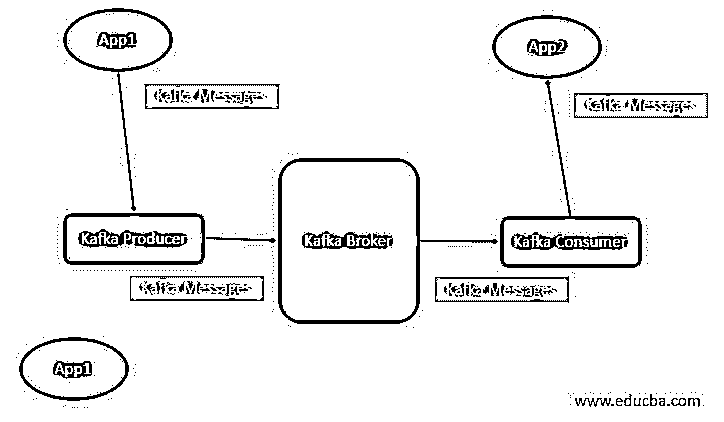
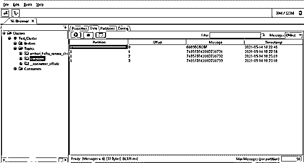

# 卡夫卡的信息

> 原文：<https://www.educba.com/kafka-message/>

## 卡夫卡信息简介

Kafka 最初是 LinkedIn 开发的。Kafka 是为流处理开发的框架。卡夫卡的信息是一个小的或中等的数据片段。对卡夫卡来说，这些信息只不过是一组简单的字节。卡夫卡的信息只不过是信息或数据。来自不同的来源。这些源代码并不特定于任何平台或软件。我们可以将 Kafka 与多种技术和不同的平台相结合。在 Kafka 中，消息将按照比特格式流动。在 Kafka 环境中，我们也可以实现并行处理。如果我们需要和卡夫卡一起工作，信息就不是一个单一的概念。为了理解卡夫卡的信息，我们需要理解卡夫卡的不同组成部分，并且需要理解它。那么只有我们才能理解卡夫卡式的信息概念。

**卡夫卡消息的语法**

<small>Hadoop、数据科学、统计学&其他</small>

因此，Kafka 消息不存在特定语法。为了处理卡夫卡的信息，我们需要理解进出数据。同样，我们需要理解数据的流动。在 Kafka 消息中，我们使用它的服务数量。根据要求或需要，我们将安装 Kafka 集群并对其进行相应的配置。在 Kafka 消息中，我们使用 CLI Kafka 命令的次数。但是如果我们正在 Kafka 集群上工作，那么我们被推荐只管理 Kafka UI 上的配置。对管理层来说会更好。对于故障排除方面，我们还需要研究 Kafka 日志。

### 卡夫卡的信息是如何运作的？

正如我们所讨论的，卡夫卡的信息只不过是一个简单的字节数组。卡夫卡的信息只不过是数据。数据的大小取决于配置。默认情况下，Kafka 代理可以处理的消息大小是 1MB。但是如果我们需要增加消息或数据的大小，那么我们也可以增加它。我们需要在 Kafka 配置中进行更改，并增加那里的值。这将取决于系统或应用要求。

为了获得卡夫卡的信息，我们需要首先理解卡夫卡成分的基本概念。在卡夫卡的作品中，有许多不同的成分，扮演着不同的角色。以下是 Kafka 组件的列表。

卡夫卡的制作者:就卡夫卡的信息而言，制作者是非常重要的。制作人负责制作卡夫卡中的信息。因此，我们可以在卡夫卡的环境中创造生产者的数量。

**2) Kafka 消费者:**消费者负责获取或消费 Kafka 生产者的消息(关于特定 Kafka 主题)。

**3)卡夫卡经纪人:**在卡夫卡环境下，消费者和生产者无法直接沟通。在这里，卡夫卡经纪人充当了卡夫卡消费者和卡夫卡生产者之间的沟通桥梁。在卡夫卡经纪人的帮助下，消息将会传播。

按照上面的流程，我们有两个不同的应用程序，即 App1 和 App2。App1 应用程序正在 Kafka 生成器上发送消息或数据。然后 Kafka 生产者(来自特定主题)将把消息传递给 Kafka 经纪人。卡夫卡经纪人负责沟通。卡夫卡经纪人将在卡夫卡生产者和卡夫卡消费者之间进行沟通。最初，在消费来自 Kafka 消费者的数据时，它将从头开始消费数据。但是从下一次开始，新的或更新的数据将被 Kafka 消费者消费。这里，偏移值出现在图片中。在消费更新的消息时，消费者将检查更新的偏移值并从其消费。

### 理解卡夫卡信息的例子。

以下是卡夫卡作品的例子:

#### 卡夫卡信息:推送卡夫卡信息

在卡夫卡的环境中，我们需要推送关于卡夫卡主题的信息。Kafka 主题将按照默认的保持期保存消息。

**命令:**

`./kafka-console-producer.sh --broker-list 10.10.132.70:6667 --topic test_topic`

**说明:**

按照上面的命令，我们正在运行“Kafka-console-producer.sh”脚本。这里，我们使用代理的 IP 地址和端口。最后，我们需要更新主题名称。在哪个主题上，我们需要推送信息。

**输出:**

#### 卡夫卡的信息:获取卡夫卡的信息

在卡夫卡的环境中，我们能够消费卡夫卡的信息。这里，我们需要使用 Kafka 消费者来获取 Kafka 消息。

**命令:**

`./kafka-console-consumer.sh --bootstrap-server 10.10.132.70:6667 --topic test_topic --from-beginning`

**说明:**

按照上面的命令，我们正在使用卡夫卡的信息。这里，我们正在运行“Kafka-console-consumer.sh”脚本。我们需要使用代理的 IP 地址和端口。最后，我们需要更新主题名称。关于哪个主题，我们需要消费或获取消息。

**输出** **:**

#### Kafka 消息:在 Kafka 工具上检查消息状态

在 Kafka 中，通常，我们在命令行上与 Kafka 一起工作。但是我们也有在 UI 上检查 Kafka 消息状态的功能。

**命令:**

这里没有语法或命令。相反，我们需要配置 Kafka 工具。在 Kafka 工具中，我们需要提供 zookeeper 细节并连接 Kafka。

**说明:**

在 Kafka 生态系统中，我们也能够在 UI 中获得 Kafka 消息。根据下面的截图，我们已经用 Kafka 工具配置了 Kafka 集群，并获得了 Kafka 消息的状态。

**输出:**

### 结论

我们已经看到了“卡夫卡式的信息”的未删节的概念，有适当的例子、解释和命令，有不同的输出。卡夫卡的信息只不过是一小块或中等大小的数据。它是一个简单字节数组的集合。根据需求或应用需要，我们还可以将 Kafka 与许多不同的应用程序集成在一起。

### 推荐文章

这是卡夫卡信息的指南。在这里，我们讨论了“卡夫卡信息”的未切割的概念，适当的例子，解释，和不同输出的命令。您也可以阅读以下文章，了解更多信息——

1.  [卡夫卡集群](https://www.educba.com/kafka-cluster/)
2.  [卡夫卡隔断](https://www.educba.com/kafka-partition/)
3.  [卡夫卡主题](https://www.educba.com/kafka-topic/)
4.  [卡夫卡事件](https://www.educba.com/kafka-event/)

