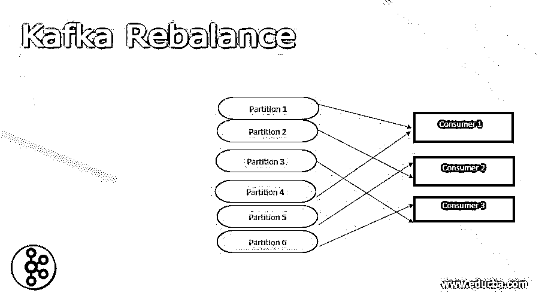
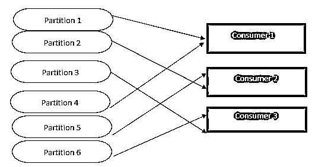
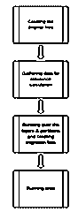
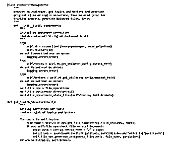
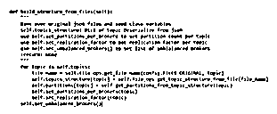
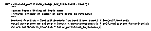
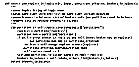

# 卡夫卡再平衡

> 原文：<https://www.educba.com/kafka-rebalance/>

## 卡夫卡再平衡简介

Kafka rebalance 的定义是，它是一个向精确客户描述每个分区的过程，因为客户群是一组客户，它们可以将 Kafka 主题中可用的一个客户或多个客户的消息淹没在一起。 当我们有一个新客户时，该客户可以附加到客户群或从客户群中离开，这时 Kafka 重新平衡可以发生，客户也可以在一段时间内结束消息过滤，然后从一个主题中过滤事件可以缓慢进行。

### 什么是卡夫卡再平衡？

正如我们所知，Kafka 集群包含一个或多个“代理”，“生产者”可以从 Kafka 代理中取出数据，然后“消费者”可以是解释来自代理的消息的应用程序，并且要传送的数据可以存储在主题中，其中每个主题可以有不同的“分区”，一个消费者可以一次解释一个分区。

<small>Hadoop、数据科学、统计学&其他</small>

我们可以说，Kafka 重新平衡是以特定的方式将分区划分给消费者的过程，当重新平衡进行时，可以以递增的方式将一个分区移交给消费者，让我们借助下图来理解它。

从上图中，我们可以看到分区的分配情况。

*   **卡夫卡再平衡场:**

Apache Kafka 是一个著名的分散甚至流动的平台，可以用于数据管道、流动分析和数据组合，然后我们可以找出问题，总结能力和平衡。

下面给出了卡夫卡再平衡的一些关键领域，

*   Topics:一个 Kafka 集群，可以管理称为 Topic 的保留类别。
*   代理:可以包含多个服务器的集群就是代理。
*   分区日志:每个主题都可以支持分区日志。
*   一个主题可以包含各种分区，所有分区都可以作为主并行执行。
*   副本:可以是能够为每个分区复制日志的代理列表。

### 卡夫卡再平衡过程

#### 步骤 1:创建原始文件:

它包含两个部分，

*   通过 Zookeeper，它可以获得每个主题的当前代理、主题和分区。
*   对于每个主题，已经分配了最初创建的文件。

并且可以分配原始文件，

*   如果有任何干扰，就传达整群调查的情况，所以在这种情况下，我们不需要开始。
*   过一段时间，我们就可以有真正的分配来测试它。

#### 步骤 2:收集用于计算重新平衡的数据

在这一步中，

*   这些主题可以在文件中考虑。
*   每个主题的分区。
*   也为每个代理进行分区。
*   然后是每个主题的复制因子。

之后，我们可以把不平衡经纪人，我们可以把它作为一半的中位数分区相加，不平衡的相关性必须降低，在调节再平衡的情况下，

#### 步骤 3:管理主题和分区并生成迁移文件:

在这一步中，当我们试图计算下面给出的一些任务时，可以在主题上进行循环。

*   每个主题要更改的分区数量。
*   经纪人可以降低和总结的主题升级再平衡。
*   此外，它可以计算经纪人的夸大和不足。
*   创建一个新的余额分配文件，只需在代理中做最小的修改，因此让我们看看如何计算每个主题的分区，

*   我们可以实现一个特定的主题来减少由替换计数产生的任何修改，

*   搜索和替换过程可以寻找具有最高代理计数的分区，

#### 步骤 4:流测试

在这个确认步骤中，我们可以测试下面给出的一些内容，

*   Test_changes_in_assignment:它可以检查真正的主题平衡下的分区中没有进一步的修改。
*   Test_if_topics_are_balanced:它可以检查与分区的中间值相比，是否有超过 15%的任何类型的差异。
*   Check_brokers_to_reduce:它可以测试代理可以是完整代理列表的子集。

### 卡夫卡重新平衡消费者

卡夫卡式再平衡中的消费者是一个从主题和行为中解读信息的过程，其中主题可以携带经纪人可以接受的各种划分，一个消费者群体可以有不同的消费者，其中不能吸收相同的信息，如果相似的信息被多个消费者吸收，那么就必须在不同的消费者群体中， 其中我们可以说在消费者的数量和分区的数量之间可能有紧密的关系，但是如果我们有更少的消费者，那么消费者必须从可能影响输出的各种分区中进行解释， 每个消费者可以只理解他的分配，并且组的领导者也可以是这样的消费者，其中它可以跟随组中的其他消费者和他们的分配，这意味着新的消费者可以执行一些任务，其中每个分区也可以具有保留痴迷消息索引的平衡。

### 结论

在本文中，我们得出结论，卡夫卡再平衡是在一段时间内过滤信息的过程，我们也讨论了卡夫卡再平衡场、卡夫卡再平衡过程和消费者的卡夫卡再平衡，因此本文将有助于理解卡夫卡再平衡的概念。

### 推荐文章

这是卡夫卡再平衡的指南。这里我们分别讨论导论、什么是卡夫卡再平衡、卡夫卡再平衡的过程、例子。您也可以看看以下文章，了解更多信息–

1.  [卡夫卡 JDBC 连接器](https://www.educba.com/kafka-jdbc-connector/)
2.  [卡夫卡偏移](https://www.educba.com/kafka-offset/)
3.  [卡夫卡的留言](https://www.educba.com/kafka-message/)
4.  [卡夫卡 vs JMS](https://www.educba.com/kafka-vs-jms/)

