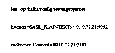

# 卡夫卡港

> 原文：<https://www.educba.com/kafka-port/>

## 卡夫卡港简介

Kafka 端口的定义是，正如我们所知，端口是任何可以利用网络或互联网通过服务器传送消息的应用程序的逻辑地址，Kafka 服务器安装在端口 9092 上，它可以利用 Zookeeper 服务器，它可以安装在 2181 端口上，以便通过使用 2182 端口在 TLS 加密的帮助下与 Apache Zookeeper 进行交互，如果幸存的端口无法接受，那么我们可以通过在构建中附加一些代码来切换该服务器。

### 卡夫卡港是什么？

当我们尝试在任何计算机上安装 kafka 时，它基本上以文件的形式出现，这些文件可以通过使用扩展来执行，还有两种类型的端口被配置为 Kafka 服务器(broker ),其本地主机端口为 9092，zookeeper 本地主机端口为 2181， 这里我们需要记住的一点是，当我们试图在同一台计算机上安装多个端口时，我们必须使用不同的端口，因为每个端口都可能被单台计算机上的单个进程占用， 因此，如果我们想在同一台计算机上编译三个 zookeeper，那么我们需要调整相同的配置文件，并为每个具有不同端口的 zookeeper 实例创建配置文件，为每个实例创建单独的 localhost 也是一个好主意，例如，您可以为一个 Zookeeper 使用 2181，为第二个 Zookeeper 使用 2182， 第三个 zookeeper 为 2183，Kafka broker 也会发生同样的情况，因为我们需要根据不同的端口调整配置，如:9092、9092、9093 等等，这取决于我们要在计算机上运行的代理的数量，我们还需要调整 broker 可以存储消息的文件夹。

<small>Hadoop、数据科学、统计学&其他</small>

如果我们要在不同的计算机上运行 Zookeeper 和 broker，那么在这种情况下，我们不需要更改端口，因为我们可以在同一个端口上运行所有这些端口，但它们必须在不同的计算机上运行。关于 Kafka broker，我们需要记住一点，如果代理应该是可公开访问的，我们需要在代理的配置中调整“advertised.listeners”属性，在 Kafka broker 和 Zookeeper 之间传递的广告名称。

### 如何找到卡夫卡港？

让我们看看如何找到卡夫卡的端口号，

*   我们可以从服务器上获得这个号码。属性的文件，一般来说，这个文件可以有必要的信息，我们可以说，文件通常可以建立在这个位置上。
*   服务器的属性。属性”文件可以通过使用源文件来查看，

less/opt/Kafka/config/server . properties

listeners = SASL _ 明文://10.10.77.21:9092

动物园管理员。连接=10.10.77.21:2181 '

因此，从文件中，我们可以说该端口已经被 Kafka 和 Zookeeper 服务使用，这是可以指定的。

*   配置文件的默认位置可以是“$(confluent _ home)/etc/Kafka/server . properties”，其默认端口号为 9092。
*   我们可以检查服务器中的 Kafka 端口。通过对门户 9092 使用“netstat”命令，

sudo netstat -anp | grep 9092

使用该过程可以检查或查看 Zookeeper，

‘sudo netstat -anp | grep 2181’,

*   Zookeeper 端口号可以接受来自‘zookeeper’。“属性”文件，它可以是配置文件，默认端口号为 2181。
*   如果我们找到了下面给出的输出，那么我们可以理解这应该是针对在该端口参与的 Java 进程的，

' TCP 6 0 0:::9092:::* list EN 52922/Java '

*   Kafka 属性文件:它可以通过使用替代属性文件进行配置，在该文件中，它可以在 Kafka 提供的开发环境中使用，但它只能进行一次修改，该修改可以验证服务器上的主题的非自愿生成，并且由于服务器可以快速启动，当我们想要用各种 Kafka 服务器启动服务器 Kafka 服务器时，我们可以简单地附加我们自己的“Kafka 服务器”。属性文件添加到我们的构建中。

### 卡夫卡港口服务公司

Kafka 服务可以通过贡献 Apache Kafka 来提及云服务，Apache Kafka 是数据流平台，因为它实现起来很复杂，尤其是当我们使用混合云环境时，因此数据流系统的许多用户通常可以选择 Kafka 服务，并且框架和系统管理被卸载给服务提供商。

Kafka 服务端口能够使用 9092 作为默认端口来利用 Kafka 服务器上的 Kafka 服务，在该端口中，Kafka 能够通过 TCP 进行通信，因为这有利于在混合云环境中实现薄层，数据流服务能够具有比数据应用更严格的要求，在该应用中，数据流能够实时地传送串行信息，并且大量敏感数据能够快速流动，Kafka 能够具有如下给出的一些服务，

*   它可以控制开发和其他核心功能。
*   它允许在早期阶段快速开始开发，以便快速部署新技术。
*   它还可以提供一个额外云服务的大型生态系统，该生态系统可以明确基于流的应用程序的交付。
*   基于消费的定价可以让我们奖励那些他们拥有的东西和他们拥有的时间。

### 结论

在本文中，我们得出结论，默认情况下，Kafka 端口从使用 Zookeeper 服务器的 9092 端口开始，因此我们也讨论了如何找到 Kafka 端口和服务，因此本文将有助于理解 Kafka 端口的概念。

### 推荐文章

这是卡夫卡港的指南。这里我们讨论了简介，什么是 Kafka 端口，如何找到 Kafka 端口，以及代码实现的例子。您也可以浏览我们推荐的其他文章，了解更多信息——

1.  [卡夫卡再平衡](https://www.educba.com/kafka-rebalance/)
2.  [卡夫卡 JDBC 连接器](https://www.educba.com/kafka-jdbc-connector/)
3.  [卡夫卡经理人](https://www.educba.com/kafka-manager/)
4.  [卡夫卡偏移](https://www.educba.com/kafka-offset/)

