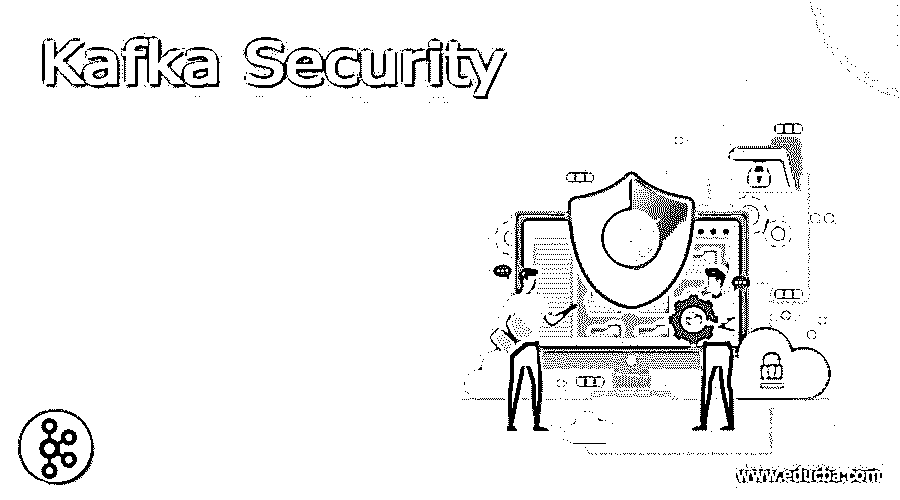
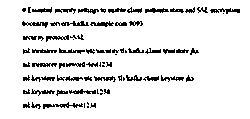
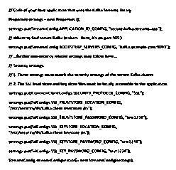
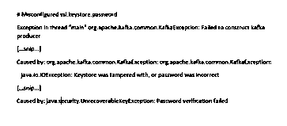

# 卡夫卡安全

> 原文：<https://www.educba.com/kafka-security/>

## Kafka 安全简介

Kafka 安全被定义为 Apache Kafka 是一个内部中心层，它允许后端系统通过 Kafka 主题相互划分实时数据，在 Kafka 主题中，它可以有一些可以解释来自 Kafka 的数据的消费者和可以将数据放在一起的生产者。此外，还需要确保数据的安全性，因为可能有不同的消费者可以解释数据并在一个或多个特定用户之间共享数据。因此，在这种情况下，需要保护数据免受其他消费者的侵害。

### Kafka 安全概述

Kafka 可以在 Apache Kafka 的帮助下利用端到端的数据安全模型和基于单元的安全模型，其中 Kafka 中基于单元的安全原型可以具有访问控制列表、简单身份验证、安全层和主题级安全，并提供我们需要的这种类型的安全:结构化数据、列表的访问控制、代理端身份验证以及消息级安全，它可以根据银行需求利用实际使用案例。 我们需要不同类型的消费者和用户，以便敏感信息能够保留与银行相关的信息，如卡号和其他真实身份，能够将安全元数据加入到消息中，数据可以构造为有效的 JSON，它可以输出带有安全数据的消息头，并且消息可以通过安全数据来澄清，它可以向后兼容生产者、消费者和经纪人。

<small>Hadoop、数据科学、统计学&其他</small>

### 卡夫卡的安全问题及其解决

卡夫卡安全性有三个要素，

1.  使用 SSL/TLS 加密传输中的数据:

这可以支持我们的生产者和 Kafka 之间以及消费者和 Kafka 之间的数据加密，因此我们可以说它可以对所有在网络上传递的人产生普通的影响。

2.使用 SSL 或 SASL 的身份验证:

这个元素可以认证集群，比如 SSL 和 SASL，允许我们的生产者和消费者澄清身份。允许客户记录有助于授权的身份可能是更安全的途径。

3.使用 ACL 的身份验证。

在这个元素中，标识一个特定的客户端可以被授权解释或阅读几个主题，在这些主题中 Kafka 可以通过 ACL(访问控制列表)部署客户端。

### Kafka 安全模型

**1。明文**:

通常，数据可以以字符串的形式传送，而明文不需要经过认证和授权；因此，数据是不安全的，因此明文可以被用作证据；因此，对于可能需要大量数据安全性的环境，它将是无用的。

**2。SSL:**

SSL 代表安全套接字层，可用于加密和认证；如果任何应用程序都可以利用 SSL，那么首先需要对其进行配置，使其允许单向身份验证，以便客户端能够对服务器提供的证书进行身份验证，SSL 身份验证可以提供双向身份验证，以便代理也可以对客户端证书进行身份验证。尽管如此，SSL 还是会因为加密项目而影响效果。

**3。SASL:**

SASL 代表安全身份验证和安全层，它是网络顶部的数据安全和用户身份验证结构，Apache Kafka 可以通过 SASL 对客户端进行身份验证，因此 SASL 系统的数量可以在代理上进行验证，但客户端只能选择一个系统。

SASL 也可以有不同的系统，如 GSSAPI，其中它不需要安装新的服务器，特别是对于 Kafka，PLAIN 可以用来验证用户名和密码，这可以默认执行，SCRAM 属于 SASL 家族，它可以通过使用用户名和密码来验证安全概念，OUATHBEARER 是允许第三方应用程序访问 HTTP 服务的授权结构。包括 SASL 方法在内的所有方法都可以使用委托令牌，它只能在 Kafka 经纪人和客户之间共享机密性。

### 例子

让我们看一个例子，在这个例子中，集群中的 Kafka 代理可以进行安全设置，并且必要的 SSL 证书可以用于应用程序，

*   例如，如果我们正在使用 docker，那么我们必须在图像的适当位置添加 SSL 证书；现在，下面的代码可以允许对客户端进行身份验证，并使用 SSL 加密在 Kafka 流和 Kafka 集群之间传输数据，这些数据可以被解释和读取，

bootstrap . servers = Kafka . example . com:9093

security.protocol=SSL

SSL . trust store . location =/etc/security/TLS/Kafka . client . trust store . jks

SSL . trust store . password = test 1234

ssl。keystore . location =/etc/security/TLS/Kafka . client . keystore . jks

ssl。Keystore.password=test1234

SSL。key.password=test1234

*   这种类型的设置可以在我们的应用程序中为“StreamsConfig”实例进行配置。这种设置可以加密任何正在被解释或写入 Kafka 的数据，我们的应用程序可以通过 Kafka 代理进行身份验证，Kafka 代理可以进行交互，但这个示例不能进行客户端授权。

属性设置=新属性()；

settings.put(StreamsConfig。APPLICATION_ID_CONFIG，" secure-Kafka-streams-app ")；

settings.put(StreamsConfig。BOOTSTRAP_SERVERS_CONFIG，" Kafka . example . com:9093 ")；

settings . put(CommonClientConfigs。SECURITY_PROTOCOL_CONFIG，" SSL ")；

settings.put(SslConfigs。SSL_TRUSTSTORE_LOCATION_CONFIG，"/etc/security/TLS/Kafka . client . trust store . jks ")；

settings.put(SslConfigs。SSL_TRUSTSTORE_PASSWORD_CONFIG，" test 1234 ")；

settings.put(SslConfigs。SSL_KEYSTORE_LOCATION_CONFIG，"/etc/security/TLS/Kafka . client . KEYSTORE . jks ")；

settings.put(SslConfigs。SSL_KEYSTORE_PASSWORD_CONFIG，" test 1234 ")；

settings.put(SslConfigs。SSL_KEY_PASSWORD_CONFIG，" test 1234 ")；

streams config streams configuration = new streams config(设置)；

*   在我们的应用程序中，如果配置不正确，它通常会在开始后的运行时停止。例如，如果我们不得不为 ssl 输入错误的密码。Keystore.password '设置，将会记录一条错误消息，我们的应用程序将会关闭。

线程“main”org . Apache . kafka . common . Kafka 异常:无法构造 Kafka 生成器

[…snip…]

起因于:org . Apache . Kafka . common . Kafka 异常:org . Apache . Kafka . common . Kafka 异常:

java.io.IOException:密钥库被篡改，或者口令不正确

[…snip…]

原因:Java . security . unrecoverablekeyexception:密码验证失败

### 结论

在本文中，我们得出结论，Kafka 安全性在共享数据时非常重要，因为它需要防止其他用户使用，我们还讨论了 Kafka 安全性的问题和解决方案、安全模型以及示例，因此本文将有助于理解 Kafka 安全性的概念。

### 推荐文章

这是一本卡夫卡安全指南。在这里，我们讨论介绍，概述，Kafka 安全问题和解决方案，以及代码实现的例子。您也可以看看以下文章，了解更多信息–

1.  [卡夫卡港](https://www.educba.com/kafka-port/)
2.  [卡夫卡 JDBC 连接器](https://www.educba.com/kafka-jdbc-connector/)
3.  [卡夫卡再平衡](https://www.educba.com/kafka-rebalance/)
4.  [卡夫卡偏移](https://www.educba.com/kafka-offset/)

