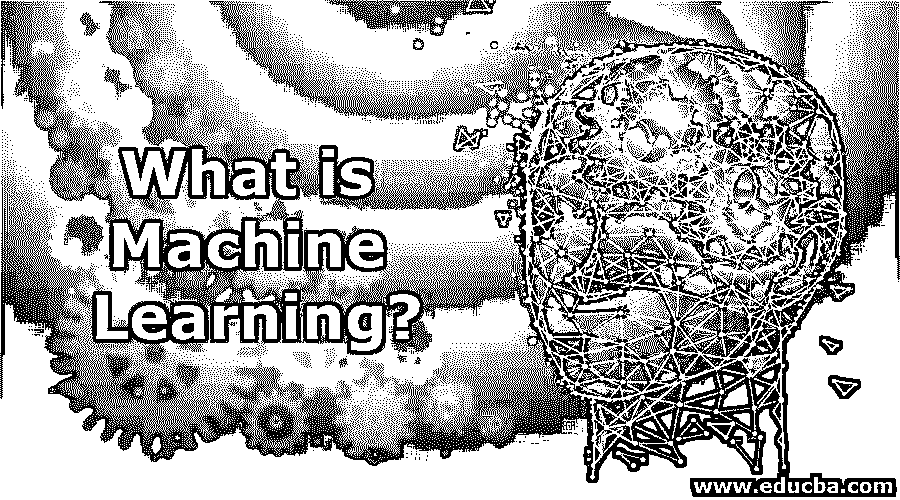

# 什么是机器学习？

> 原文：<https://www.educba.com/what-is-machine-learning/>

## 什么是机器学习？

机器学习被定义为人工智能的子领域，它专注于开发计算机程序，这些程序通过向系统提供学习和自动改进的能力来访问数据，而无需任何人工干预或行动。基于数据类型，即标记或未标记的数据，模型在机器学习中的训练被分类为监督和非监督学习。

### 机器学习定义

简单地说，就是在数据中寻找模式，并使用这些模式来预测未来。它允许我们发现现有数据中的模式，并创建和利用一个模型来识别创新数据中的模式。它已经成为主流。大供应商认为这个市场有很大的利润空间。它通常会支持您的业务。

<small>Hadoop、数据科学、统计学&其他</small>

### 学习是什么意思？

**学习过程:**

*   识别模式。
*   当你再次看到它们时，认出它们。

### 为什么机器学习目前这么流行？

*   大量的数据。
*   强大的计算机能力。
*   一种有效的机器学习算法。

所有这些因素实际上比以往任何时候都更容易获得。

### 机器学习是如何让工作变得如此简单的？

*   每当我们了解如何利用权力时，机器学习将帮助我们过上更快乐、更健康、甚至更有成效的生活。
*   一些人宣称人工智能通常会带来“商业革命”之前的工业革命控制了身体和机械力量，而新的革命将控制智力和认知能力。最终，计算机不会取代体力劳动，但也会取代脑力劳动。然而，究竟如何去这个清单呢？这是目前正在发生的吗？
*   这里有一些人工智能和机器学习将影响你的日常生活。

**自动驾驶汽车和自动化交通:**

*   你最近坐过飞机吗？如果，在这种情况下，你有非常丰富的交通自动化工作经验。这些先进的商用飞机使用 FMS(飞行管理系统)，这是一种 GPS、运动传感器和计算机系统的组合，能够在飞行中自我定位。因此，波音 777 飞行员平均只花费 7 分钟来手动驾驶飞机，其中几分钟用于起飞和着陆。
*   向自动驾驶汽车的飞跃更具挑战性。街上的汽车越来越多，要防止的障碍越来越多，因此当涉及到交通模式和协议时，要考虑限制因素。然而，自动驾驶汽车实际上是一种现实。根据对 55 辆已完全行驶超过 130 万英里的谷歌汽车的研究，这些人工智能汽车在完全安全方面甚至超过了人类驾驶的汽车。
*   导航查询在很久以前就被修复了。谷歌地图目前正在从智能手机获取位置数据。只需评估该装置从一个时间点到另一个时间点的位置，它就可以计算出该装置行驶的速度。简而言之，它可以实时计算出[缓慢的交通是如何进行的](https://www.educba.com/real-time-analytics/)。它可以将这些数据与通过用户发生的事件相结合，以形成任何给定时刻的交通图像。根据您和目的地之间的交通堵塞、建筑工程或事故，地图可以为您建议最快的路线。

此外，还有一些让我们的生活变得简单的人工智能和人工智能的例子，比如:

*   谷歌搜索
*   智能游戏
*   股票预测
*   机器人学

### 顶级机器学习公司

它正成为我们日常生活的重要组成部分。它实际上用于金融程序、医疗检查、物流、邮寄和各种不同的快速发展的行业。

*   **谷歌:** [神经网络](https://www.educba.com/what-is-neural-networks/)和机器
*   **特斯拉:**自动驾驶
*   **亚马逊:** Echo 音箱 Alexa
*   **苹果:**个性化嘿 Siri
*   **TCS:** 采用机器人技术的机器优先交付模式
*   脸书:聊天机器人军队等。

### 使用机器学习

机器学习允许计算机复制和调整类似人类的行为。在应用机器学习后，每一次对话和每一个动作都变成了系统可以轻松学习和利用的东西，因为在一定时间范围内有专门知识。去理解并变得更好。

它有三个类别，我们将通过示例向您展示它们是如何操作的。最初，有:

#### 1.监督机器学习

其中系统受益于先前的统计来预测未来的结果。

那这是如何体现的呢？

想想 Gmail 的垃圾邮件识别系统。现在，它将考虑最近被分类为垃圾邮件或非垃圾邮件的一组电子邮件(数量巨大，就像数百万封)，从这个级别，它能够识别电子邮件的垃圾邮件或非垃圾邮件显示的特征。一旦了解了这一点，就能够将开始的电子邮件分类为垃圾邮件或其他邮件。

#### 2.无监督机器学习

无监督学习只是处理输入数据。对于输入的数据来说，让它变得更容易理解和更有组织是非常理想的。主要是，它研究输入数据，以发现你的潜在客户的行为或共性或缺陷。可能考虑过亚马逊或其他任何类型的在线商店如何推荐你可以购买的产品？

这真的是因为[无监督的机器学习](https://www.educba.com/unsupervised-machine-learning/)。像这样的网站会考虑之前的收购，它们能够推荐你可能也在考虑的其他活动。

#### 3.强化学习

[强化学习](https://www.educba.com/what-is-reinforcement-learning/)使系统能够理解依赖于其活动的先前益处。每当一个系统需要一个决议的时候，它就可以因为它的行为而受到惩罚或被尊重。对于每一个行动，它应该得到良好的反馈，这发现如果这是一个不正确的或纠正的行动。这种机器学习通常纯粹关注功能的增强有效性。

### 机器学习的优势

机器学习在各个领域都有很多优势；下面列出了一些字段及其优点:

#### 1.网络安全

由于企业要应对持续不断的网络攻击和复杂的持续威胁，现在需要更多忠诚的员工来管理网络间谍问题。为了成功检测违规行为，新一代工具必须以极高的速度评估大量数据，以找出可能的违规行为。有了机器学习，合格的网络专家可以轻松卸下大部分繁重的工作，这将帮助他们区分值得追踪的威胁和真正的活动，而不需要额外的分析。

#### 2.商业

*   正确的销售预测:有许多方法可以帮助销售预测。

ML 提供的关于销售预测的各种功能有:

I .快速研究预测和处理

二。来自不确定来源的数据使用

二。帮助表达客户端行为的传统统计数据

*   **有助于医疗预测和诊断分类(针对医疗行业的公司):** ML 在医疗保健行业提供了卓越的价值，因为它除了有助于做出诊断和建议最有效的药物之外，还有助于确定高风险患者的过程。
*   工作场所电子邮件垃圾邮件安全: ML 使垃圾邮件过滤系统能够产生最新的协议，应用类脑神经网络来清除不需要的电子邮件。

#### 3.供应链管理的学习与人工智能

*   **更快、更高产量的运输和交付:**自动驾驶汽车市场仍处于萌芽阶段。即便如此，仅仅因为它开始成熟，当然有极大的可能性减少运输时间。人类卡车司机可以很容易地在街上着陆，以获得特定时间范围内的一小段时间。由人工智能和机器学习驱动的自动驾驶汽车不需要通常的驾驶时间。
*   **库存管理:**本质利用 AI 的优势通常是提高 ERP(企业资源规划)系统和机器的计算机视角特性。计算机透视可以被描述为计算机科学的[领域](https://www.educba.com/career-in-computer-science/)，它实际上允许计算机系统找出、确定和处理图像。由于机器学习和深度学习，图像区分已经变得越来越可行，这表明计算机系统现在能够识别和分类图像中具有高度可靠性的项目——在某些情况下，可能超过人类。关于供应链管理，计算机视角可以很容易地允许更好的库存管理。关注，比如测试一个预装摄像头的机器人监控商店库存的系统。(关于[现代供应链管理](https://www.educba.com/career-in-supply-chain-management/)中不同趋势和关键问题的事实)。

### 必需的机器学习技能

命令来学习像 R、Python、TenserFlow.js 这样的机器学习技能，R 是一种开源的编程语言，对环境友好。它支持机器学习；它支持关于统计和更多的各种计算。它有许多可用的软件包来解决机器学习问题和其他各种问题。

*   **R 非常受欢迎:**许多商业机器学习产品都支持 R，但它不是唯一的选择。
*   Python: 由于执行机器学习的开源技术，Python 变得更加流行。python 也有许多库和包。所以 R 不再是唯一的开源语言。
*   **tenser flow . js:**tensor flow . js 是一个开源的硬件加速的 [JavaScript 库，旨在](https://www.educba.com/install-javascript/)用于训练，[实现机器学习模型](https://www.educba.com/machine-learning-models/)。
*   **在 Web 浏览器中开发 ML:**利用通用且用户友好的 API，通过使用低级 JavaScript 线性代数集合以及高级层 API，从一开始就开发模型。
*   **管理现有模型:**使用 TensorFlow.js 模型转换来执行预先存在的最适合于网络浏览器的 [TensorFlow 模型](https://www.educba.com/tensorflow-models/)。
*   **研究现有模型:**重新训练预先存在的 ML 模型，这些模型使用附加到 web 浏览器的传感器数据或不同的客户端统计数据。

### 为什么要用机器学习？

*   对于复杂到人类无法直接编码的任务，它是必需的。一些任务非常复杂，如果不是很困难的话，让人类来执行所有的技术细节并对它们进行显式编码是不合适的。
*   因此，相反，我们向[机器学习算法](https://www.educba.com/machine-learning-techniques/)提供大量数据，然后让该算法通过发现这些数据并寻找一个模型来完成实际计算机程序员设定的目标。

### 机器学习范围

它现在是计算机科学中最热门的话题之一。数字、大数据、人工智能、自动化和机器学习等技术正在逐步塑造工作和就业的未来。它实际上是一个特殊的方法列表，使机器能够从数据中理解并帮助进行预测。如果最近和现在的偏见推动了对未来的预测，那么期望人工智能独立于人类缺陷工作是很高的。

#### 1.协作学习

协作学习就是利用不同的计算实体，使他们能够协作，创造比他们自己更好的学习成果。一个很好的例子是实现物联网传感器网络系统的节点，或者准确地说是所谓的边缘分析。在使用物联网时，最有可能的是，许多不同的实体将有助于以多种方式协作学习。

#### 2.量子计算过程

机器学习工作需要复杂性，包括在高维区域操纵和分类许多向量。我们目前应用的解决这些复杂问题的传统算法需要一些时间。量子计算机将很可能擅长操纵巨大张量项区域中的高维向量。最有可能的是，[有监督的和无监督的](https://www.educba.com/supervised-learning-vs-unsupervised-learning/)量子机器学习算法的两种发展肯定会大大增加向量的数量和维度，比传统算法快得多。这往往会导致[机器学习算法](https://www.educba.com/machine-learning-algorithms/)的工作速度显著提高。

### 谁是学习机器学习技术的合适受众？

下面给出了谁是学习机器学习技术的合适受众:

#### 1.商业领袖

他们想要商业问题的解决方案。好的解决方案具有真正的商业价值。好的组织做事更快、更好、更便宜，所以企业领导人真的需要这些解决方案。这是一件好事，因为企业领导也有钱支付这些解决方案。

#### 2.软件开发人员

他们想创建一个更好的应用程序。如果你有软件开发者，它可以帮你构建更智能的 apps 即使你不是创建模型的人，你也可以使用模型。

#### 3.数据科学家

他们想要功能强大、易于使用的工具。第一个问题是提醒您什么是数据科学家？

知道以下信息的人:

*   统计数字
*   [机器学习软件](https://www.educba.com/machine-learning-software/)
*   一些问题领域(理想情况下)

**一些问题领域****–**机器人预防性维护和信用卡交易欺诈等。

关于 Data Scientist，有一些重要的事情需要了解

*   好的很少
*   好的很贵

你可以用机器学习解决一个重要的商业问题，你可以节省很多钱，这有真正的商业价值，所以知道统计学、机器学习软件和问题领域这三者的优秀数据科学家可以有巨大的价值。

### 这项技术将如何帮助你的职业发展？

以下几点对于职业发展中的机器学习非常重要:

#### 1.将组织复杂性转化为数学观点

这几乎是一个为逻辑思维而创造的领域。作为一种职业，它将技术、数学和商业评估融为一体。你必须能够非常专注于技术，并获得这种智力上的关注；然而，你也应该获得这种对业务复杂性的可见性，并且陈述一个关于数学机器学习困难的公司问题，并且最终提供益处。

#### 2.本质上，具有数据分析的背景

数据分析师处于理想的位置，可以在下一阶段转向机器学习职业。在这一部分中，一个重要的元素可以是分析思维，表明这是一种考虑原因、结果和自律的方法，在这种方法中，你研究数据，挖掘数据，确定什么表现，具体来说不是真正的操作，是否有异常值。此外，看起来能够以重要的方式讨论信息，产生良好的可视化，综合信息以便业务合作伙伴可以理解，这是非常重要的。

#### 3.学习 python 以及如何使用机器学习库

就编程语言和获得 Python 知识而言。之后，[跳入机器学习库](https://www.educba.com/machine-learning-libraries/):“Scikit-learn 和 Tensor Flow 在该领域非常有名。”

### 结论

在复杂分析领域的有组织评估中使用的机器学习过程，包括质量改进，可能有助于标题和主观添加筛选过程。[机器学习方法](https://www.educba.com/machine-learning-methods/)是考虑到不断提高搜索结果而特别感兴趣的方法，并且总证据的可访问性是分析领域质量进步的一个特别障碍。改进的审稿人合同似乎与更好的预测效率有关。

### 推荐文章

这是什么是机器学习的指南。在这里，我们讨论了机器学习的工作原理和优势，以及实施这项技术的顶级公司。您也可以浏览我们推荐的其他文章，了解更多信息——

1.  [机器学习功能](https://www.educba.com/machine-learning-feature/)
2.  [机器学习的用途](https://www.educba.com/uses-of-machine-learning/)
3.  [机器学习备忘单](https://www.educba.com/machine-learning-cheat-sheet/)
4.  [神经网络机器学习](https://www.educba.com/neural-network-machine-learning/)

