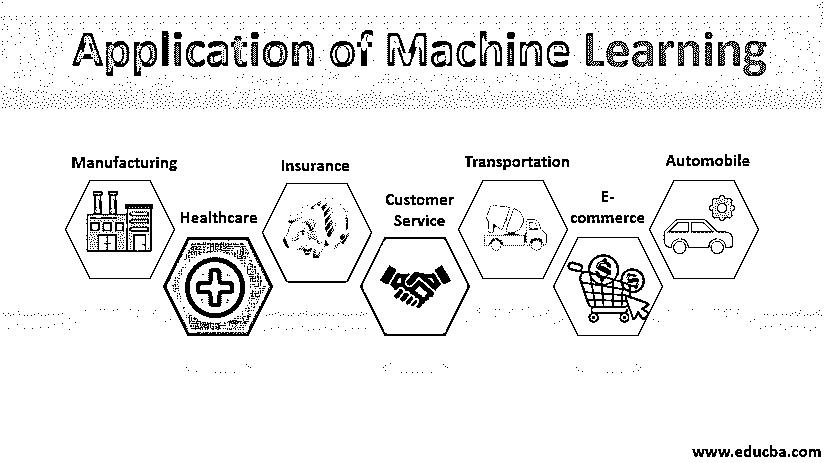
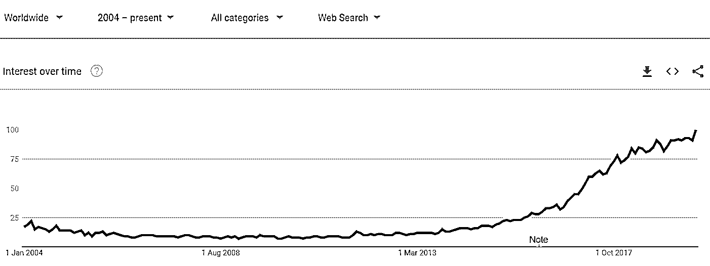

# 机器学习的应用

> 原文：<https://www.educba.com/applications-of-machine-learning/>

## 机器学习应用介绍

人工智能是一个非常热门的话题，全世界都在讨论。机器学习是人工智能最令人兴奋的技术之一，它赋予系统像人类一样思考和行动的能力。机器学习是人工智能的一个子领域，它有各种各样的应用，帮助进行预测、分析、分类等。这一点得到了多个行业公司的认可(如金融服务、政府、医疗保健、交通运输等。)来处理组织有效运营业务和获得竞争优势所需的大量数据。

### 基于业务线的应用程序

让我们根据业务对机器学习的用途进行分类。

<small>Hadoop、数据科学、统计学&其他</small>

#### 1.制造业

作为一个行业，制造业是任何健康经济的支柱。从优化资源规划到缩短上市时间，机器学习正在帮助制造业转型。

#### 2.营销

在一个拥有超过 250 亿台互联设备的世界中，机器学习在个性化数字营销中扮演着至关重要的角色。广告点击预测，向客户展示相关广告，识别目标客户，流失分析等。，是机器学习在营销领域的重要应用。

#### 3.卫生保健

医疗保健可能是人工智能将产生奇迹般影响的领域。从历史上看，医疗保健行业高度依赖人工干预和高技能专业人员。但在当今世界，机器学习使我们能够做出数据驱动的决策，这些决策可以预防疾病，帮助更好的患者诊断，更快的根本原因检测等。科技巨头谷歌、脸书、高通等。，正在投资数十亿美元用于基于 ML 的医疗保健研究。

#### 4.数字媒体和娱乐

机器学习在数字媒体、社交媒体和娱乐领域有着巨大的应用。个性化推荐(即 Youtube 视频推荐)、用户行为分析、垃圾邮件过滤、社交媒体分析和监控是机器学习的一些最重要的应用。

#### 5.电子商务

机器学习的进步也是当今电子商务转型的关键利益相关者。当我们在浏览一个电子商务网站时，我们可以看到个性化的推荐，这是通过基于内容或协同过滤实现的。大规模用户数据的可用性可能是电子商务巨头在竞争中领先于零售商的原因。机器学习也用于时装设计。印度电商巨头 Myntra 拥有多个由深度学习系统设计的品牌。

#### 6.活力

能源是机器学习解决方案带来巨大差异的核心领域之一。功耗和需求预测、动态单位成本维护、硬件寿命分析是该领域中机器学习应用的一部分。它还被用于管理替代能源。

#### 7.银行和金融

在数字经济中，机器学习有助于银行和其他金融机构防范欺诈、洗钱、非法金融检测、识别有价值的客户等。它还帮助金融机构进行股票市场预测、需求预测，为客户提供个性化的银行解决方案等。

#### 8.汽车

汽车是机器学习影响巨大的另一个领域。几乎每个汽车制造商都使用人工智能来优化油耗、故障预测，甚至自动驾驶。特斯拉、英伟达等。，正在对自动驾驶汽车进行大量投资。

#### 9.客户服务

几乎每个组织都在使用聊天机器人进行客户服务。聊天机器人具有成本效益，并在很大程度上改变了客户服务的格局。自动化翻译和最先进的文本到语音和语音到文本系统正在帮助克服语言障碍。

#### 10.治理和监督

机器学习正在重塑现代治理和防御系统。在最先进的[深度学习算法](https://www.educba.com/deep-learning-algorithms/)和基础设施的帮助下，安全机构现在能够进行实时图像检测、无人机监控、自动化社交网络监控等。

#### 11.保险

保险业坐拥大量数据，这些数据传统上只在行业的应用程序级别使用。在人工智能和机器学习的帮助下，保险公司现在能够从他们拥有的数据中获得有价值的见解。机器学习正被用于更快的索赔恢复、欺诈检测、续保预测、流失分析等。从今天的两笔新业务交易来看，它可以用在保单生命周期的每个阶段。

#### 12.人力调配

虽然还处于早期阶段，但机器学习现在也正被用于管理人力资源。像亚马逊、HDFC 银行等组织。在招聘过程的不同阶段使用机器人和视频分析。IBM Watson 也用于人力资源优化。

#### 13.运输

在使用 app 打车服务时，您一定在某个时间点观察到了动态定价和激增费用。这也是机器学习的一个应用。用户数据也被用来预测最短路径。

#### 14.艺术和创造力

机器学习不再被用来自动化人类的日常工作；它也被用于创造性的目的。艺术风格转换、文本到图像合成、自动配乐和视频创作、图像着色、社交媒体聊天机器人等。，是机器学习在这个领域的一些很酷的应用。

### 机器学习的趋势

从互联网时代开始，机器学习的应用呈指数级增长。让我们看看 2004 年至 2019 年期间谷歌机器学习的全球趋势。

来源:https://trends.google.com

### 结论

机器学习和人工智能不再是科幻小说或好莱坞电影的一部分；它们的应用在我们的日常生活中无处不在。每一项创新都有积极和消极的一面；机器学习也不例外。虽然在本文中，我们主要讨论了机器学习的积极应用，但它也可能被用作邪恶。像 Deep Fakes 这样的深度学习系统对人类的生活和隐私有着巨大的影响。作为一个不断发展的研究和应用领域，对强大的数据治理的需求也成为一种必然。

### 推荐文章

这是机器学习应用指南。在这里，我们讨论基于业务线和机器学习趋势的应用。您也可以浏览我们的其他相关文章，了解更多信息——

1.  [机器学习平台](https://www.educba.com/machine-learning-platform/)
2.  [机器学习技术](https://www.educba.com/machine-learning-techniques/)
3.  [机器学习的用途](https://www.educba.com/uses-of-machine-learning/)
4.  [机器学习简介](https://www.educba.com/introduction-to-machine-learning/)

