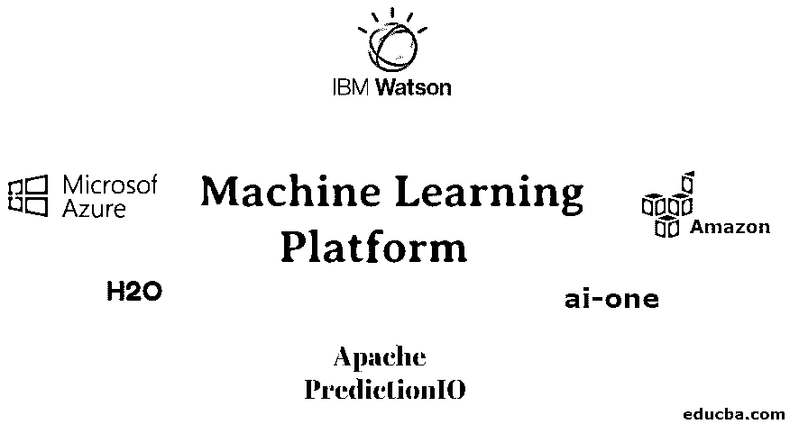

# 机器学习平台

> 原文：<https://www.educba.com/machine-learning-platform/>

## 机器学习平台简介

机器学习平台(微软 Azure，IBM Watson，亚马逊，H20，ai-one 等。)是组织良好的软件系统应用程序，用于自动化和加速预言应用程序的交付生命周期，允许开发者在不同的操作系统上有效地构建他们的模型，并使用在线工具，这些工具可以是付费版本也可以是免费的。此外，这些在线媒体能够使用与机器学习相关的技术处理大量数据。

### 什么是机器学习平台？

一个平台，用于自动化和加快预言性应用程序的交付生命周期，这些应用程序能够采用机器学习或关联程序进行大量数据处理。

<small>Hadoop、数据科学、统计学&其他</small>

这一定义中的一些关键思想是:

*   加速是为了诱导更快的解决方案交付生命周期，此外还通过分布式和内存计算等高级过程加快运行时间。
*   信息分析师真正的任务由许多冗长乏味的任务组成。自动化这些任务可以消除项目瓶颈，允许组织更快地交付新项目，更新和获得更多任务，而不增加人员。
*   机器学习平台为用户提供服务和处理来自良好来源的大量数据的能力。
*   这些平台专注于实现交付预测应用的完整生命周期，因为它们不同于 PC 工具和代码库。
*   它应该被集成，因为它们被很好地组织成软件系统应用程序，这是强烈推荐的。
*   它集中在帮助交易了解未来的结果，如客户购买给定报价或拒绝交易的能力。

### 机器学习平台

机器学习领域发展迅速。因此，选择合适的平台非常重要，这样才能成功地使用端到端方法构建模型。这是机器学习平台的列表。

#### 1.微软 Azure

微软 Azure 的机器学习工具允许开发者建立模型。它提供 SDK 和服务来快速准备信息、训练和部署机器学习模型。提高生产力和价格与汽车缩放密码&管道。将这些功能与开源的 [Python 框架](https://www.educba.com/python-frameworks/)结合使用，比如 PyTorch、Tensor Flow 和 scikit-learn。

**特性**

*   它使用 Azure Machine Learning Studio 作为其界面，具有用于构建模型的拖放环境。
*   它拥有运行决策树、深度神经网络、分类和回归的自动化程序。
*   它只允许大型数据集上传到 Azure cloud，而不允许来自任何服务提供商的较小数据集上传。
*   它提供功能有限的标准版和免费版。

#### 2.IBM 沃森

IBM Watson 平台是为开发者和用户开发的，拥有大量的人工智能工具。它提供系统程序和查询、预测和汇编工具来创建工作簿。此外，它允许强大的信息可视化，在拖放环境的帮助下创建模型。

**特性**

*   使用 SPSS 图形分析的前端界面。
*   信息和预测必须存储在 IBM Bluemix 中。
*   专注于企业客户端的服务帮助使用 API 连接器创建基于 ML 的应用程序。
*   它们是收费的，甚至免费的版本都有。

#### 3.亚马孙

亚马逊机器学习平台为任何开发人员提供现成且简单可用的预测模型，即使他们对数据科学一无所知。现收现付的模式，需要很少的硬件或软件包投资，已经使亚马逊成为一个最简单的 ML 平台提供商，一个新进入者将会登记。此外，开发者可以利用 [AWS(亚马逊网络服务)](https://www.educba.com/what-is-aws/)提供的 AI 工具包，其中还包括亚马逊 Lex 和亚马逊 Polly。

**特性**

*   它使用了亚马逊机器学习边栏和亚马逊字符用户界面。
*   这些信息必须存放在相关的 AWS 帐户中，如 S3、红移和 RDS。
*   它基于现收现付模式，对于基数批量预测，其价格远低于 10 美分。

#### 4.ai-one

使用 ai-one 平台，开发人员将生产智能助手，这些助手将很容易部署在几乎任何软件应用程序上。工具资源列表包括开发人员 API、文档库和构建代理，它们将用于将信息转换为支持 ML 和 AI 结构的规则集。

#### 5.阿帕奇预测

它是一个开源的栈，有一个为机器学习设计的开源服务器；最重要的是，Apache PredictionIO 是创建满足任何机器学习任务的预测引擎的最简单方法。除了事件服务器和平台本身，Apache PredictionIO 还包括一个模型库。

#### 6.H2O

该平台是为 python、R & Java by H2O.ai 等编程语言设计的，它结合提供了分析 Apache Hadoop 文件系统和云中数据集所需的工具。H2O.ai 在加州山景城进行预测。它提供了免费、开源的 H2O OpenThis 平台，该平台是为 python、R & Java by H2O.ai 等编程语言设计的，它还提供了分析 Apache Hadoop 文件系统和云中的数据集所需的工具。H2O.ai 总部位于加州山景城。并提供免费、开源的 H2O 开源机器学习(H2O、苏打水和 H2O4GPU)和一款名为 H2O 无人驾驶人工智能的商业产品。H2O.ai 的组件针对中央处理器多核和多节点配置进行了高度优化和并行化。

### 结论

本文简要介绍了机器学习平台。机器学习可以是一种有监督或无监督的技术，训练机器比普通人更快更好地执行活动。当涉及到开发自己的机器学习模型时，有各种开发语言、ide 和平台可供选择。这篇文章给出了用户可以使用的最佳平台；它可以是基于云的平台，也可以是基于生产的平台。

### 推荐文章

这是一个机器学习平台的指南。在这里，我们讨论的基本概念，不同平台的机器学习的特点。您也可以阅读以下文章，了解更多信息——

1.  [机器学习方法](https://www.educba.com/machine-learning-methods/)
2.  [机器学习方法](https://www.educba.com/machine-learning-methods/)
3.  [机器学习架构](https://www.educba.com/machine-learning-architecture/)
4.  [机器学习中的损失函数](https://www.educba.com/loss-functions-in-machine-learning/)

