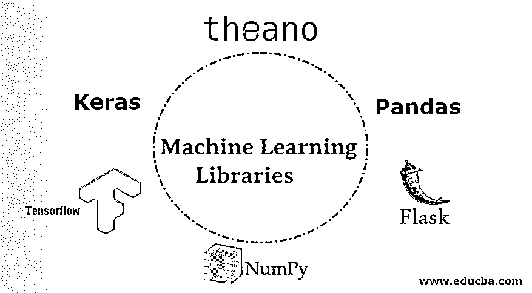

# 机器学习库

> 原文：<https://www.educba.com/machine-learning-libraries/>

## 机器学习库简介

机器学习库(Pandas，Numpy，Matplotlib，OpenCV，Flask，Seaborn 等。)被定义为以给定语言编写的一组规则或优化函数的接口，以执行重复工作，如算术计算、可视化数据集、读取图像等。这为开发人员节省了大量时间，并使开发人员的生活更加轻松，因为开发人员可以直接使用库的功能，而无需了解算法的实现。

### 机器学习图书馆

以下是一些最流行的机器学习库

<small>Hadoop、数据科学、统计学&其他</small>

*   熊猫
*   Numpy
*   Matplotlib
*   Scikit learn
*   希伯恩
*   Tensorflow
*   提亚诺
*   Keras
*   PyTorch
*   OpenCV
*   瓶

让我们简单地了解一下他们吧！

#### 1.熊猫

Pandas 是一个开源的 python 库，它提供了灵活、高性能、易于使用的数据结构，如序列、数据帧。Python 是一种有助于数据准备的语言，但在数据分析和建模方面却落后了。为了克服这种滞后，Pandas 帮助完成 Python 中的整个数据分析工作流，而无需切换到任何其他特定于领域的语言，如 r。Pandas 使用户能够以各种格式(文本、CSV、XLS、JSON、SQL、HTML 等)读取/写入数据集。它为数据挖掘、整形、子集设置、数据对齐、切片、索引、合并/连接数据集提供了高性能。但是，熊猫的内存利用率很低。它创建了太多的对象，使得数据操作变得很容易，这就占用了大量内存。

#### 2.NumPy

NumPy 是最基本的数据处理库，广泛用于 python 的科学计算。它允许用户用执行数学运算的能力来处理一个大的 N 维数组。NumPy 以其运行时执行速度、并行化和矢量化能力而闻名。这是有用的矩阵数据操作，如整形，转置，快速数学/逻辑运算。其他操作如排序、选择、基本线性代数、离散傅立叶变换等等。NumPy 消耗更少的内存并提供更好的运行时行为。但是它依赖于 Cython，这使得 NumPy 很难与其他 C/C++库集成。

#### 3\. Matplotlib

Matplotlib 是一个数据可视化库，可以与 numpy、pandas 和其他跨平台的交互环境一起工作。它产生高质量的数据可视化。Matplotlib 可以自定义绘制图表、轴、图形或出版物，在 [jupyter 笔记本](https://www.educba.com/what-is-juypter-notebook/)中也很容易使用。对于一些人来说，matplotlib 的代码可能看起来令人望而生畏，但是一旦用户习惯了它，它就很容易实现。但是高效使用 matplotlib 需要大量的练习。

#### 4.Sci-kit 学习

sci-kit learning 可以被认为是经典机器学习的核心，它完全专注于对数据进行建模，而不是加载、操作或汇总数据。任何任务，你只需说出它的名字，sci-kit learn 就可以高效地执行它。sci-kit learn 是用于[数据挖掘和数据分析](https://www.educba.com/data-mining-vs-data-analysis/)的最简单有效的库之一，是一个基于 NumPy，SciPy & Matplotlib 构建的开源库。它是作为谷歌夏季代码项目的一部分开发的，现在已经成为一个被广泛接受的机器学习任务库。Sci-kit learns 可用于准备分类、回归、聚类、降维、模型选择、特征提取、标准化等等。sci-kit 学习一个缺点是，利用分类数据不方便。

#### 5.希伯恩

Seaborn 库构建在 matplotlib 之上。Seaborn 使绘制数据可视化变得容易。它用较少的代码行绘制吸引人的信息生成图。Seaborn 特别支持分类和多元数据来显示聚合统计数据。

#### 6\. Tensorflow

TensorFlow 由谷歌大脑团队开发供内部使用，是一个开源平台，用于开发和训练[机器学习模型](https://www.educba.com/machine-learning-models/)。它是 ML 研究人员、开发人员和生产环境中广泛接受的平台。Tensorflow 执行各种任务，包括模型优化、图形表示、概率推理、统计分析。张量是这个库的基本概念，它为高维数据提供了向量和矩阵的概括。Tensorflow 可以完成许多 ML 任务，但被高度用于构建深度神经网络。

#### 7.提亚诺

由蒙特利尔学习算法研究所(MILA)开发的 theano 是一个 python 库，它使用户能够用 N 维数组计算数学表达式。是的，这类似于 Numpy 库。唯一的区别是 Numpy 对机器学习有帮助，而 theano 对深度学习很有效。此外，Theano 提供了比 CPU 更快的计算速度，可以检测和解决许多错误。

#### 8\. Keras

“让深度神经网络变得简单”——这应该是这个库的口号。Keras 是为人类设计的用户友好型产品，遵循最佳流程来减少认知负荷。Keras 提供简单快速的原型制作。它是用 python 编写的高级神经网络 API，运行在 CNTK、TensorFlow 和 MXNET 之上。Keras 提供了大量已经预先训练好的模型。它支持递归和卷积网络以及这两种网络的组合。用户可以很容易地添加新的模块，这使得 Keras 适合高水平的研究。Keras 的性能完全取决于底层后端(CNTK、TensorFlow 和 MXNET)

#### 9\. PyTorch

PyTorch 最初是由脸书的人工智能团队开发的，后来该团队与 caffe2 合并。在 TensorFlow 出现之前，PyTorch 是市场上唯一的[深度学习](https://www.educba.com/what-is-deep-learning/)框架。它与 python 如此集成，以至于可以与其他趋势库一起使用，如 numpy、Python 等。此外，PyTorch 允许用户导出标准 ONNX(开放式神经网络交换)中的模型，以直接访问 ONNX 平台、运行时等。

#### 10.OpenCV

OpenCV 是一个计算机视觉库，旨在为计算机视觉应用提供中央基础设施，并改善机器感知。该库可免费用于商业用途。OpenCV 提供的算法可用于人脸检测、物体识别、跟踪运动物体和摄像机运动。此外，OpenCV 对于组合两幅图像非常有用，可以生成高分辨率图像，跟踪眼球运动，提取物体的 3D 模型，等等。它具有在不同平台上执行的能力；它的 C++、Java 和 Python 接口可以支持 Windows、macOS、iOS、Linux 和 Android。

#### 11.瓶

一群国际 python 爱好者在 2004 年开发了一个 flask。如果要开发 web 应用，Flask 可以是最好的 python web 应用框架。它依赖于 Jinja 模板引擎和 Werkzeug WSGI 工具包。它与 google app engine 兼容，包含开发服务器和调试器。其他一些库:- Scrapy，Plotly，Bokeh，Spacy，Dask，Gensim，data。table，Caffe，NLTK，FastAI，Gluon 等等，不胜枚举。

### 结论

因此，本文概述了当前的机器学习库，它们的用途，以及一些缺点。我们讨论了各种可以执行繁琐任务的库，如矩阵计算、数据挖掘、数据可视化和人脸检测。但是，您不应该将自己局限于这些库。市场上有许多很棒的图书馆。

### 推荐文章

这是机器学习库的指南。在这里，我们以简洁的方式讨论机器学习的不同库的基本概念。您也可以浏览我们推荐的其他文章，了解更多信息——

1.  [机器学习架构](https://www.educba.com/machine-learning-architecture/)
2.  [机器学习的类型](https://www.educba.com/types-of-machine-learning/)
3.  [机器学习领域的职业](https://www.educba.com/careers-in-machine-learning/)
4.  [超参数机器学习](https://www.educba.com/hyperparameter-machine-learning/)

