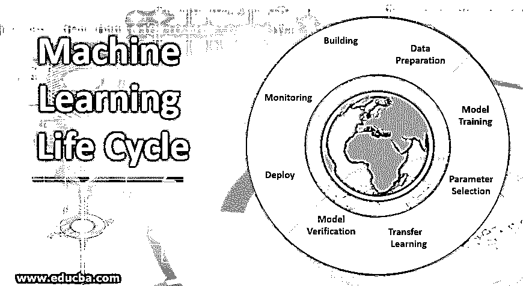
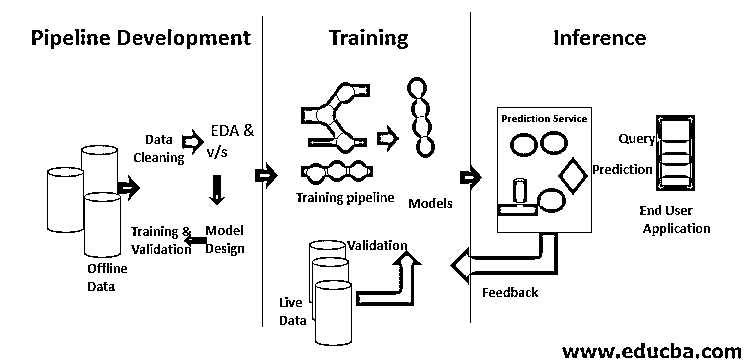
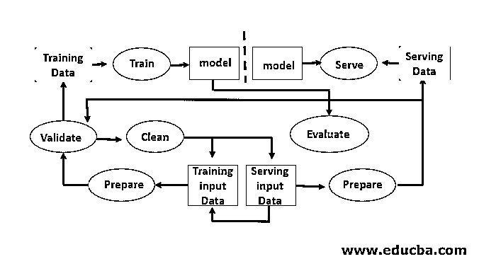

# 机器学习生命周期

> 原文：<https://www.educba.com/machine-learning-life-cycle/>

## 机器学习(ML)生命周期简介

机器学习生命周期被定义为一个循环过程，它包括三个阶段的过程(管道开发、训练阶段和推理阶段),由数据科学家和数据工程师使用各种应用程序中涉及的大量数据来开发、训练和服务模型，以便组织可以利用人工智能和机器学习算法来获得实际的商业价值。

<small>Hadoop、数据科学、统计学&其他</small>

机器学习生命周期的第一步包括将原始数据转换为干净的数据集，该数据集通常会被共享和重用。如果分析师或数据科学家在收到的数据中遇到问题，他们需要访问原始数据和转换脚本。有各种各样的原因，我们可能想回到我们的模型和数据的早期版本。例如，寻找早期最佳版本可能需要搜索许多备选版本，因为模型不可避免地会降低其预测能力。这种退化有许多原因，如数据分布的变化可能导致作为误差补偿的预测能力迅速下降。诊断这种下降可能需要将训练数据与实时数据进行比较，重新训练模型，重新考虑早期的设计决策，甚至重新设计模型。

### 从错误中学习

模型的开发需要单独的训练和测试数据集。在训练期间过度使用测试数据会导致较差的泛化能力和性能，因为它们可能会导致过度拟合。上下文在这里起着至关重要的作用，因此有必要了解哪些数据用于训练预期的模型，以及使用了哪些配置。机器学习生命周期是数据驱动的，因为模型和训练的输出与它被训练的数据相关联。下图显示了从数据角度来看的端到端机器学习管道的概况:

### 机器学习生命周期中涉及的步骤

Machine Learning developer 不断地对新的数据集、模型、软件库、调整参数进行实验，以优化和增强模型的准确性。因为模型性能完全取决于输入数据和训练过程。

#### 1.构建机器学习模型

这一步根据应用程序决定模型的类型。它还发现了模型在模型学习阶段的应用，从而可以根据预期应用的需要来适当地设计它们。各种机器学习模型是可用的，例如监督模型、非监督模型、分类模型、回归模型、聚类模型和强化学习模型。下图详细描述了这一点:

#### 2.数据准备

各种数据可以用作机器学习目的的输入。这些数据可能来自多个来源，如企业、制药公司、物联网设备、企业、银行、医院等。在机器的学习阶段会提供大量数据，因为随着数据数量的增加，它会朝着产生所需结果的方向发展。该输出数据可用于分析或作为输入馈入其他机器学习应用或系统，它将作为这些应用或系统的种子。

#### 3.模特培训

这个阶段关注的是从给它的数据中创建一个模型。在这个阶段，训练数据的一部分用于寻找模型参数，例如多项式的系数或机器学习中的权重，这有助于最小化给定数据集的误差。然后，剩余的数据用于测试模型。为了提高模型的性能，这两个步骤通常要重复多次。

#### 4.参数选择

它涉及与训练相关的参数的选择，这些参数也称为超参数。这些参数控制训练过程的有效性，因此，最终模型的性能取决于此。它们对于机器学习模型的成功生产至关重要。

#### 5.迁移学习

因为跨不同领域重用机器学习模型有很多好处。因此，尽管事实上模型不能在不同的域之间直接转移，因此它被用于为开始下一阶段模型的训练提供起始材料。因此，它大大减少了培训时间。

#### 6.模型验证

该阶段的输入是由模型学习阶段产生的经训练的模型，而输出是经验证的模型，其提供足够的信息以允许用户确定该模型是否适合其预期应用。因此，机器学习生命周期的这一阶段关注的是这样一个事实，即当处理看不见的输入时，模型工作正常。

#### 7.部署机器学习模型

在机器学习生命周期的这个阶段，我们申请将机器学习模型集成到流程和应用程序中。这个阶段的最终目标是模型在部署后的正确功能。模型应该以这样的方式部署，即它们可以用于推理，并且应该定期更新。

#### 8.监视

它包括安全措施，以确保模型在其生命周期内正常运行。为了做到这一点，需要适当的管理和更新。

### 机器学习生命周期的优势

机器学习通过学习提供了能力、速度、效率和智能的好处，而无需将这些明确编程到应用程序中。它为提高性能、生产率和稳定性提供了机会。

### 结论

随着各种应用程序中涉及的数据量迅速增加，机器学习系统正变得日益重要。机器学习技术是智能设备、家用电器和在线服务的核心。机器学习的成功可以进一步扩展到安全关键系统、数据管理、高性能计算，这对应用领域具有巨大的潜力。

### 推荐文章

这是机器学习生命周期指南。在这里，我们讨论介绍，从错误中学习，机器学习生命周期中涉及的步骤与优势。您也可以浏览我们推荐的其他文章，了解更多信息——

1.  [人工智能公司](https://www.educba.com/artificial-intelligence-companies/)
2.  [QlikView 集合分析](https://www.educba.com/qlikview-set-analysis/)
3.  [Cassandra 数据建模](https://www.educba.com/cassandra-data-modeling/)
4.  [机器学习的统计数据](https://www.educba.com/statistics-for-machine-learning/)

